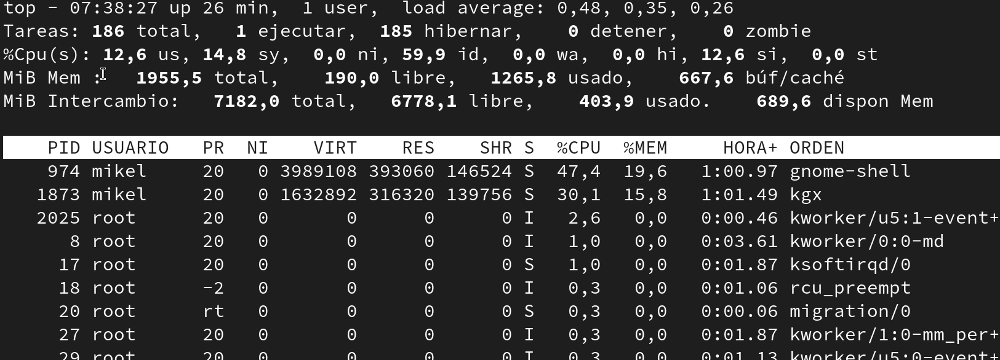

- [Prozesu kudeaketa Linuxen](#prozesu-kudeaketa-linuxen)
  - [Zer dira prosezuak Sistema Eragile baten](#zer-dira-prosezuak-sistema-eragile-baten)
  - [Prosezuak bistaratu](#prosezuak-bistaratu)
  - [Prosezuak kudeatu](#prosezuak-kudeatu)
- [Prosezu kudeaketa windowsen (erakuspena klasen)](#prosezu-kudeaketa-windowsen-erakuspena-klasen)

# Prozesu kudeaketa Linuxen

## Zer dira prosezuak Sistema Eragile baten

Prosezuak ordenagailuan martxan daduden programak dira, memoria eta prosezagailu denbora erabiltzen dute.

## Prosezuak bistaratu

Process Status 

```bash
ps
```


```bash
ps -e
```


```bash
ps -aux
```


TOP *Table of processes* agindua, prosezuak bistaratzeko balio duen agindua da. 

```bash
top
```


```bash
htop
```


## Prosezuak kudeatu 

```bash
killid id
```

# Prosezu kudeaketa windowsen (erakuspena klasen)

1. Erakutsi Ataza Kudeatzailea eta nola hemen ikusten dire prosezuak, erabiltzen duten memoria eta prosezamendu portzentaila
2. Zabaldu photoshop (irudi haundi bat 4milloi pixelekoa edo)
3. Ikusi memoriaren erabileraren aldaketa
4. Erabili photshopeko trensaren bat, adibidez atzamarra erakusteko nola prosezamendu kopurua igotzen dens