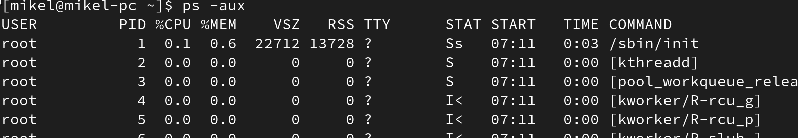

# Prozesu kudeaketa Linuxen

## Zer dira prosezuak Sistema Eragile baten

Prosezuak ordenagailuan martxan daduden programak dira, memoria eta prosezagailu denbora erabiltzen dute.

## Prosezuak bistaratu

Process Status 

```bash
ps
```


```bash
ps -e
```


```bash
ps -aux
```


TOP *Table of processes* agindua, prosezuak bistaratzeko balio duen agindua da. 

```bash
top
```


```bash
htop
```


## Prosezuak kudeatu 

```bash
killid id
```
