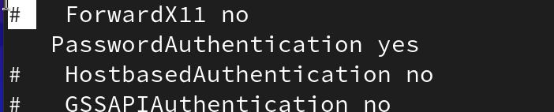

# Urrunetik sistema kudeatzen

## SSH protokoloa erabiliz

### SSH instalatu

1. Virtual Box erabiltzen badugu, aldatu sare interfazea *Adaptador Puente *sarera.


2. Istalatzeko openssh-server paketea instalatuko dugu lehenik eta behin.

```bash
pacman -S openssh-server
```

2. SSH zerbitzariaren Konfiguraketa aldatuko dugu

Pasahitza eskatzeko, hurrengo lerroari iruzkina kenduko diogu:
```bash
nano /etc/ssh/ssh_config
```



3. Gehitu hurrengo lerroa `/etc/hosts.allow` fitxategira onartzeko konekzio guztiak
   
Fitxategia sortu existitzen ez bada:

```bash
nano /etc/hosts.allow
```

```bash
sshd:ALL
```
### SSH bitartez konektatu


```bash
ssh mike@10.0.2.15
```

## FTP erabili

1- Instalatu ftp zerbitzaria arch linuxen
2- Konfiguratu aldaketak
3- Konektatu