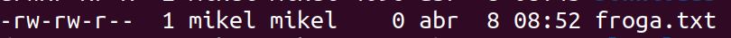
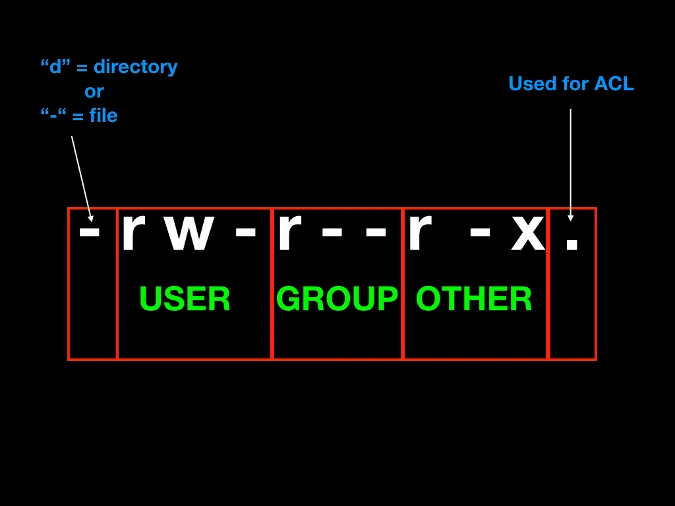
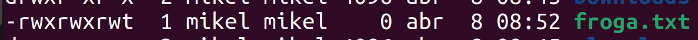

# Baimenak Linux

- [Baimenak Linux](#baimenak-linux)
  - [Fitxategi eta direktorioen baimenak](#fitxategi-eta-direktorioen-baimenak)
    - [Baimen taldeak](#baimen-taldeak)
    - [Baimenak esleitzen modu sinbolikoan](#baimenak-esleitzen-modu-sinbolikoan)
    - [Baimenak modu oktalean](#baimenak-modu-oktalean)
  - [Sticky bit baimena](#sticky-bit-baimena)
  - [SUID eta GUID baimenak](#suid-eta-guid-baimenak)
    - [SUID](#suid)
  - [Ezaugarri bereziak - lsattr eta chattr](#ezaugarri-bereziak---lsattr-eta-chattr)
- [Ariketak](#ariketak)
  - [Ariketa 1](#ariketa-1)

## Fitxategi eta direktorioen baimenak

Fitxategi eta direkotorioen baimenak hurrengo aginduarekin ikusi ditzakegu.

```bash
ls -al
```



### Baimen taldeak

- **Jabea (user)**: Fitxategi bat sortzen dugunean, sortzailea jabea izango da defektuz.
- **Talde (group)**: Fitxategi baten jabetza talde bati ere bai dagokio.
- **Besteak (other)**: Jabeak edo taldekideak ez direnak



### Baimenak esleitzen modu sinbolikoan


Bai, hemen dituzu eskatutako informazioa Linuxen baimen motak eta chmod komandoaren erabilera buruz:

Linuxen, fitxategi eta karpeta batzuek hiru baimen mota dituzte: irakurketa (r), idazketa (w) eta exekuzioa (x). Baimen hauek hiru entitateetara aplika daitezke: fitxategiaren jabea, fitxategiak pertenitzen dion taldea eta beste erabiltzaileak.

`chmod` komandoa fitxategi eta karpetaen baimenak aldatzeko erabiltzen da Linuxen. Hemen duzu nola erabiliaren adibide bat:

```bash
chmod baimenak fitxategia_edo_karpeta
```

Non "baimenak" diren baimenak ordezkatzen dituzten letrak edo zenbakiak eta "fitxategia_edo_karpeta" fitxategi edo karpeta izena den.

Adibidez, jabeari (user) exekuzio baimena horrela eman ahal diogu.
```bash
chmod u+x froga.txt
```

Honela, taldeari eta besteei exekuzio eta idazteko baimenak emago dizkiegu.
```bash
chmod go+wx froga.txt
```

Besteei, irakurtzeko baimena horrela kendu diezaiokegu.
```bash
chmod o-r froga.txt
```

### Baimenak modu oktalean

- 0 = 000 = --- = baimanrik gabe
- 1 = 001 = --x = exekuzio baimena
- 2 = 010 = -w- = idazteko baimena
- 3 = 011 = -wx = idazteko eta exetuatzeko baimena
- 4 = 100 = r-- = irakurtzeko baimena
- 5 = 101 = r-x = irakurtzeko eta exekutatzeko baimena
- 6 = 110 = rw- = irakurtzeko eta idazteko baimena
- 7 = 111 = rwx = baimean guztiak

Adibidez baimen guztiak kentzeko
```bash
chmod 000 froga.txt
```

Baimen guztiak gehitzeko 
```bash
chmod 777 froga.txt
```

Erabiltzaileari baimen guztiak emateko eta besteei edo taldekiedei irakurtze eta exekuzio baimenak emateko.
```bash
chmod 755 froga.txt
```

## Sticky bit baimena

Sticky bita daukan fitxategi edo direktorio bat bakarrik jabea edo rootek aldatu ahal dio izena edo ezabatu ahal du.

Stiky bita gehitzeko
```bash
chmod +t froga.txt
```



## SUID eta GUID baimenak

### SUID

SUID aktibatuta dagoenean fitxategi hau exekutatzen duen erabiltzaileak sortazailearen baimenak izango ditu.

```bash
chmod u+s froga.txt
```

Sortu exekutable bat root bezala, hurrengo edukiarekin eta izenarekin.

suidfroga.sh
```bash
#!/bin/bash
echo erabiltzailea
id
echo exekuzio baimen erabiltzailea 
echo $EUID
```
Baimenak esleituko dizkiogu fitxategiari
```bash
chmod 755 suidfroga.sh
```

Ezarri SUID suidfroga.sh fitxategiari

```bash
chmod u+s suidfroga.sh
```
```bash
chmod 4755 suidfroga.sh
```


## Ezaugarri bereziak - lsattr eta chattr

Ezaugarri bereziak ikusteko `lsattr` agindua erabiliko dugu.

Ezaugarri bereziak aldatzeko `chattr` agindua erabiliko dugu.

- **i** atributoaren fitxategi bat inmutablea bilakatzen dugu. Hau esan nahi inork ezin duela aldatu ez ezabatu, ezta root-ek. Ezabatu nahi izatekotan, i atributoa kendu beharko genioke lenehago.

```bash
chattr +i froga.txt
lsattr froga.txt
```


- **u** ezaugarriarekin fitxategi bat ezabatzen dugunean, datuak gordeta gelditzen dira eta bere berreskurapena ahalbidetzen du.

```bash
chattr +u froga.txt
```

- **e** ezaugarriarekin fitxategi bat ezabatzen denean, okupatzen zuen memoria zeroekin berridazten da.

```bash
chattr +e froga.txt
```

- **c** ezaugarriarekin fitxategi bat konprimituta gordeko da.
```bash
chattr +c froga.txt
```

- **a** ezaugarriarekin fitxategi bati bakarrik gehitu ahal zaizkio gauzak, hau da, ezin da aldatu aurretik zegoen ezer
```bash
chattr +a froga.txt
```

# Ariketak

## Ariketa 1

lotu dagokion baimenarekin:

- 462
- 123
- 711
- 333
- 161
- 765
- 567
- 101
- 162

- rwx--x--x
- --x-w--wx
- --x-----x
- -wx-wx-wx
- r-xrw-rwx
- rwxrw-r-x
- --xrw--w-
- r--rw--w-
- --xrw---x