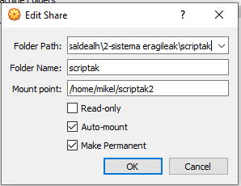
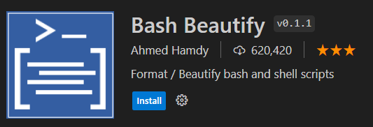

# Scriptak Linuxen

- [Scriptak Linuxen](#scriptak-linuxen)
  - [Oinarrizko script baten adibidea:](#oinarrizko-script-baten-adibidea)
  - [Script bat exekutatu](#script-bat-exekutatu)
  - [Andagaiak Bash-en](#andagaiak-bash-en)
    - [Aldagaien erabileraren adibidea:](#aldagaien-erabileraren-adibidea)
  - [Baldintzak Bash-en](#baldintzak-bash-en)
    - [Baldintza adibidea:](#baldintza-adibidea)
  - [Bukleak Bash-en](#bukleak-bash-en)
    - [Bukle adibidea, `for`:](#bukle-adibidea-for)
    - [Bukle adibidea, `while`:](#bukle-adibidea-while)
  - [Erabiltzaileak sartutako aldagai baten irakurketa](#erabiltzaileak-sartutako-aldagai-baten-irakurketa)
    - [Erabiltzaileak sartutako aldagaiaren irakurketaren adibidea](#erabiltzaileak-sartutako-aldagaiaren-irakurketaren-adibidea)
  - [Scripta deitzerakoan parametroak erabili](#scripta-deitzerakoan-parametroak-erabili)
    - [Script-ari parametroak gehitzeko adibidea](#script-ari-parametroak-gehitzeko-adibidea)
  - [Scripten erabilera arruntak Linux-en](#scripten-erabilera-arruntak-linux-en)
- [Ariketak](#ariketak)
  - [Nola garatu Scriptak](#nola-garatu-scriptak)
  - [Nola entregatu ariketak](#nola-entregatu-ariketak)
  - [Ariketa 1 - Whoami](#ariketa-1---whoami)
  - [Ariketa 2 - Datak](#ariketa-2---datak)
  - [Ariketa 3 - Berdinak](#ariketa-3---berdinak)
  - [Ariketa 4 - Kalkulagailua](#ariketa-4---kalkulagailua)
  - [Ariketa 5 - Baimenak](#ariketa-5---baimenak)
  - [Ariketa 6 - Fitxategiak](#ariketa-6---fitxategiak)
  - [Ariketa 7 - Menua](#ariketa-7---menua)


Linuxeko script-ak zeregin espezifikoak egiteko modu sekuentzialean exekutatzen diren komandoen edo jarraibideen sekuentziak dira. Script horiek Bash (Bourne Again Shell) bezalako lengoaietan idatzita daude, Linuxen banaketa gehienetan defektuzko shell-a BASH da.

## Oinarrizko script baten adibidea:

```bash
#!/bin/bash

# Hau iruzkin bat da
echo "Kaixo, Mundua!"
```

Adibide honetan:

- `#!/bin/bash`: Lerro honek, sistemari adierazten dio bash interpretea erabili behar duela scripta exekutatzeko.
- `echo "Kaixo, Mundua!"`: Hurrengo agindua kaixo mundua inprimatuko du.

## Script bat exekutatu
  


Demagun, **hello.sh** izeneko fitxategia. Script-a exekutatzeko, terminaletik hurrengo komandoa idatzi behar da:

```bash
bash hello.sh
```

Edo, exekutagarri bihurtu eta ./ erabiliz horrela:

```bash
chmod +x hello.sh
./hello.sh
```

## Andagaiak Bash-en

Aldagaiak geroago script-ean erabiliko den informazioa gordetzeko erabiltzen dira. Aldagaiei balioak eslei dakizkieke eta, ondoren, aldagai horiek script-ean erabil daitezke.

### Aldagaien erabileraren adibidea:

```bash
#!/bin/bash

# Esleitu balio bat aldagaiari
IZENA="Patxi"

# Usar la variable
echo "Kaixi, $IZENA!"
```

## Baldintzak Bash-en

Fluxua kontrolatzeko egiturak, baldintzak bezala, script batean erabakiak hartzeko erabiltzen dira. Bashen, hurrengo gako-hitzak erabiliz sortzne dira baldintzak: `if`, `else`, `elif` (else if) eta `then`, baldintzak definitzeko.

### Baldintza adibidea:

```bash
#!/bin/bash

ADINA=18

if [ $ADINA -ge 18 ]; then
    echo "Adin naguzia zara."
else
    echo "Adin txikia zara."
fi
```

- `[ $ADINA -ge 18 ]`: Baldintza `-ge` **greater or equal** esan nahi du
  
- Beste komparaketa operadoreak:
  - `eq` = equal = berdina
  - `ne` = not equal = ezberdina
  - `lt` = less than = txikiagoa
  - `gt` = greater than  = handiagoa 
  - `le` = less than or equal = txikiagoa edo berdina
  - `ge` = greater or equal = handiagoa edo berdina

```bash
#!/bin/bash

ADINA=18

if [ $ADINA -ge 80 ]; then
    echo "Aitite bat zera."
elif [$ADINA -ge 18]; then
    echo "Adin nagusia zara."
else
    echo "Adin txikia zara."
fi
```

## Bukleak Bash-en 

Begiztak komando batzuk hainbat aldiz errepikatzeko erabiltzen dira. Bash-en, `for` y `while` erabil ditzakezu.

### Bukle adibidea, `for`:

```bash
#!/bin/bash

# Inprimatu 1-tik 5-era dauden zanbakiak
for ZENBAKI in 1 2 3 4 5; do
    echo "Zenbakia: $ZENBAKI"
done
```

### Bukle adibidea, `while`:

```bash
#!/bin/bash

# Aldagai bat 
KONTADOREA=0

# While buklea baldintza betetzen den bitartean exekutatuko da, hau da kontadorea 7 baino txikiagoa den bitartean.
while [ $KONTADOREA -lt 7 ]; do
    echo "Contador: $KONTADOREA"
    # Kontadoreari bat gehitu
    ((KONTADOREA++))
done
```

## Erabiltzaileak sartutako aldagai baten irakurketa

Erabiltzaileak sartutako aldagai bat irakurtzeko, Bash-en `read`  komandoa erabil dezakezu. Komando horrek aukera ematen dio erabiltzaileari datuak teklatutik sartu eta script-ean aldagaiei esleitzeko.

### Erabiltzaileak sartutako aldagaiaren irakurketaren adibidea


```bash
#!/bin/bash

# Galdetu erabiltzaileari izena idazteko
echo "Mesedez, idatzi zure izena:"
read IZENA

# Agurtu erabiltzailea bere izena erabiliz
echo "Kaixo $IZENA!"
```

## Scripta deitzerakoan parametroak erabili

Komando-lerrotik exekutatzen duzunean, parametroak gehi diezazkiokezu script-ari. Parametro horiek script-aren barruan sar daitezke, honako aldagai berezi hauek erabiliz: `$1`, `$2`, `$3` eta abar. Aldagai horietan, `$1` lehen parametroa adierazten du, `$2` bigarrena, eta horrela hurrenez hurren.


### Script-ari parametroak gehitzeko adibidea

```bash
#!/bin/bash

#Script-ari emandako lehen parametroa erabiltzea
echo "Lehen parametroa da: $1"

#Script-ari emandako bigarren parametroa erabiltzea
echo "Bigarren parametroa da: $2"

#Script-ari emandako hirugarren parametroa erabiltzea
echo "Hirugarren parametroa da: $3"
```

Script hori parametroekin exekutatzeko, honela egin dezakezu komando-lerrotik:

```bash
bash script.sh parametro1 parametro2 parametro3
```

Adibide honetan, `parametroa1`, `parametro2` eta `parametro3` parametroak script-era pasatzen dira, eta script-aren barruan erabil daitezke, hurrenez hurren,  `$1`, `$2` eta `$3` aldagai bereziak erabiliz.

Horrela, erabiltzaileak sartutako aldagaiak erraz irakur ditzakezu, baita script-ari parametroak gehitu ere, moldakorragoa eta egoera desberdinetara egokigarriagoa izan dadin.

## Scripten erabilera arruntak Linux-en

1. **Atazen automatizazioa**: Script-ak ataza errepikakorrak automatizatzeko erabiltzen dira, hala nola fitxategiak kopiatzeko, segurtasun-kopiak sortzeko eta paketeak instalatzeko.
2. **Sistemaren administrazioa**: Sistema-administratzaileek script-ak erabiltzen dituzte Linux zerbitzariak konfiguratu eta mantentzeko, sistemaren segurtasun-kopiak egiteko eta zerbitzariaren errendimendua monitorizatzeko.
3. **Datuak prozesatzea**: Script-ak datu-multzo handiak prozesatzeko eta aztertzeko erabiltzen dira, hala nola zerbitzarien erregistroak eta erregistro-fitxategiak.
4. **Aplikazioak hedatzea**: Scriptak aplikazioak hedatzeko prozesua automatizatzeko erabiltzen dira, konpilaziotik eta paketatzetik hasi eta produkzio-zerbitzarietan inplementatzeraino.

Linuxeko script-ak tresna ahaltsua dira, zereginak automatizatzen, prozesuak sinplifikatzen eta sistema eragilearekin egiten duzun eguneroko lanaren eraginkortasuna hobetzen lagun diezazukeena. Praktika pixka batekin eta Basheko oinarrizko programazio-egiturak ulertuta, hainbat helburutarako script erabilgarri eta eraginkorrak sor ditzakezu.

# Ariketak 


## Nola garatu Scriptak

Garatzeko, erosoena Visual Studio erabiltzea da, windowsen bertan, baina scriptak makina birtualean exekutatuko ditugu. Horretarako hurrengo egingo dugu.
1. Zabaldu Visual Studio zuen repositorioan orain harte egin dugun bezala
2. Sortu karpeta berri bat **scriptak** izenekoa
3. Virtual boxen Guest Additions instalatua izan behar duzue, [jarraitu gida hau ubunturako](https://www.linuxtechi.com/install-virtualbox-guest-additions-on-ubuntu/)
4. VirtualBox-en jarraitu pauso hauek
- Zuen makinaren aukeretan.

- Karpeta partekatuak

- Hautatu **scriptak** karpeta, eta **scriptak** izena jarri bestea utzi horrela. (kasu honetan shared jartzen du)

1. Orain nabigatu dezakezue karpeta horretara eta scriptak exekutatu
  
2. Gomendatzen diren extensiok Visual Studio-rako



## Nola entregatu ariketak

  1. Ariketa bakoitzkeko scriptak `ariketa1.sh`, `ariketa2.sh`, ... izenekin gorde zuen repositorioko karpetan
  2. Igo script guztiak zuen repositoriora
     1. Gogoratu igotzeko aginduak
        1. `git add --all`
        2. `git commit -m "ariketak script"`
        3. `git push`

  3. Irakasleak ariketak zuzenduko ditu 
 
 --- 

  4. Ariketa guztiak zuzeduta daudenean dokumentazioa sortuko dugu.
  5. Sortu `Linux-Script-Ariteketak.md` izeneko fitxategi bat eta ebazpen guztiak jarri fitxategi batean markdown formatua erabiliz.
  6. Fitxategiren testuaren gainean eskumako klika erabili sakatu html-ra bihurtzeko aukera. edo `Ctrl + Shift + P` eta `markdown ... to html` agindua erabiliz
  7. Html bat sortuko da izen berdinarekin
  8. Eskumako klika erabiliz **open with live server** aukeratu, zuen dokumentazioa nabigatzailean ikusiko duzue
  9. Zihurtatu irudiak ondo ikusten direla, hala ez bada, 
     1.  Bilatu irudiren bat eta aldatu irudiaren bide absolutua bide erlatiboagaitik. `Ctrl + F` erabiliz irudi guztiak aldi berean zuzendu ditzakezu.
     2.  Zihurtatu irudi guztiak ondo ikusten direla
  10. Nabigatzailean, eskumako klika erabiliz imprimatu webgunea pdf dokumentu batera.

*Oharra: 4 garren eta 10 garren arteko prosezua irakasleak egingo du klasen zuek ikus dezazuen baina ez da zaila.*


## Ariketa 1 - Whoami
Sortu script bat hurrengo aginduak egingo dituena. 

1. Terminala ezabatu, 
2. Ze erabiltzaile zaren eta zein direktoriotan zauzen esango dizu. 

## Ariketa 2 - Datak
Hilabete eta urte bat idazteko eskatuko dizu, ondoren data horretako egutegia erakutsi beharko dizu. 

## Ariketa 3 - Berdinak
Script honek terminaletik idazten ditugun bi izen berdinak diren edo ez konprobatuko du. Berdinak badira, berdinak direla erantzungo digu eta desberdinak badira, desberdinak direla

## Ariketa 4 - Kalkulagailua
Script bat sortu, non balio bat eskatuko dizun, gero ze eragiketa egin nahi duzun galdetuko dizu (batuketa +, kenketa -, biderkaketa *, eta zatiketa /) eta azkenik bigarren balio bat. Zure script-ak emaitza kalkulatuko du.
        
## Ariketa 5 - Baimenak
Aldagai bezela fitxategi baten izena jaso behar da eta konprobatu behar da eta ze baimena dituen, (idazteko, irakurtzeko edo exekutatzeko). Programak esango digu zeintzuk diren baimenak.

## Ariketa 6 - Fitxategiak
Aldagai bezala fitxategi batzuen izena jaso eta bakoitzarentzak konprobatu existitzen den fitxategiak diren eta horrela bada, erakutsi fitxategiaren edukia pantailan. 

## Ariketa 7 - Menua
Sortu programa bat erabiltzaileari hurrengo aukerak eskeiniko dizkiona, 6 garren aukera hautatu harte behin eta berriro, terminala garbitu eta menua erakutsi.

  1.  Karpeta tamaina ikusi
  2.  Fitxategiak listatu
  3.  Fitxategi bat sortu
  4.  Karpeta sortu
  5.  Karpeta eta fitxategiak ezabatu
  6.  Irten
  


