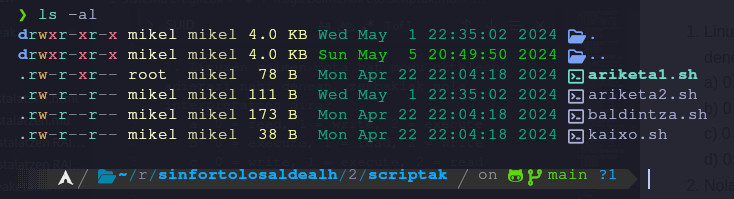

# Azterketa Baimenak eta Scriptak

- Izen Abizenak:
- Nota: 


#### 1. Linuxen baimen mota bat modu oktalean adierazi nahi denean, zenbakiak nola interpretatzen dira? (+1 / -0,33)
    a) 0 = read, 1 = write, 2 = execute
    b) 0 = execute, 1 = read, 2 = write
    c) 0 = write, 1 = execute, 2 = read
    d) 0 = execute, 1 = write, 2 = read
    read write execute
    4    2     1
    
---

#### 2. Nola gehitu exekuzio baimena jabearentzat baimenak modu sinbolikoan? (+1 / -0,33)
    a) chmod u+x file.txt
    b) chmod x+u file.txt
    c) chmod +u+x file.txt
    d) chmod u+x+ file.txt
---

#### 3. Nola gehitu sticky bita fitxategi edo karpeta bati modu oktalean? (+1 / -0,33)
    a) chmod +t file.txt
    b) chmod 1755 file.txt
    c) chmod u+s file.txt
    d) chmod +s file.txt
---

#### 4. Demagun hurrengo fitxategiak:



##### 1. Exekuta dezake mikel erabiltzaileak ariketa1.sh scripta? (+0.5/ -0,5)
##### 2. Exekuta dezake root erabiltzaieleak ariketa2.sh scripta? (+0.5/ -0,5)
##### 3. Zein da ariketa1.sh fitxategiaren taldea eta ownerra? (+0.5/ -0,5)
---

#### 5. Sticky bitari buruz, zein da egia? (+1 / -0,33)
    a) Jabeak soilik aldatu edo ezabatu dezake fitxategia
    b) Taldeko erabiltzaileek soilik aldatu dezakete fitxategia
    c) Root-ek soilik aldatu edo ezabatu dezake fitxategia
    d) Guztiak aldatu edo ezabatu dezakete fitxategia
---

#### 6. Zertarako erabiltzen da SUID baimena? (+1 / -0,33)
    a) Erabiltzaile guztiek fitxategiaren exekuzio baimenak izango dituzte
    b) Erabiltzaile guztiek fitxategiaren idazketa baimenak izango dituzte
    c) Sortzaileak soilik fitxategiaren exekuzio baimenak izango ditu
    d) Fitxategia, sortzailearen baimenekin exekutatuko da
---

#### 7. Zer adierazten du `-c` ezaugarriak fitxategiari ematen dion? (+1 / -0,33)
    a) Fitxategia konprimituta gordetzen da
    b) Fitxategia ezabatzean, zeroekin berridatzi egiten da
    c) Fitxategia ezabatzean, okupatzen zen memoria ezabatzen da
    d) Fitxategiari datuak bakarrik gehitu ahal zaizkio, aurretin zegoen edukia aldatu gabe
---

#### 8. Zer adierazten du `-u` ezaugarriak fitxategiari ematen dion? (+1 / -0,33)
    a) Fitxategia konprimituta gordetzen da
    b) Fitxategia ezabatzean, zeroekin berridatzi egiten da
    c) Fitxategia ezabatzean, datuak berreskura daitezke gero
    d) Fitxategiari datuak bakarrik gehitu ahal zaizkio, aurretin zegoen edukia aldatu gabe
---

#### 9.  Zer adierazten du `-a` ezaugarriak fitxategiari ematen dion? (+1 / -0,33)
    a) Fitxategia konprimituta gordetzen da
    b) Fitxategia ezabatzean, zeroekin berridatzi egiten da
    c) Fitxategia ezabatzean, okupatzen zen memoria ezabatzen da
    d) Fitxategiari datuak bakarrik gehitu ahal zaizkio, aurretin zegoen edukia aldatu gabe
---

#### 10.  Nola ezartzen da aldagai baten balioa erabiltzaileak sartzen dituen datoekin? (+1 / -0,33)
    a) read ALDAGAIA
    b) echo \$ALDAGAIA
    c) read "ALDAGAIA"
    d) read $ALDAGAIA

---

#### 11. Zein da aldagaiare erabilera zuzena? (+1 / -0,33)
    a) echo "nire ALDAGAIA"
    b) echo "nire -ALDAGAIA"
    c) echo "nire $ALDAGAIA"
    d) echo "nire #ALDAGAIA"

---

#### 12.  Hurrengo scripta, printer.sh izena du. 

```bash
#!/bin/bash

for param in "$@"
do    
   echo $param
done
```

##### a) Nola exekutatu beharko zenuke hurrengo irteera lortzeko? (+1)

```bash
> Nire 
> katua 
> rayo
> izena
> du
```
##### b) Zertarako erabiltzen da `$@` ikurra? (+1)

---

#### 13.  Hurrengo scripta izanda:
```bash
#!/bin/bash

read -r ALDAGAIA

if [ "$ALDAGAIA" -ge 5 ]; then
    echo "tximista"
else 
    if [ "$ALDAGAIA" -eq 3 ]; then
        echo "rayo"
    elif [ "$ALDAGAIA" -gt 3 ]; then
        echo "rayo"
    else
        echo "whiskers"
    fi
fi
```

##### a. Zer idatzi beharko luke erabiltzailea terminalean `rayo` ikusteko? (+0.5)

##### b. Zer ikusko da terminalean erabiltzaileak `1334` idazten badu? (+0.5)

##### c. Zer ikusko da terminalean erabiltzaileak `-999` idazten badu? (+0.5)

--- 

#### 14. Hurrengo scripta izanda:

```bash
#!/bin/bash

ALDAGAIA=0

while [ "$ALDAGAIA" -le 6 ] ; do
    ALDAGAIA = ALDAGAIA + 2
    echo "rasca $ALDAGAIA"
    echo "pika {$ALDAGAIA + 3}"
done
```

##### a. Zein izango da scriptaren irteera? (+1.5)