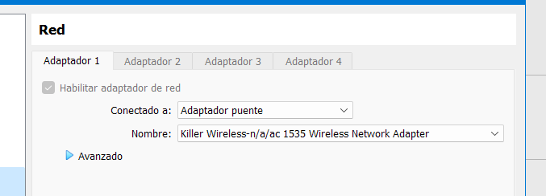

---
tags:
  - SistemasOperativos
  - Arch
---

- [Ingurune virtuala ezarri  📦](#ingurune-virtuala-ezarri--)
	- [Deskargatu ISOa 📀](#deskargatu-isoa-)
	- [VBoxen makina sortu 🖥️](#vboxen-makina-sortu-️)
		- [Diska gogorrak](#diska-gogorrak)
- [Oinarrizkoak  👣](#oinarrizkoak--)
- [RAID 0 bat prestatu 💽💽](#raid-0-bat-prestatu-)
	- [MDADM programa instalatu](#mdadm-programa-instalatu)
- [Partizioak, formatoa eta muntaia](#partizioak-formatoa-eta-muntaia)
	- [Partizioak sortu 🍕](#partizioak-sortu-)
	- [Boot partizioa](#boot-partizioa)
	- [Partizioak formateatu ℹ️](#partizioak-formateatu-ℹ️)
	- [Partizioak montatu 🏇](#partizioak-montatu-)
		- [Fstab fitxategia sortu](#fstab-fitxategia-sortu)
	- [Sisteman sartu 🏠](#sisteman-sartu-)
- [Sistema konfiguratzen ⚙️](#sistema-konfiguratzen-️)
	- [Erabiltzaileak 👥](#erabiltzaileak-)
		- [Root pasahitza 🗝️](#root-pasahitza-️)
		- [Erabiltzaile arrunta sortu 🙍](#erabiltzaile-arrunta-sortu-)
		- [**sudoers** fitxategia editatu](#sudoers-fitxategia-editatu)
	- [Hizkuntzak 💬](#hizkuntzak-)
		- [Programen hizkuntzak](#programen-hizkuntzak)
		- [Teklatuaren hizkuntza kontsolan ⌨️](#teklatuaren-hizkuntza-kontsolan-️)
	- [Grub instalatzen ☣️](#grub-instalatzen-️)
	- [Sistema berrebiarazi ♻️](#sistema-berrebiarazi-️)
- [Sistema Konfiguratzen - 2 ⚙️](#sistema-konfiguratzen---2-️)
	- [Interneterako serbitzuak konfiguratu 📶](#interneterako-serbitzuak-konfiguratu-)

Video Erreferentzia: https://www.youtube.com/watch?v=fshLf6u8B-w&t=2737s

# Ingurune virtuala ezarri  📦
## Deskargatu ISOa 📀

Deskargatu isoa arch linuxen webgune ofizialetik, eta beheko estekatik

[Arch Linux Official website](https://archlinux.org/download/)


## VBoxen makina sortu 🖥️

Sortu makina berri bat beheko ezaugarriekin, <mark style="background: #FF5582A6;">2Gb Ram, prosezadore birekin.

![[Pasted image 20231214083910.png]]


![[Pasted image 20231214083957.png]]


![[Pasted image 20231214084010.png]]

### Diska gogorrak 

3 diska gogor erabiliko ditugu, 1Gb batekoa eta 2 10GB-ekoak.


# Oinarrizkoak  👣

Lehenik eta behin, teklatua gaztelerazko konfigurazioan ezarriko dugu erosoago lan egin ahal izateko.

```bash
loadkeys es
```
Egizatatu interneta daukagula ping eginez.

![[Pasted image 20231214084912.png]]


# RAID 0 bat prestatu 💽💽

Hurrengo agindua erabiliz ikusi dezakegu zein unitate dauzkagun eta beren partizioak. Beherko irudian ikusten da momentuz unitate dauzkagula, eta gure diska gogorrak **sda**, **sdb** biaj eta **sdc** izango dira.

```bash
lsblk
```

Diska bakoitzean partizio bat egingo dugu horrela:

```bash
sgdisk -n 1:0:0 /dev/sdb
sgdisk -n 1:0:0 /dev/sdc
```

Aurreko aginduen ostean, lslblk-ren irteera hurrengo izan beharko litzateke:



## MDADM programa instalatu
mdadm, raidak sortzeko eta kudeatzeko programa bat da. 

Eguneratu pacman eta instalatu programa.

```bash
pacman -Sy
```
```bash
pacman -S mdadm
```

Partizio birtuala bat sortuno dugu `/dev/md0` izenarekin. Aurreko partizioak `/dev/sdb1` eta `/dev/sdc1` bat bilakatuko dira `/dev/md0` partizioan.

Hurrengo bi aginduak baliokideak dira, bat erabili:

Luzaegoa baina ulergarriagoa:
```bash
mdadm --create --verbose /dev/md0 --level=0 --raid-devices=2 /dev/sd[b-c]1
```

Laburragoa:
```bash
mdadm -Cv /dev/md0 -l0 -n2 /dev/sd[b-c]1
```
Frogatu  `lsblk` agindua.


Informazio gehiago ikusi nahi eskero:

```bash
mdadm --detail /dev/md0
```

Azkenengo pauso honekin, partizioekin egiten den bezala gure uneko konfigurazioa gordeko dugu sistema pizterakoan raida automatikoki sor dadin.

```bash
mdadm --detail --scan --verbose | tee -a /etc/mdadm.conf
```

`/etc/mdadm.conf` Fitxategia aztertuz, lerro bat gure raidaren ezaugarriekin.


c
# Partizioak, formatoa eta muntaia

## Partizioak sortu 🍕

Gure diska gogorrak **md0** izango da.


Cfdisk programa erabiliko dugu partizioak egiteko parametro bezala gure disko gogorraren helbidea emango diogu.

```bash
cfdisk /dev/md0
```

Lehengo pausoa izango da labela aukeratzea, msdos aukeratuko dugu.


---
Bigarren pausoan,<mark style="background: #FFB8EBA6;"> bi partizio egingo ditugu, bata sistema eragilerako eta bestea swaperako</mark>. Huerrengo memoria ezarpenarekin; 6Gb swaperako eta beste guztia sistema eragilearko. Adi swap partizioari mota aldatu behar zaiola.


lsblk berriro erabiliz, gure diskaren partizioak ikusi beharko genituzke.

---

## Boot partizioa 

/dev/sda partizio bat bakarrik izango du, boot partizioa. cfdisk-ekin, ezarri bootable bezala.

```bash
cfdisk /dev/sda
```

## Partizioak formateatu ℹ️

Orain partizio bakoitzari dagokion formatua ezarriko diogu hurrengo komandoak erabiliz.

- Boot partizioa
```bash
mkfs.ext4 /dev/sda1
```

- Sistema eragilerako
```bash
mkfs.ext4 /dev/md0p2
```

- Swap partiziorako
```
mkswap /dev/md0p3
```

eta swap aktibatzeko
```bash
swapon
```

Zihurtatu formato guztiak zuzenak direla `lsblk -f` agindua idatziz.


## Partizioak montatu 🏇

Lehenik root partizioa montatuko dugu.<mark style="background: #FFB8EBA6;"> Beharrezkoa da hau lehen montatzea zere boot rooten azpian egongo da.</mark>

```bash
mount /dev/md0p2 /mnt
```

Boot partizioa /mnt/boot karpetan montatuko dugu, beti root montatu eta gero!

```bash
mkdir /mnt/boot
mount /dev/sda1 /mnt/boot
```
--- 
Packstrap erabiliz funtzezko pakete batzuk instalatuko ditugu, hauek gure linuxeko sistemaren fitzategi ezagun asko gehituko dituzte zeren momentuz /mnt hutsik dago.

```bash
pacstrap /mnt linux linux-firmware networkmanager grub base base-devel
```

* Oharra: Deskarga nahiko handia denez, une egokia da hau bukatzean <mark style="background: #ABF7F7A6;">virtual boxen snapshot bat egitea</mark>, horrela zerbat txarto badoa puntu honetara vuelta genezake. 
---
### Fstab fitxategia sortu

Fstab fitxategia sistema eragileari esaten dio nola montatu behar diren partizioak. Horrela, sistema pizterakoan automatikoki montatuko dira eta aurreko pausoak  ez ditugu egin behar.

```bash
genfstab -U /mnt > /mnt/etc/fstab
```

---
## Sisteman sartu 🏠

Hurrengo aginduarekin */mnt* sartzen gara, gogoratu mnt- root montatuta dagoela, hau da, gure sistema eragilearen erroa /.

```bash
arch-chroot /mnt
```


---

# Sistema konfiguratzen ⚙️

## Erabiltzaileak 👥

### Root pasahitza 🗝️

Lehenik eta behin, root bezala gauzenez, passwd komandoa erabili pasahitz berria ezartzeko root-eri.

```bash
passwd
```

---
### Erabiltzaile arrunta sortu 🙍

Dakizuenez, ez da egokia lan orokorrak root bezala egitea arriskua haundiak baitauzka, beraz erabiltzaile berri bat sortuko dugu eta root baimenak emango dizkiogu behar izatekotan root bezala komandoak erabiltzeko.

```bash
useradd -m mikel
passwd mikel
```
---
Orain, erabiltzailea *wheel* taldeari gehituko diogu, *sudo su* edo *sudo* egin ahal izateko lehen aipa bezala

```bash
usermod -aG wheel mikel
```

- Ikusi erabiltzaile baten taldeak `groups mikel` erabiliz, bi talde agertu beharko lirateke, wheel eta mikel (defektuzko taldea)
---
### **sudoers** fitxategia editatu

Sudoers fitxategia, konfigurazio fitxategi bat da eta */etc/sudoers* rutan dago kokatuta.

Segurtasunaren kudeaketarako erabiltzen da adibidez, sudo erabiltzean pasahitza eskatu ala ez ezarri al da beste gauza batzuen artean.

---

Orain, sudo paketea instalatuko dugu pacman erabiliz

```bash
pacman -S sudo
```

Baita fitxategia editatzeko editore batzuk instalatu beharko ditugu, nano instalatuko dugu.

```bash
pacman -S nano
```

---
Zabaldu editatzeko sudoers fitxategia 

```bash
nano /etc/sudoers
```

Kendu iruzkina `%wheel ALL=(ALL:ALL) ALL` lineari.

-<mark style="background: #FF5582A6;"> NOPASSWD lineari komentarioa kentzekotan ez luke pasahitza eskatuko wheel taldekidei sude egitean baina hau ez da oso egokia seguratasunaren aldetik.</mark>

![[Pasted image 20231214130741.png]]


---
## Hizkuntzak 💬

### Programen hizkuntzak

Nano erabiliz zabaldu */etc/locale.gen* fitxategia. Fitxategi hau, etc dauden fitxategi asko bezala konfiguraziorako da, hizkuntza asko izango ditu ezarrita barnean baina adi gehienak komentatua daudela. 

![[Pasted image 20231214133128.png]]


Gure lana gaztelerazkoari eta ingelesekoari iruzkina kentzea da.
1. Bilatu `Cntr + W` erabiliz  *en_US* eta iruzkina kendu
2. Bilatu `Cntr + W` erabiliz *es_ES* eta iruzkina kendu
3. Gorde eta atera 

Azkenik, locale-gen programa erabiliko dugu ezarritako hizkuntzen hitzak sortzeko.

```bash
locale-gen
```

### Teklatuaren hizkuntza kontsolan ⌨️

Terminala zabaldu genuenean, lehenik egin dugun gauza gazteleraz jartzea izan zen. Hau egin behar ez izateko eta defektuz gazteleraz agertzeko sortu hurrengo fitxategia.

```bash
nano /etc/vconsole.conf
```

Idatzi  `KEYMAP=es` barnean eta gorde.

---
## Grub instalatzen ☣️

Grub, linuxeko boot loadera da, menu bat eskeintzen du sistema pizterakoan zenbait pizteko modu autatzeko. 

Dual boot ubuntu/windows instalatu genuenean honek zein sistema eragile nahi genuen hautatzeko aukera emoten zigun.

```bash
grub-install /dev/sda1
```

Sortu gruberako konfigurazio fitxategia

```bash
grub-mkconfig -o /boot/grub/grub.cfg
```

---
## Sistema berrebiarazi ♻️

Puntu honetan, irten rootetik `exit` eginez eta `reboot` erabili live cd-ko kontextuan gaudenean era orain grub zabaltzen den eta sistema era egokian pizten den guk ezarritako konfigurazio guztiekin.

- Grub zabaltzen ez bada eta arch linuxek live cd-a zabaltzen bada, sakatu `F12` pizterakoan eta hautatu diska gogorra. Gruben menua agertu beharko litzateke.
  
![[Pasted image 20231214140230.png]]


* Oharra: <mark style="background: #ABF7F7A6;">Une egokia da hau bukatzean virtual boxen snapshot bat egitea, horrela zerbat txarto badoa puntu honetara vuelta genezake.</mark> 
---

# Sistema Konfiguratzen - 2 ⚙️

## Interneterako serbitzuak konfiguratu 📶

Lehenik eta behin, `ping www.googl.es` egiten saiatzen bagara ikusiko dugu internetik ez daukagula. 

Hau gertatzen da sare kudeaketarako serbitzua piztuta ez dagoelako. Beraz bi gauza egingo ditugu:

1. NetworkManager serbitzua piztu 
2. Hurrengaroako, serbitzua automatikoki pizteko ezarri


```bash
systemctl start NetworkManager.service 
```

```bash
systemctl enable NetworkManager
```

Horain, ping funtzionatu beharko luke, frogatu `ping www.googl.es`.

