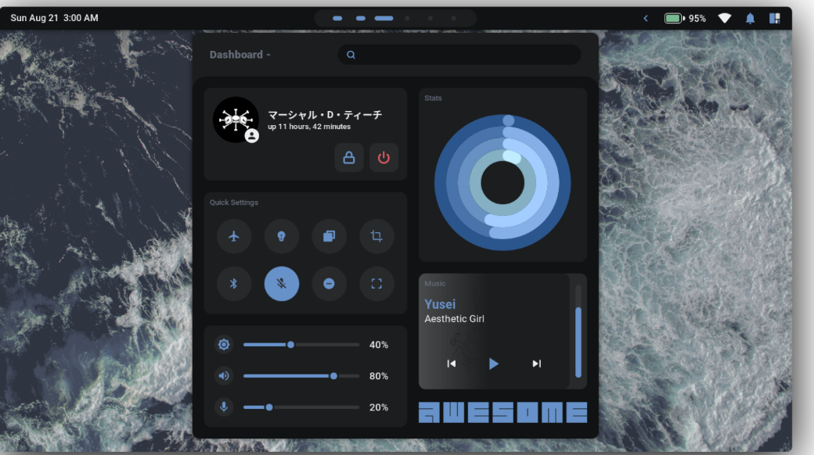

---
tags:
  - SistemasOperativos
  - Arch
---

- [🟡 Oinarrizkoa](#-oinarrizkoa)
- [🟢 Ertaina](#-ertaina)
- [🔵 Aurreratua](#-aurreratua)
  - [🦊 Firefox](#-firefox)
      - [Terminalerako kolore laguntza](#terminalerako-kolore-laguntza)
  - [🐊 Aur repositorioak](#-aur-repositorioak)
  - [🏞️ Ingurune grafikoa aldatzen](#️-ingurune-grafikoa-aldatzen)
    - [Instalatu beharrezko dependentziak](#instalatu-beharrezko-dependentziak)
    - [🈹 Yoru instalatu](#-yoru-instalatu)
      - [Proiektua deskargatu](#proiektua-deskargatu)
      - [📝 Instalatu textu iturriak](#-instalatu-textu-iturriak)


# 🟡 Oinarrizkoa 
Azterketa honen oinarrizkoa lortzeko Arch Linux sistema instalatu behar duzu [hurrengo gida jarraituz](<Arch Linux Instalatzen.md>) eta gidan aipatzen diren ezaugarri guztiekin.

# 🟢 Ertaina 
Azterketa honen ertaina lortzeko Arch Linux sistema instalatu behar duzu RAID0 baten, [hurrengo gida jarraituz](<Arch Linux Instalatzen RAID 0.md>) eta gidan aipatzen diren ezaugarri guztiekin.

# 🔵 Aurreratua 
Azterketa honen aurreratua lortzeko:
1. Arch Linux RAID0 baten instalatuta izan behar duzu. Hau da, ertainarako baldintza bete.
2. Aurrerago eskatzen diren guztiak burutu.

## 🦊 Firefox 

Instalatu firefox nabegatzailea.

#### Terminalerako kolore laguntza 

```bash
pacman -S lsd bat
```

## 🐊 Aur repositorioak

Aur, komunitateak sortutako programa asko dituen repositorio bat da. Honi esker askoz programa gehiago deskargatzeko gai izango gara. Aur repositorioak erabili ahal izateko konfiguratu beharko dugu.

1. Lehenik, git istalatu. Git, repositorioak kudeatzeko tresna bat da. Google drive-en antzelako zerbait baina koderako erabiltzen dena.

```bash
pacman -S git
```

2. Sortu *repos* karpeta zure erabiltzaile pertsonalaren profilean */home/{zure-erabiltzaile-izen}/repos*

```bash
mkdir -p Desktop/mikel/repos
```

3. Navigatu repos direktoriora

4. Klonatu hurrengo repositorioa, hau deskargatzea bezala da.
   
```bash
git clone https://aur.archlinux.org/paru-bin.git
```

Klonatu
 ostean, paru-bin izeneko karpeta bat sortuko da repos direktorioan. Sartu direktorioan eta idatzi eta zure erabiltzailearekin (Ez erabili root; ad. `su mikel` ) hurrengo agindua erabili paketea eraikitzeko.

```bash
makepkg -si
```

Eginda ! Aur paketeak eskuragarri izango ditugu horain 👏

---

## 🏞️ Ingurune grafikoa aldatzen 

Instalatuko dugun ingurune grafikoari buruzko informazio guztia hurrengo GitHub repositorioan aurki dezakezue [YORU](https://github.com/rxyhn/yoru)



### Instalatu beharrezko dependentziak

Aurreko pausoan AUR repositoriak instalatu ditugunez hurrengo agindua erabili dezakegu:

```bash
paru -S awesome-git
```

*Nota: Izan daiteke fitxategi bat editatzea eskatzea, eman baietzeri eta gorde ezer editatu gabe (q sakatu eta gero gorde aldaketak emon). Instalazio hasi beharko litzateke orduan.*

Instalatu beharrezkoak diren dependentziak (Kopiatu eta itsatsi oso agindu luzea baita!)

```bash
paru -Sy picom-git wezterm rofi acpi acpid acpi_call upower lxappearance-gtk3 \
jq inotify-tools polkit-gnome xdotool xclip gpick ffmpeg blueman redshift \
pipewire pipewire-alsa pipewire-pulse alsa-utils brightnessctl feh maim \
mpv mpd mpc mpdris2 python-mutagen ncmpcpp playerctl --needed
```

*Nota: Izan daiteke fitxategi bat editatzea eskatzea, eman baietzeri eta gorde ezer editatu gabe (q sakatu eta gero gorde aldaketak emon). Instalazio hasi beharko litzateke orduan.*

### 🈹 Yoru instalatu 

Yoru ingurune grafiko proiektu bat da eta hurrengo pausoak jarraituko ditugu instalatzeko:

#### Proiektua deskargatu 

Agindu hau 3 agindu batera dira, lehenik, proiektua klonatuko du GitHubetik, gero, karpeta horretara mugituko da eta eguneraketa bat egindo du.

```bash
git clone --depth 1 --recurse-submodules https://github.com/rxyhn/yoru.git
cd yoru && git submodule update --remote --merge
```

Kopiatu konfigurazio fitxategiak zuen erabiltzailearen home direktoriora:

```bash
cp -r config/* ~/.config/
cp -r misc/. ~/
```

💡: Agindu honek, rekurtsiboki kopiatzen ditu config direktorioko eduki guztia eta zuen home direkotorioan itsatzi egiten du. *`cp -r config/* ~/.config/` eta `cp -r config/* /home/mikel/.config/` baliokideak dira.*

#### 📝 Instalatu textu iturriak


Zenbait textu iturri instalatu beharko ditugu sisteman, iconoak eta beste karaktere mota batzuk interfazea estetika hobea izan dadin.

1. Iturri guztiak Yoru repositorioko `misc/fonts` kokaturik daude beraz egin behar dugun bakarra kopiatu eta gure sistemaren `.fonts` direktorioan itsatsi:

```bash
mkdir ~/.fonts
cp -r misc/fonts/* ~/.fonts/
cp -r .conf/
```
2. Textu iturriak ikusteko berrebiarazi cache memoria.

```bash
fc-cache -fv
```

3. Serbitzuak martxan jarri

```bash
systemctl enable --user mpd.service
systemctl start --user mpd.service
```

4. Berrebiarazi sistema eragilea.