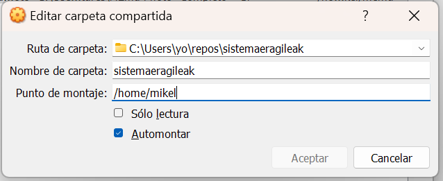

# Guest Additions Instalatu

- [Guest Aditions Instalatzeko Gida ](https://wiki.archlinux.org/title/VirtualBox/Install_Arch_Linux_as_a_guest)
- [Guest Aditions Deskargatzeko Esteka](https://download.virtualbox.org/virtualbox/7.0.14)


1. Deskargatu guesta additions [ISO-a  (deskargatu)](VBoxGuestAdditions_7.0.14.iso) eta gehitu cd bezala. Clikatu behar bada add guest aditions goiko menuan makina piztuta dagoela.




2. Instalatu virtualbox guest utils paketea Arch linuxen
   
```bash
pacman -S virtualbox-guest-utils
```

3. jarri zerbitzua martxan

```bash
systemctl start vboxservice.service
systemctl enable vboxservice
```

```bash
modprobe -a vboxguest vboxsf vboxvideo
```

4. Pantall resoluzioa (opzionala)

```bash
pacman -S hwinfo
hwinfo --framebuffer
```

WINDOWSEN VBoxManage.exe programa dagoen tokian (`C:\Program Files\Oracle\VirtualBox` rutan zihurenik.) exekutatu hurrengo agindua. 

```bash
$ .\VBoxManage setextradata "Arch Linux Raid 0" "CustomVideoMode1" "1360x768x24"
```

- "Arch Linux Raid 0" zuen virtual boxen makina izena izan behar du


5. Berrebiarazi makina

[Referentzia](https://wiki.archlinux.org/title/VirtualBox/Install_Arch_Linux_as_a_guest)
