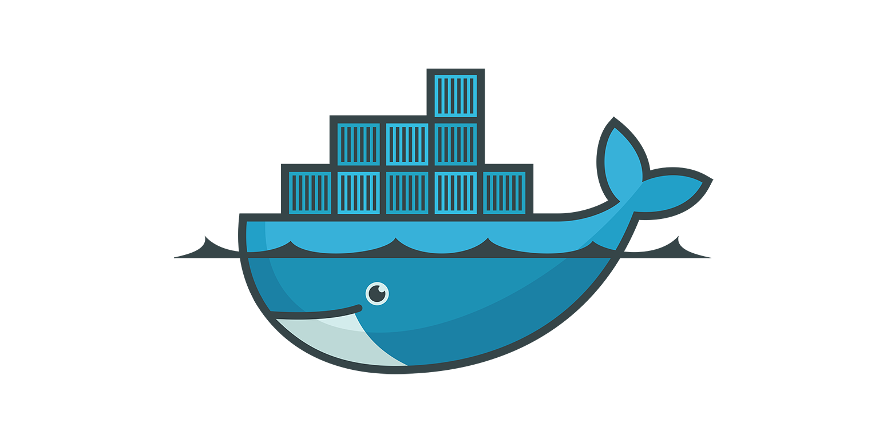

# Docker 

- [Docker](#docker)
  - [Zer da Docker?](#zer-da-docker)
  - [Zergaitik Docker](#zergaitik-docker)
    - [Nola Konparatu Docker](#nola-konparatu-docker)
      - [Erabiltzaile-basea](#erabiltzaile-basea)
      - [Helburua](#helburua)
      - [Ekosistema Eragina](#ekosistema-eragina)
      - [Aniztasuna](#aniztasuna)
      - [Merkatu Dominantzia](#merkatu-dominantzia)
      - [Integrazioa](#integrazioa)
  - [Docker praktikak](#docker-praktikak)
    - [Datu base bat sortu (MySQL)](#datu-base-bat-sortu-mysql)
      - [Datu baseak sortzen Ariketak](#datu-baseak-sortzen-ariketak)
    - [Ubuntu instalatu](#ubuntu-instalatu)
    - [Web serbitzari bat sortu (Nginx)](#web-serbitzari-bat-sortu-nginx)
      - [Ariketa: Web serbitzari bat sortu (Apache)](#ariketa-web-serbitzari-bat-sortu-apache)



## Zer da Docker?

Docker, kontendoreetan jarritako softwarearen despliegea automatizatzen duen proiektu bat da, Linux, Mac OS eta Windows sistema eragileekiko abstrakzio eta automatizazio geruza gehigarri bat da.

## Zergaitik Docker

Docker software sistema bat da, bere erabilera-espezializatua duena baina geroz eta garrantzitsuagoa bilakatzen ari dena, batez ere software garapen, banaketa eta erabilpen (DevOps) inguruan.

### Nola Konparatu Docker

#### Erabiltzaile-basea
- Docker nagusiki garatzaileek, sistema administratzaileek eta DevOps profesionalak erabiltzen dute, Microsoft Office edo Windows eta Android erabilera-sistemak bezalako erabilera zabalagoa duten softwarearekin alderatuz gero.

#### Helburua
- Docker kontainerizaziorako diseinatua da, aplikazioak eta beren dependentziak paketeatzeko eta banatzeko.

#### Ekosistema Eragina
- Docker eragina izan du hodei-informatikan, mikrozerbitzuen arkitekturan eta CI/CD pipeline-etan. Erabilera modernoan eta softwarearen banaketan izan duen eragina nabarmena da.

#### Aniztasuna
- Docker hainbat erabilera-sistema eta hodei-inguruneetan korritu daiteke, beraz aniztasuna du, baina oraindik ez da hain ohikoa web nabigatzaileak edo mugikorreko erabilera-sistemak bezalakoak diren bezala.

#### Merkatu Dominantzia
- Bere kontainerizazio eta birtualizazio kategorian, Docker jokalari dominantzia da, hainbat erabilera-sistema eta hodei-zerbitzuak bezalakoak diren bezala.

#### Integrazioa
- Docker sarritan integra daiteke beste software erabilera zabalekin eta plataformekin, hainbat hodei-zerbitzu (AWS, Azure, Google Cloud), CI/CD tresnak (Jenkins, GitLab) eta orkestrazio plataformak (Kubernetes) bezalakoak diren bezala.

Laburbilduz, software garapen eta erabilpen modernoan tresna kritikoa bihurtu da. Bere eragina, batez ere, enpresa-inguruneetan, hodei-informatikan eta garatzaileen artean sumatzen da.

## Docker praktikak

### Datu base bat sortu (MySQL)

```bash
docker run -d --name some-mysql -e MYSQL_ROOT_PASSWORD=1234 -p 3306:3306 mysql:latest
```

volumen batekin 

```bash 
docker run -d --name some-mysql -e MYSQL_ROOT_PASSWORD=1234 -p -v my_mysql_volume:/var/lib/mysql 3306:3306 mysql:latest
```

Parametroak
- **-name some-mysql** : Kontenedorearen Izena 
- **-e MYSQL_ROOT_PASSWORD=1234**: Konfigurazio parametroa
- **-d** : Detached, atzekaldeko prosezu bezela executatuko da contenedorea
- **-p 3306:3306** : Portuak mapeatu gureOrdenagailua:kontenedorea. 
  *Bi kontenedore desberdin ezin dira gure ordenagailuko portu berdinera mapeatu!
- volumenak sortzeko bi aukera:
	```-v /my/own/datadir:/var/lib/mysql``` (bind mount)
 ```-v my_mysql_volume:/var/lib/mysql```  (docker volume)
- **mysql:tag** Irudiaren izena eta etiketa


[Mysql DockerHuben](https://hub.docker.com/_/mysql)


#### Datu baseak sortzen Ariketak

1. Sortu volumen bat dockerren komando baten erabiliz. Gero sortu datu base bat volumen horri erantsiz.
   
2. Izan 4 datu base batera contenedore bezela. (ez erantsi volumenik). Aldatu izenak eta portuak!. Orain, begiratu zure makinaren prosezuak eta memoriaren erabilera. Aldi berean, zenbat mysql contendore sortzeko gai zara?

3. Zein dira hurrengo komandoaren parametroak? Zer gertatuko da hau erabiliz gero?

```bash
docker run -e MYSQL_ROOT_PASSWORD=1234 
           -v C:\Users\yo\Documents\SistemaInformatikoak\sinfortolosaldealh\init.sql:/docker-entrypoint-initdb.d/init.sql 
           -p 3306:3306 
           mysql:latest
```

docker -d run -e MYSQL_ROOT_PASSWORD=1234 -v C:\Users\yo\Documents\SistemaInformatikoak\sinfortolosaldealh\init.sql:/docker-entrypoint-initdb.d/init.sql  -p 3306:3306 mysql:latest

4. Sortu .sql script bat 3. ariketako komandoaren berdina, eta itsasi taula batzuk sortzeko eta datu batzuk ezartzeko textua (eskatu ChatGPTri). 
   1. Datu base bat martzan jarri eta egiaztatu scriptaren kodea erabili egin dela. 
   2. Script hau executatuko da contenedorea itzali eta pizterakoan?

5. Gure lantaldeak asko garatu dira, orain, gero eta konfigurazio parametro gehiago behar ditugu, gure docker commandoak asko luzatu dira! Nola egin genezake konfigurazio guzti hauek fitxategi baten bitartez ezartzeko? 

### Ubuntu instalatu

1. Irudia deskargatu
   
```docker pull dorowu/ubuntu-desktop-lxde-vnc:latest```

1. sortu volumen bat, bi era dakizkigu volumenak 

2. 
```
  docker run -d `
  --name ubuntu_desktop `
  -v ubuntu-si:/dev/shm `
  -p 6080:80 `
  dorowu/ubuntu-desktop-lxde-vnc 
```

Referentzia

```
https://computingforgeeks.com/run-ubuntu-linux-in-docker-with-desktop-environment-and-vnc/?expand_article=1
```

### Web serbitzari bat sortu (Nginx)

Sortu indexa 
	index.html
	
Sortu Dockerfilea

```bash
FROM nginx

# Copiatu Index.html 
COPY . /usr/share/nginx/html
```

Irudia sortu


```docker build -t webPolita .```  

 -t webPolita : Tag etiketa
 . contsolaren egungo kokapena (hemen Dockerfile bat egon behar da presente)
 
```docker run --name webPolita -d -p 8080:80 web-polita ```
  
[Nginx DockerHuben](https://hub.docker.com/_/nginx)

#### Ariketa: Web serbitzari bat sortu (Apache)

[Apache DockerHuben](https://hub.docker.com/_/httpd) 

