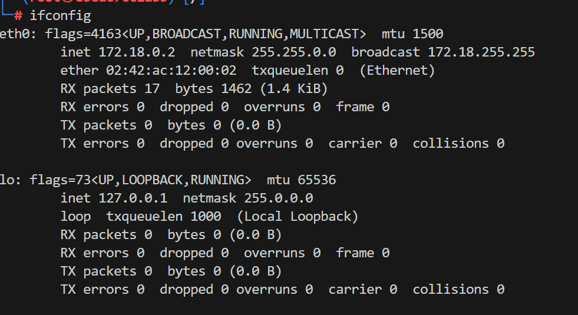

# Segurtasuna Aitorpena Froga

- [Segurtasuna Aitorpena Froga](#segurtasuna-aitorpena-froga)
  - [Nola ebaluatuko da](#nola-ebaluatuko-da)
  - [Ingurunea prestatu](#ingurunea-prestatu)
  - [1. ariketa](#1-ariketa)
  - [2. Ariketa](#2-ariketa)
  - [3.Ariketa](#3ariketa)

## Nola ebaluatuko da


| Kontzeptua          | Puntuak  |
|-------------------- |-------- |
| Ariketa 1.1         | 2     |
| Ariketa 1.2         | 1     |
| Ariketa 2.1         | 2     |
| Ariketa 2.2         | 1     |
| Ariketa 3.1         | 1     |
| Ariketa 3.1         | 2     |
| Zuzentazuna eta dokumentazioaren formatua*    | 1  | 

**Kodea bash sintaxi highlightinarekin eta kopiatu ahal izan behar da.*
**Izneburua, aurkibidea, etb*

Azterketa ikasgelara igoko da.

## Ingurunea prestatu

Azterketako ingurunea `docker-compose.yml` fitxategi baten aurkituko duzue karpeta honetan eta `.env` fitxategi bat izango duzue kontenedoreen sarea ezartzeko. Kokatu azterketako kontendore guztiak zuen kali linux makinaren sare berdinean azterketa ebazten hasteko 

*Oharra: Sare horretan ez da beste kontendorerik egon behar, solik azterketakoak eta kali makinarena.*

## 1. ariketa

1. Aztertu sarea nmap erabiliz, zehaztu ip-a, maskara eta CIDR-a, erakutsi nmap-en ireteera.

Ip-a aurkitu eta maskara:
```bash
ifconfig
```



Sarearen id-a beraz 172.18.0.0 eta CIDRa /16

```bash
nmap -p- 172.18.0.0/16
```

```bash
Starting Nmap 7.94SVN ( https://nmap.org ) at 2024-04-22 14:03 UTC
Nmap scan report for 172.18.0.1
Host is up (0.0000040s latency).
Not shown: 65533 closed tcp ports (reset)
PORT      STATE SERVICE
111/tcp   open  rpcbind
53761/tcp open  unknown
MAC Address: 02:42:49:BA:99:A0 (Unknown)

Nmap scan report for azterketa2-m7-1.hacking-lab_pentesting-lab-network (172.18.0.3)
Host is up (0.0000060s latency).
Not shown: 65534 closed tcp ports (reset)
PORT   STATE SERVICE
21/tcp open  ftp
MAC Address: 02:42:AC:12:00:03 (Unknown)

Nmap scan report for azterketa2-m15-1.hacking-lab_pentesting-lab-network (172.18.0.4)
Host is up (0.0000060s latency).
All 65535 scanned ports on azterketa2-m15-1.hacking-lab_pentesting-lab-network (172.18.0.4) are in ignored states.
Not shown: 65535 closed tcp ports (reset)
MAC Address: 02:42:AC:12:00:04 (Unknown)

Nmap scan report for azterketa2-m11-1.hacking-lab_pentesting-lab-network (172.18.0.5)
Host is up (0.0000060s latency).
Not shown: 65534 closed tcp ports (reset)
PORT   STATE SERVICE
21/tcp open  ftp
MAC Address: 02:42:AC:12:00:05 (Unknown)

Nmap scan report for azterketa2-m13-1.hacking-lab_pentesting-lab-network (172.18.0.8)
Host is up (0.0000060s latency).
Not shown: 65534 closed tcp ports (reset)
PORT   STATE SERVICE
21/tcp open  ftp
MAC Address: 02:42:AC:12:00:08 (Unknown)

Nmap scan report for azterketa2-m14-1.hacking-lab_pentesting-lab-network (172.18.0.9)
Host is up (0.0000060s latency).
All 65535 scanned ports on azterketa2-m14-1.hacking-lab_pentesting-lab-network (172.18.0.9) are in ignored states.
Not shown: 65535 closed tcp ports (reset)
MAC Address: 02:42:AC:12:00:09 (Unknown)

Nmap scan report for azterketa2-m8-1.hacking-lab_pentesting-lab-network (172.18.0.10)
Host is up (0.0000060s latency).
Not shown: 65534 closed tcp ports (reset)
PORT   STATE SERVICE
21/tcp open  ftp
MAC Address: 02:42:AC:12:00:0A (Unknown)

Nmap scan report for azterketa2-m10-1.hacking-lab_pentesting-lab-network (172.18.0.11)
Host is up (0.0000060s latency).
Not shown: 65534 closed tcp ports (reset)
PORT   STATE SERVICE
21/tcp open  ftp
MAC Address: 02:42:AC:12:00:0B (Unknown)

Nmap scan report for azterketa2-m5-1.hacking-lab_pentesting-lab-network (172.18.0.12)
Host is up (0.0000060s latency).
Not shown: 65533 closed tcp ports (reset)
PORT    STATE SERVICE
80/tcp  open  http
443/tcp open  https
MAC Address: 02:42:AC:12:00:0C (Unknown)

Nmap scan report for azterketa2-m12-1.hacking-lab_pentesting-lab-network (172.18.0.13)
Host is up (0.0000060s latency).
Not shown: 65534 closed tcp ports (reset)
PORT   STATE SERVICE
21/tcp open  ftp
MAC Address: 02:42:AC:12:00:0D (Unknown)
```

2. Egin taula bat aurkituta host, portuak, protokoloak, portuen egoera eta serbitzuak azalduz.

| IP Host  | Portua | Protokoloa | Egoera | Serbitzua |
|--------------------|--------|-----------|--------|----------|
| 172.18.0.1         | 111    | tcp       | open   | rpcbind  |
| 172.18.0.1         | 53761  | tcp       | open   | unknown  |
| 172.18.0.3         | 21     | tcp       | open   | ftp      |
| 172.18.0.4         | Todos  | -         | Ignorado| -       |
| 172.18.0.5         | 21     | tcp       | open   | ftp      |
| 172.18.0.8         | 21     | tcp       | open   | ftp      |
| 172.18.0.9         | Todos  | -         | Ignorado| -       |
| 172.18.0.10        | 21     | tcp       | open   | ftp      |
| 172.18.0.11        | 21     | tcp       | open   | ftp      |
| 172.18.0.12        | 80     | tcp       | open   | http     |
| 172.18.0.12        | 443    | tcp       | open   | https    |
| 172.18.0.13        | 21     | tcp       | open   | ftp      |


## 2. Ariketa

1. Aztertu ftp zerbitzuak eta aurkitu modu anonimoan logeatzen onartzen dutenak. Erakutsi nmapen iretera.

```bash
nmap --script ftp-anon -p21 172.18.0.0/16
```

```bash
Nmap scan report for azterketa2-m13-1.hacking-lab_pentesting-lab-network (172.18.0.8)
Host is up (0.000012s latency).

PORT   STATE SERVICE
21/tcp open  ftp
| ftp-anon: Anonymous FTP login allowed (FTP code 230)
|_-rwxr-xr-x    1 ftp      ftp         50037 Feb 06 05:27 flag.pdf
MAC Address: 02:42:AC:12:00:08 (Unknown)

... 

Nmap scan report for azterketa2-m8-1.hacking-lab_pentesting-lab-network (172.18.0.10)
Host is up (0.000040s latency).

PORT   STATE SERVICE
21/tcp open  ftp
| ftp-anon: Anonymous FTP login allowed (FTP code 230)
|_-rwxr-xr-x    1 ftp      ftp         50037 Feb 06 05:27 flag.pdf
MAC Address: 02:42:AC:12:00:0A (Unknown)
```

2. Demagun aztertzen ari garen ordenagailuak oso hurrun daudela eta sarea oso geldoa dela, zer egi zenzake aitorpena azkartzeko?. Zehaztu 2 neurri.
- portu bakarra aztertu
- Ip zehatzak aztertu
- Temporizado plantilla erabili adibidez, -T5 parametroa

## 3.Ariketa

Aurreko hosten artean, web Zerbitzari bat aurkituko duzue. Fuzzing aplikatu hurrenko dikzionarioa erabiliz:

https://github.com/danielmiessler/SecLists/blob/master/Discovery/Web-Content/common-and-spanish.txt


Aurkitu zerbitzariaren erroan dauden fitxategian html edo extensiorik gabeak, zer agindu erabili duzu? Kopiatu terminaleko irteera erantzunean.

```bash
wfuzz -c --hc=404,403 -t 200 -w /usr/share/SecLists/blob/master/Discovery/Web-Content/common-and-spanish.txt azterketa2-m2-1/FUZZ
```

```bash
********************************************************
* Wfuzz 3.1.0 - The Web Fuzzer                         *
********************************************************

Target: http://azterketa2-m2-1/FUZZ
Total requests: 4986

=====================================================================
ID           Response   Lines    Word       Chars       Payload
=====================================================================

000000997:   200        0 L      0 W        0 Ch        "comics"
000001608:   200        0 L      0 W        0 Ch        "es"
000002182:   200        9 L      20 W       283 Ch      "index.html"
000002415:   200        0 L      0 W        0 Ch        "la"
000003094:   200        0 L      0 W        0 Ch        "palabra"

Total time: 2.923853
Processed Requests: 4986
Filtered Requests: 4981
Requests/sec.: 1705.283
```

Aurkitu zerbitzariaren erroan dauden fitxategiak java, sh edo php extensioekin. zer agindu erabili duzu? Kopiatu terminaleko irteera erantzunean.

```bash
wfuzz -c --hc=404,403 -t 200 -w /usr/share/SecLists/blob/master/Discovery/Web-Content/common-and-spanish.txt -z list,sh-jar-php azterketa2-m2-1/FUZZ.FUZ2Z
```

```bash
********************************************************
* Wfuzz 3.1.0 - The Web Fuzzer                         *
********************************************************

Target: http://azterketa2-m2-1/FUZZ.FUZ2Z
Total requests: 14958

=====================================================================
ID           Response   Lines    Word       Chars       Payload
=====================================================================

000007613:   200        18 L     110 W      3504 Ch     "lock - jar"
000007634:   200        0 L      0 W        0 Ch        "log4net - jar"
000012304:   200        0 L      0 W        0 Ch        "spiders - sh"
000012307:   200        0 L      0 W        0 Ch        "splash - sh"
000012690:   200        0 L      0 W        0 Ch        "sunos - php"
000014028:   200        0 L      0 W        0 Ch        "void - php"

Total time: 9.641671
Processed Requests: 14958
Filtered Requests: 14952
Requests/sec.: 1551.390
```