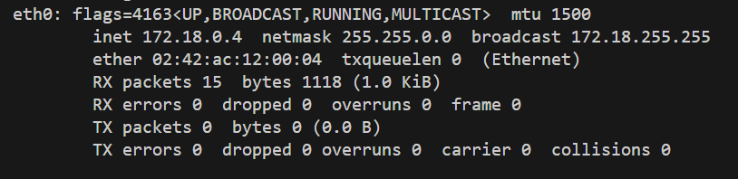
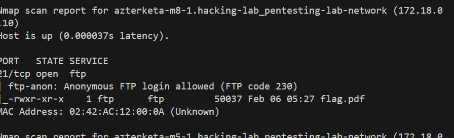
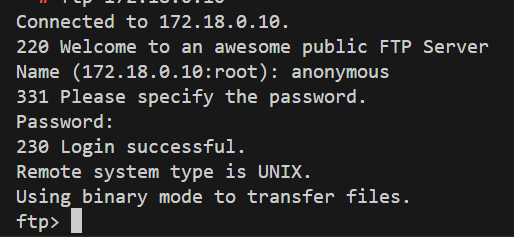
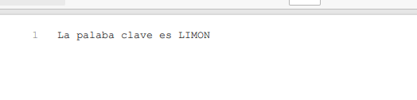
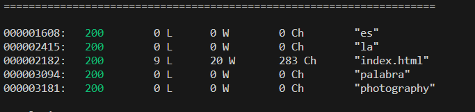
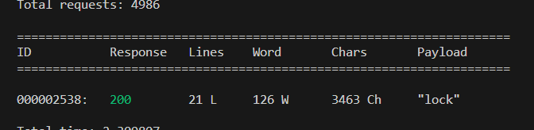
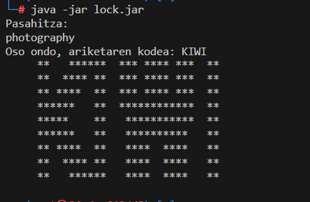

# Sarea aztertu nmapekin

- [Sarea aztertu nmapekin](#sarea-aztertu-nmapekin)
  - [Lehen kodea FTP zerbitzariak](#lehen-kodea-ftp-zerbitzariak)
  - [Bigarren kodea webgunea](#bigarren-kodea-webgunea)

Kali makinan sartu garela eta azterketako kontendoreak sarean altzatuta daudela.

[Apunteak](<../Nmap eta eskaneatze motak.md>)

Ip-a aurkitu eta maskara:
```bash
ifconfig
```



Sarearen id-a beraz 172.18.0.0 eta CIDRa /16

```bash
nmap -p- 172.18.0.0/16
```

Azterketaren emaitza ikertuz zera aurki dezakegu:
- Gure kali mankina 
- web zerbitzari bat:
  - azterketa-m5-1 kontendorean 172.18.0.11 arekin
- Zenbait ftp zerbitzari 
  - azterketa-m9-1
  - azterketa-m7-1
  - azterketa-m8-1
  - azterketa-m12-1
- Beste makina batzuk
  - azterketa-m15-1
  - azterketa-m14-1

```bash
Nmap scan report for 172.18.0.1
Host is up (0.0000030s latency).
Not shown: 65533 closed tcp ports (reset)
PORT      STATE SERVICE
111/tcp   open  rpcbind
54973/tcp open  unknown
MAC Address: 02:42:D2:93:99:35 (Unknown)

Nmap scan report for azterketa-m9-1.hacking-lab_pentesting-lab-network (172.18.0.2)
Host is up (0.0000030s latency).
Not shown: 65534 closed tcp ports (reset)
PORT   STATE SERVICE
21/tcp open  ftp
MAC Address: 02:42:AC:12:00:02 (Unknown)

Nmap scan report for azterketa-m15-1.hacking-lab_pentesting-lab-network (172.18.0.3)
Host is up (0.0000030s latency).
All 65535 scanned ports on azterketa-m15-1.hacking-lab_pentesting-lab-network (172.18.0.3) are in ignored states.
Not shown: 65535 closed tcp ports (reset)
MAC Address: 02:42:AC:12:00:03 (Unknown)

Nmap scan report for azterketa-m7-1.hacking-lab_pentesting-lab-network (172.18.0.5)
Host is up (0.0000040s latency).
Not shown: 65534 closed tcp ports (reset)
PORT   STATE SERVICE
21/tcp open  ftp
MAC Address: 02:42:AC:12:00:05 (Unknown)

Nmap scan report for azterketa-m10-1.hacking-lab_pentesting-lab-network (172.18.0.6)
Host is up (0.0000030s latency).
Not shown: 65534 closed tcp ports (reset)
PORT   STATE SERVICE
21/tcp open  ftp
MAC Address: 02:42:AC:12:00:06 (Unknown)

Nmap scan report for azterketa-m11-1.hacking-lab_pentesting-lab-network (172.18.0.7)
Host is up (0.0000030s latency).
Not shown: 65534 closed tcp ports (reset)
PORT   STATE SERVICE
21/tcp open  ftp
MAC Address: 02:42:AC:12:00:07 (Unknown)

Nmap scan report for azterketa-m12-1.hacking-lab_pentesting-lab-network (172.18.0.8)
Host is up (0.0000030s latency).
Not shown: 65534 closed tcp ports (reset)
PORT   STATE SERVICE
21/tcp open  ftp
MAC Address: 02:42:AC:12:00:08 (Unknown)

Nmap scan report for azterketa-m14-1.hacking-lab_pentesting-lab-network (172.18.0.9)
Host is up (0.0000030s latency).
All 65535 scanned ports on azterketa-m14-1.hacking-lab_pentesting-lab-network (172.18.0.9) are in ignored states.
Not shown: 65535 closed tcp ports (reset)
MAC Address: 02:42:AC:12:00:09 (Unknown)

Nmap scan report for azterketa-m8-1.hacking-lab_pentesting-lab-network (172.18.0.10)
Host is up (0.0000030s latency).
Not shown: 65534 closed tcp ports (reset)
PORT   STATE SERVICE
21/tcp open  ftp
MAC Address: 02:42:AC:12:00:0A (Unknown)

Nmap scan report for azterketa-m5-1.hacking-lab_pentesting-lab-network (172.18.0.11)
Host is up (0.0000030s latency).
Not shown: 65533 closed tcp ports (reset)
PORT    STATE SERVICE
80/tcp  open  http
443/tcp open  https
MAC Address: 02:42:AC:12:00:0B (Unknown)
```

## Lehen kodea FTP zerbitzariak

Zenbait ftp zerbitzari daude eta erabiltzaile ez pasahitzei buruzko informaziorik ez da ematen enuntziatuan. Nmapen script bat erabiliko dugu ea baten bat zabalik dagoen ikusteko.

[Title](<../Zerbitzu enumerazioa FTP, SSH, HHTP, SMB.md>)

```bash
nmap --script ftp-anon -p21 172.18.0.0/16
```

Emaitzean ikus daieke bat zabalik dagoela
  - azterketa-m8-1 kontenedorea 172.18.0.10 iparekin
  


Ftp zerbitzarira konektatu eta logeatu, anonymou/anonymous bezala
```bash
ftp 172.18.0.10
```



Deskargatu pdf fitxategia:

```bash
ls
get flag.pdf
exit
cp flag.pdf /root/scan-output
```
Kopiatu volumen bat geneukan karpetara eta pdfa zabaldu kodea ikusteko.



## Bigarren kodea webgunea

Aurreko eskanotik badakigu zein den zerbitzaria. Fuzzing erabiliko dugu azterketaren enuntziatuan aipatzen den dikzionarioa erabiliz.

[Title](<../webguneak aztertzen.md>)

```bash
wfuzz -c --hc=404,403 -t 200 -w /usr/share/SecLists/blob/master/Discovery/Web-Content/common-and-spanish.txt azterketa-m5-1/FUZZ
```



Berdina .jar gehituz.
```bash
wfuzz -c --hc=404,403 -t 200 -w /usr/share/SecLists/blob/master/Discovery/Web-Content/common-and-spanish.txt azterketa-m5-1/FUZZ.jar
```



Lock.jar fitxategia deskargatuko dugu eta exekuzio baimenak eman.

```bash
wget azterketa-m5-1/lock.jar
chmod 777 lock.jar
```

Java instalatu instalatuta ez badaukagu eta exekutatu programa.

```bash
apt install default-jre
java -jar lock.jar
```

pasahitza jarri eta hor daukagu kodea:
