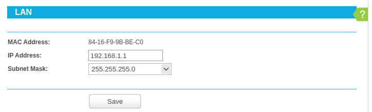
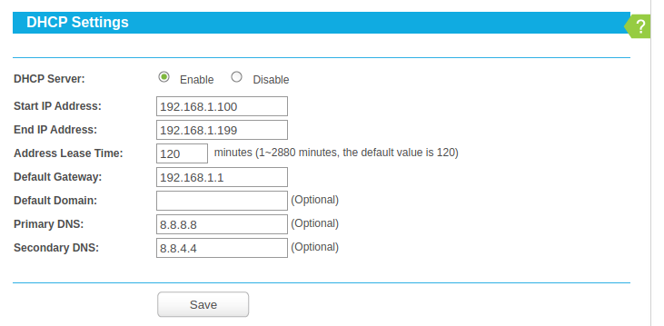
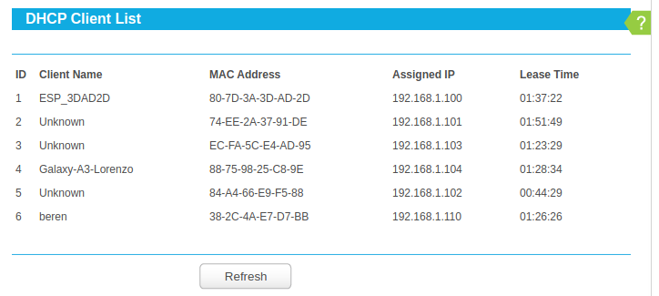
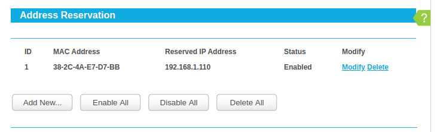
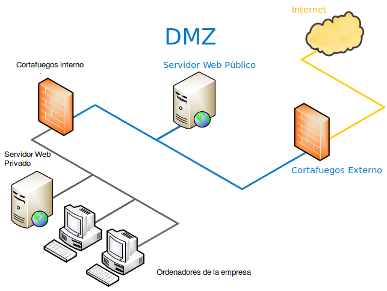
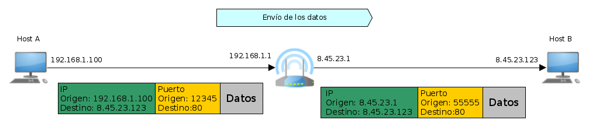
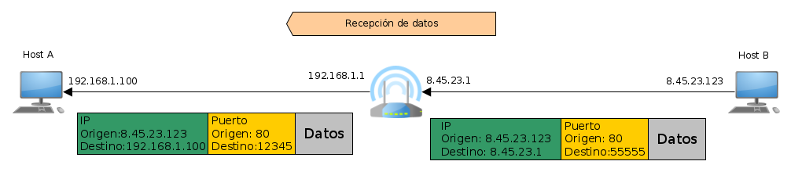

# DNS, DHCP, DMZ, NAT eta Firewallak 

- [DNS, DHCP, DMZ, NAT eta Firewallak](#dns-dhcp-dmz-nat-eta-firewallak)
  - [DNS](#dns)
  - [DHCP](#dhcp)
  - [DMZ](#dmz)
  - [NAT](#nat)


## DNS

Ordu arte beti egiten ditugu probak IPak erabiliz, baina IP bat ez da oso erosoa gizaki batek gogoratzeko. Horregatik, Host baten domeinu-izena sortzen da, gizaki batentzako gogoratze-izen sinple bat besterik ez dena. Eta domeinu-izen bat IP bati lotzen diona. 

Domeinuen adibide batzuk:
- www.google.es
- tolosaldea.hezkuntza.net/

Domeinu-izen batek IP bakarra izan dezake; izan ere, bat baino gehiago balitu, ez genuke jakingo zer erabili, baina IP berak hainbat domeinu izan ditzake. Hau da, Host berak domeinu-izen bat baino gehiago izan ditzake. Hori normala da, ordenagailu berean domeinu desberdinetako orriak jartzen baitira kostu ekonomikoak aurrezteko.

Horren ondorioz, DNS zerbitzari *"prozesuak"* sortu ziren. DNS zerbitzari bat domeinu-izena bidaltzen diogun zerbitzari bat da, eta bere IPa itzultzen digu.

Informazio gehiago:
- [DNS](https://es.wikipedia.org/wiki/Sistema_de_nombres_de_dominio)
- [Como funciona internet dns](https://www.xatakamovil.com/conectividad/como-funciona-internet-dns)

DNS protokoloa oso erraza da, UDP bidez bidaltzen da gure DNS zerbitzariaren 53 portura domeinu-izen bat eta IPa itzultzen digu. Ez gara sartuko DNS protokoloaren formatuan. Xehetasun bat da, lehenik eta behin, gure DNS zerbitzariaren IP jakin behar dugu. Beraz, eskuz ezarri behar da, lotura-atearekin egiten genuen bezala.

Linux erabiltzen ari den DNS zerbitzariak jakiteko, `systemd-resolve --status`:

```bash
Global
          DNSSEC NTA: 10.in-addr.arpa
                      16.172.in-addr.arpa
                      168.192.in-addr.arpa
                      17.172.in-addr.arpa
                      18.172.in-addr.arpa
                      19.172.in-addr.arpa
                      20.172.in-addr.arpa
                      21.172.in-addr.arpa
                      22.172.in-addr.arpa
                      23.172.in-addr.arpa
                      24.172.in-addr.arpa
                      25.172.in-addr.arpa
                      26.172.in-addr.arpa
                      27.172.in-addr.arpa
                      28.172.in-addr.arpa
                      29.172.in-addr.arpa
                      30.172.in-addr.arpa
                      31.172.in-addr.arpa
                      corp
                      d.f.ip6.arpa
                      home
                      internal
                      intranet
                      lan
                      local
                      private
                      test
 
Link 3 (docker0)
      Current Scopes: none
       LLMNR setting: yes
MulticastDNS setting: no
      DNSSEC setting: no
    DNSSEC supported: no
 
Link 2 (enp2s0)
      Current Scopes: DNS
       LLMNR setting: yes
MulticastDNS setting: no
      DNSSEC setting: no
    DNSSEC supported: no
         DNS Servers: 8.8.8.8
                      8.8.4.4
          DNS Domain: ~.
```

Ikusten dugu azken lerroetan "DNS Servers" agertzen dela, eta ikusten dugu bi DNS daudela, zeinen IPak "8.8.8.8" eta "8.8.4.4" diren.

Ez dugu ikusiko nola ezarri DNS zerbitzariak Ubuntun, baina ikuspenen bat behar baduzue, gogoratu **netplan** izeneko tresna bat erabiltzen dela.

Guretzat DNS eskaera bat "dig" agindua domeinu izenarekin erabiltzen da.

```bash
logongas@beren:~$ dig www.fpmislata.com +short
87.98.231.18
```

Pentsa dezakegu "dig" agindua ez dela oso erabilgarria, baina batzuetan sare-arazoak izaten dira, eta DNSek funtzionatzen duten jakiteko, agindu hori erabil dezakegu.

Batzuetan, gure ordenagailuan DNS zerbitzari bat izatea interesatzen zaigu, adibidez, gure XBoxeko IPra konektatzen bagara, edo SmartTVra, etab. Horrela, IP bidez sartu beharrean, izenaren bidez sar gaitezke. DNS zerbitzari oso bat muntatzea, konplexua ez bada ere, irakasgaiaren helburutik haratago dago. Baina IP bat domeinu-izen batekin lotzeko oso modu erraza dago. **"/etc/hosts" **izeneko fitxategi bat IParekin eta domeinu-izenarekin betetzea besterik ez da.

```bash
logongas@beren:~$ cat /etc/hosts
127.0.0.1   localhost
192.168.1.110   beren
 
# The following lines are desirable for IPv6 capable hosts
::1     ip6-localhost ip6-loopback
fe00::0 ip6-localnet
ff00::0 ip6-mcastprefix
ff02::1 ip6-allnodes
ff02::2 ip6-allrouters
```
Hor ikusten denez, "127.0.0.1" erabili beharrean, domino "localhost" izena erabil daiteke, baita "beren" domino izena ere, 192.168.1.106 IPari lotua.

Beraz, gure XBox-ak 192.168.1.67 IP badu, adibidez, "/etc/hosts" fitxategiari honako hau gehitu beharko litzaioke:

```bash
192.168.1.67 xbox
```
Eta xbox izena erabil genezake. Teknika horren alde txarra da "/ etc/hosts" fitxategia aldatu dugun ordenagailutik bakarrik funtzionatzen duela; beraz, mugikor batetik ezingo genuke "xbox" izena erabili. Beraz, ez da zoragarria, baina arazoren batetik ateratzeko, balio dezake.

## DHCP

Internet bidez komunikatu ahal izateko, informazio hau behar dugula ikusi dugu:

- Gure ordenagailuaren IPa
- Sareko maskara
- Lotura-atea
- DNS zerbitzarien IPak

Jakina, hori guztia eskuz jartzea bideraezina da, beraz, sistema eragilea hastean informazio hori guztia lortzea ahalbidetzen duen DHCP protokoloa sortzen da. Horretarako, DHCP zerbitzari bat egon behar da gure sarean. Gure etxean zerbitzari hori gure routerraren barruan dago. DHCP protokoloak Etherneten gainean funtzionatzen du, eta ez IPn, TCPn edo UDPn, hori baita, hain zuzen ere, konfiguratu nahi duguna.

Zergatik da garrantzitsua DHCP zerbitzaria? Gure etxeko routerrean sartu eta konfigurazioa alda dezakegulako.

Hurrengo irudian router baten barne-sareko IParen konfigurazioa ikusten da:



LANen konfigurazioak routerraren barne-sarea nolakoa izango den adierazten du, eta datu horiek DHCP zerbitzariak eman dezakeen IPen tartea mugatuko dute.

- IP Address: Routerrak barne-sarean izango duen IPa da
- Subnet Mask: Barneko sareko maskara da




Hona hemen DHCP zerbitzariak itzuliko dituen datuen balioak

- **Start IP Adress eta End IP Address**: IPen tarte bat da. Routerrak soilik IPak esleituko dizkie tarte horretan dauden IPen DHCP bidezko hostei. Hau da, DHCP bidez ezin da sareko edozein IP eduki, baizik eta tartean sartutakoren bat bakarrik. Jakina, LAN konfiguratzean definitu zen sarearen barruan egon behar du tarteak.
- **Default Gateway**: Lotura-atea DHCP bidez eskatzen duten Hostek izango duten lotura-atea da. Normalena routerraren beraren IParekin bat etortzea da.
- **Primary DNS**: Hostek erabiliko duten DNS zerbitzariaren IPa
- **Secondary DNS**: Hostek erabiliko duten DNS zerbitzariaren IPa, DNSren zerbitzari primarioa erorita badago.

DHCP zerbitzari bat Host berari beti IP bera ematen saiatuko da (badaki Hosts bera dela bere MAC helbideagatik), baina ez du horretarako betebeharrik. Horregatik esaten da DHCP bidezko hostek IP dinamiko bat dutela, edozein unetan alda baitaiteke. Bestalde, Host batean IPa eskuz ezartzen badugu, IP estatiko bat duela esaten da, ez baita aldatuko, erabiltzaileak aldatzen ez badu.

Router baten hurrengo irudian, DHCP zerbitzariak MAC bakoitzari eman dizkion IPak eta MACak dituen taula ikusten da. Horrela, MAC berari IP bera ematen saia daiteke ordenagailuak IP bat abiarazi eta eskatzen duen hurrengoan.



Azkenik, zirkuluaren koadratura dugu, hau da, DHCP duen IP finko bat eduki ahal izatea. Nola egiten da? Ba oso erraza da, IP erreserbatuko dugu esanez IP hori MAC jakin bati bakarrik emango diogula. Router baten hurrengo irudian ikus dezakegu IP 192.168.1.110 beti MAC 38-2C-4A-E7-D7-BBri emango zaiola.



DHCPk nola funtzionatzen duen ikusi ondoren, zer erabilgarritasun du hori guztia aldatzeko? Hainbat erabilera daude.

- **IP estatikoak eskuz**. IP estatiko bat duen gailuren bat izan nahi badugu gure sarean. Adibidez, XBox delakoak ezin du DHCP zerbitzariaren barrutiaren barruan dagoen IPrik erabili, eta, beraz, zer maila duen jakin behar da. Horrek esan nahi du, halaber, DHCP zerbitzariaren barrutiak ez duela dena erabiltzen hemen sarearen mailan. Eta konfiguratuta dagoen moduari erreparatzen badiogu, lehenengo IPa 192.168.1.100 urtean hasten da, eta azkena 192.168.1.199 urtean. Oker pentsatuz gero, lehenengoa zergatik ez zen 192.168.1.2 5) eta azkena zergatik ez zen 192.168.1.2546). Hau da, normalean sareko tarteren bat libre uzten da IP estatikoetarako. Baina, jakina, aukerakoa da.
- **IP estatikoak DHCP bidez**: IP estatiko bat izateko esan dugun bezala, baina eskuz idatzi beharrean DHCP zerbitzarian gorde dezakegu MAC horretarako.
- **DNS pribatutasuna**: DNS protokoloa ikustean esan genuen "espiatzen" gaituztela ebazten ditugun domeinu-izenak jakinda. Beraz, interesgarria da erabiltzen ditugun DNS zerbitzariak aldatu ahal izatea.
- **DNS abiadura**: Nabigatzen ari garenez, domino izenak ebazten ari gara etengabe. Horregatik, batzuetan, DNS zerbitzariak aldatu nahi izaten ditugu, eta gero eta arinagoak diren beste zerbitzari batzuk jarri.


## DMZ

Suebakiekin jarraituko dugu, baina orain ikusiko dugu zein kasutan nahi dugun Internetetik gure zerbitzariren batera konektatzea. Kasurik ohikoena da gure enpresan web-zerbitzari bat eduki nahi izatea. Gure web zerbitzarira konexioak baimentzearen arazoa da hackeatua izateko aukera dagoela. Eta behin Web zerbitzarian sartuta, hortik gure sareko gainerako ordenagailuetara sar daitezke. Hori saihesteko, sarea eremu desmilitarizatua edo DMZ sortuz antolatzen da.

DMZ azaltzeko, ikus ditzagun gure enpresan ditugun ordenagailuak:


| Zerbitzaria | Erabilera | Sarbidea nondik |
| --- | --- | --- |
| Web zerbitzari publikoa | Gure enpresaren informazio publikoa ostatatuta dagoen zerbitzaria da. Edozein webguneren ohiko webgunea da. | Internet | 
| Web zerbitzari pribatua | Gure enpresaren informazio pribatua dagoen zerbitzaria da. Gure enpresako Barne Saileko bezero, salmenta, erosketa, kontabilitate eta abar guztiak biltzen dituen webgunea da. | Enpresaren barnetik | 
| Enpresaren beraren ordenagailuak | Langileek erabiltzen dituzten ordenagailuak dira | Enpresaren barnetik | 


Nola antolatzen dugu sarea aurreko taulan jarri duguna bete dadin? Izan ere, hurrengo irudian dena nola geratzen den ikusten da:



Garrantzitsuena da orain bi suebaki daudela:

- **Kanpoko suebakia**: Web zerbitzari publikorako diren 80 eta 443 atakarako sarrera bidezko konexioak soilik baimentzen ditu.
- **Barneko suebakia**: Ez du sartzen uzten.

Hau da, barruko suebakiak ez du kanpoko konexiorik baimentzen. Beraz, kanpotik hackeatu dezakete, ez enpresako ordenagailuetara, ezta web zerbitzari pribatura ere. Baina guztiak sare berean daudenez, inolako arazorik gabe komunika daitezke beren artean. Bestalde, kanpoko suebakiak web zerbitzari publikorako konexioak bakarrik ahalbidetzen ditu. Hori dela eta, web zerbitzari publikoa hackeatu egin daiteke, baina hori gertatuko balitz, ez lituzke arriskuan jarriko ez web zerbitzari pribatua ez enpresako ordenagailuak. Bestalde, enpresako ordenagailuetatik beti sar daiteke zerbitzari publikoan (eta, jakina, baita Interneten ere), barneko suebakiak irteerako konexioak ahalbidetzen baititu.

Beraz, DMZ sare bat baino ez da, non zerbitzari bat edo gehiago dauden, non suebakiak Internetetik sartzeko konexioak ahalbidetzen dituen, baina hackeatuz gero enpresako gainerako ordenagailuak arriskuan jartzen ez dituena. Izan ere, azken horiek beste suebaki batekin babestuta daude.

## NAT


NAT sortzen da, zeren eta $2^{32}$ IP helbideak ez dira nahikoa munduko Host guztientzat. Beraz, "trikimailu" bat egin zuten IP baino Internetera konektatutako Hosts gehiago izateko. Hau da, gaur egun 4.294.967.296 Hosts baino gehiago daude Interneten.


Hori guztia azaltzeko, gure etxea erabiliko dugu adibide gisa. Internet kontratatzen dugunean, operadoreak IP bakarra esleitzen dio gure etxeari. Duela 20 urte hori ez zen arazo bat, ez baitzegoen Interneteko mugikorrik, ez kontsolak Internetera harremanetan jartzen zirenik, etab. Beraz, ordenagailu bakar batek behar zuen Interneterako sarbidea. Garai hartan, gure telekomunikazio-operadoreak esleitzen zigun IP hori zen gure ordenagailuak zuena, eta ez zegoen router bat, ez baitzuen zentzurik, gure etxean ordenagailu bakarra baitzegoen.

Baina denbora pasa zen eta gure etxean Host bat baino gehiago edukitzen hasi ginen Internetera konektatuta, baina IP eskasia zela eta, gure telekomunikazio operadoreak IP bakarra ematen zigun. IP hori da orain IP Publikoa deitzen duguna. IP "normala eta arrunta" dela esan dezakegu.

Baina, orduan, IPek gure etxeko gainerako aparatuak zituzten? Kasu horretan, eraldaketa hau egin zen:

Gure operadoreak router bat ematen zigun, orain Host batzuk genituelako eta erroterrak datagramak Hosts bakoitzera bideratu behar zituelako.

IP publikoa Interneterako bideratzailearen sare-interfazeari esleitzen zaio.

Gure Hosts bakoitzak IP pribatu bat zuen.
Routerrak IP pribatu bat ere badu

Zer esan nahi du IP pribatu batek? Interneten nabigatu ezin duen IP bat da, ez baita bakarra. Edonor da zure etxea gure IP bera izan dezake. Hauek dira IP pribatuak:

- 10.0.0.0tik 10.255.255.255era
- 172.16.0.0tik 172.31.255.255era
- 192.168.0.0-192.168.255.255

Normalean, gure etxean 192.168.1.0/24 motako sarea izaten dugu. Horrek esan nahi du, adibidez, 192.168.1.100 IPa milaka eta milaka pertsonak izan dezaketela etxeko ordenagailuetan. Beraz, routerren batek IP hori duen datagrama bat bidaliko balu, gainerako routerrek ez lukete jakingo milaka eta milaka etxeetatik zeini bidali beharko litzaiokeen; beraz, datagrama horiek baztertu egiten dira beti.

Baina, nola nabigatu dezakegu Interneten egunero, IP pribatu bat izanda ere? Ba NATi esker. NAT routerretan jarri zuten trikimailu bat da, IP pribatu bat duen Host batek Interneten nabigatu ahal izateko.

Adibide batekin azalduko dugu: Host A-k konexio bat hasten du Host B-ren zerbitzariarekin routerretik pasatuz.

Hurrengo irudietan, Host A-tik Host B-ra eta gero alderantziz bidaltzen diren segmentuak ikusiko ditugu.



Datuak Host A-ra bidaltzean, ikus dezakegu Host A-k bidaltzen duen TCP segmentua "normala" dela TCP segmentuan espero genituzkeen IP eta atakekin, baina routerrak Host B-ra bidaltzen duen TCP segmentua ikusten badugu, jatorrizko IPa aldatu egin dela ikusten dugu, routerraren IP publikoa da eta ataka ere ez da bera. Zergatik gertatu da hori? Argi zegoen 192.168.100eko IP pribatua ezin zela routerretik atera, beraz, beste IP bat jarri behar zen eta posible zen bakarra routerraren IP publikoa da. Ikusten dugu, halaber, portua aldatu egiten dela; izan ere, aipatu dugun bezala, jatorrizko portua ez da garrantzitsua.




Ikus dezagun orain erantzuna Host B-tik Host B-k bidaltzen duen TCP segmentua, Host B-k dakienerako itxarongo genukeena da. Hau da, B host-ak uste du erantzuna Routerraren IP publikorako dela, nahiz eta benetan Host A-rako joan.

Baina orain dator interesgarria dena, TCP segmentua routerrera iristen zaionean, helmugako IP routerraren beraren IP publikoa izan arren, berak badaki ez dela berarentzat segmentu hori, baizik eta Host A. Beraz, TCP segmentua Host A-ra birbidaltzen duenean, routerrak IP destinoa aldatzen du Host A-rena izan dadin.

Hau da, NAT duen router batek honako hau egiten du 8. IPekin):

- Irteera-segmentuetan: Jarri jatorrizko IP gisa routerraren IP publikoa, routerrera ordenagailu baten jatorri pribatuko IP batekin iristen baitzaizkio.
- Sarrera-segmentuetan: Helmugako IP gisa komunikatu nahi genuen ordenagailuarena jarri, routerrera routerraren IP publikoarekin iristen baitzaizkio
  
Aldaketak ez dirudite oso zailak, baina arazoa sarrerako segmentuetan dago. Nola daki routerrak zein ordenagailutara doan segmentu hori, IP destinoa routerraren publikoa bada? Hau da arazoaren gakoa. Azaldu dezagun berriro arazoa. Host B-k itzulerako datuak bidaltzen dituenean, xede-ip routerraren IP publikoa da. Nola daki routerrak ez doala routerrera? Eta nola dakizu zure barne-sareko ordenagailu guztietatik zeinetara doan segmentu hori?

Erantzuna erraza da, badakizu, lehenengo Host B-ra segmentu bat bidali zuelako, Host A.tik zetorrena. Beraz, datuak itzultzen direnean, badaki Host A.rentzat dela. Beraz, hori da garrantzitsuena. Host A-k konexioa hasi behar du, horrela routerrak jakingo baitu noiz iristen diren Host A.ak egiten dituen datuak. Eskaera hasten duenaren informazio hori, ondoren, helmugako ostatutik datuak bidaltzen direnean, Hostek barne-saretik entregatzera, "NAT taula" deritzonean gordetzen da.

Baina horrek arazo bat sortzen digu. Zer gertatzen da kanpoko norbaitek gure barne-sareko zerbitzari batera konektatu nahi badu? Hau da, orain konexioa Host B-tik Host A-ra hasten bada. Ba, besterik ezean, ezin du! Eta hori ona da, ez baikenuen nahi Interneteko edozein puntu desegitea norbait gure zerbitzarietara konektatu ahal izateko. Beraz, NAT izatean, zeharka suebaki bat sortu dugu.
