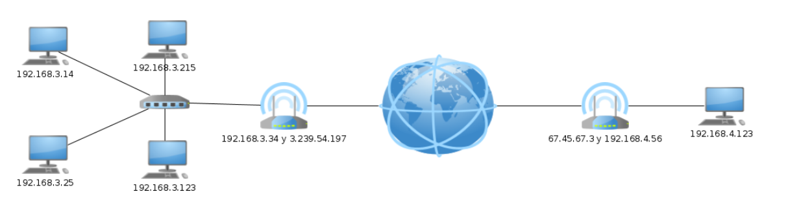

# IP protokoloa

- [IP protokoloa](#ip-protokoloa)
  - [IP helbideak](#ip-helbideak)
  - [Sare motak](#sare-motak)
  - [Routerra](#routerra)
  - [IP protokoloa](#ip-protokoloa-1)
  - [Gatewaya](#gatewaya)
  - [Bideratze taula](#bideratze-taula)
- [Adibidea](#adibidea)
- [Ariketak](#ariketak)
  - [1. Ariketa](#1-ariketa)
  - [2. Ariketa](#2-ariketa)
  - [3. Ariketa](#3-ariketa)
  - [4. Ariketa](#4-ariketa)
  - [5. Ariketa](#5-ariketa)
  - [6. Ariketa](#6-ariketa)
  - [7. Ariketa](#7-ariketa)
  - [8. Ariketa](#8-ariketa)
  - [9. Ariketa](#9-ariketa)

## IP helbideak

Hurrengo komandoak ip *inet* 172.17.0.2 erakusten du, eta Interneteko protokoloa erabiltzen duen sare batean ekipoa identifikatzen duen ip pribatua da.

## Sare motak

Hurrengo irudian, lau ordenagailu , switch bat eta router bat dituen sare bat ikusiko dugu. Lau ordenagailuek antzeko IPak dituzte, guztiek dute amankomunean `192.168.3`. Beraz, sarea `192.168.3.0/24` da.

Sareko IDa `192.168.3.0` izango litzateke eta broacast helbidea `192.168.3.255`. Hau da, sareko maskaran zerora dauden bit guztia (ip-an alda daitezken bitan, kasu honetan azken zortziak, maskara 255.255.255.0 baita) zerora dauzkanean ID-a izango da eta batera daudenean, broadcast helbide. Beste guztiak, dakizuenez, host erabilgarriak izango dira.

| Sare Helbidea | Broadcast Helbidea     | Host baten helbidea  |
|--------------|-----------------------|--------------------|
| 192.168.3.0/24  | 	192.168.3.255   | 192.168.3.77        |

## Routerra

Orain ordenagailu berri bat gehituko dugu Interneten `beste aldean`

Ordenatu berri horrek `192.168.4.123` IPa du. Badakigu sarea C motakoa zela, beraz, sarearen helbidea `192.168.4.0/24` da. Routerrak `192.168.4.56` helbidea du.

Baina router bakoitzak 2 IP dituela ikus dezakegu, hau da, bi sare desberdinetara konektatuta dagoelako eta sare bakoitzean IP desberdinak dituelako. Sare-interfazeak izeneko bi sare-txartel ere izan behar ditu.

- **A Routerra** (ezkerrekoa)

| **IP**	| **Mascara**	| **Interfaz de red** |
|--------------|-----------------------|--------------------|
|192.168.3.34	| 255.255.255.0	| eth0 |
|3.239.54.197	| 255.255.255.0	| eth1 |

- **B Routerra** (eskumakoa)

| **IP**	| **Mascara**	| **Interfaz de red** |
|--------------|-----------------------|--------------------|
|67.45.67.3	| 255.255.255.0 |	eth0 |
|192.168.4.56 |	255.255.255.0 |	eth1 |

Linuxen `ifconfig` komandoa erabiliz, ditugun sare-interfaze guztiak ikusi ahal izango ditugu. Hala ere, orain `enp2s0` deitzen zaie, `eth0` deitu beharrean. Izena zergatik aldatu den jakiteko, [ikus hurrengo esteka](https://juncotic.com/eth0-enp0s3-nombres-interfaces-red-linux/). Baita [Linuxeko sare-interfazeen izenak eta zergatik aldatu dute sareko interfazeen izena Linuxen](https://hardlimit.com/por-que-han-cambiado-el-nombre-de-las-interfaces-de-red/)

Gogora dezagun une batez Ethernet zertan ari zen. Ethernet Kable batekin zuzenean konektatuta dauden bi ordenagailu (edo Hosts ere deituak) komunikatzeko aukera ematen zuen. Gogoratu Switch batek ordenagailuak zuzenean konektatzen dituela (enchufe elektrikoen erregeleta bat bezala da)

Orduan, ethernet bidez ezin da zuzenean komunikatu `192.168.3.123` host-a `192.168.4.123` host-arekin, fisikoki sare desberdinetan baitaude. Nola bidaltzen da informazioa orduan? Routerren bidez. Esan dezakegu router batek bi sare desberdin konektatzen dituela.

Nola dakigu bi ordenagailu sare desberdinetan daudela? Zure sareko helbidea desberdina delako. Kalkulua egiteko, sare-helbidea eta sare-maskara erabili behar dira.

## IP protokoloa

IP protokoloa routerrek eta ordenagailuek duten softwarea besterik ez da, Interneteko ordenagailu batetik bestera informazioa bidaltzeko aukera ematen duena, zuzenean konektatuta egon gabe. Etherneten zerbait bidaltzen genuen bakoitzean Ethernet paketeen bidez egiten bazen, IP protokoloan **Datagramak** bidaltzen ditugu. [IP protokoloa](http://es.wikipedia.org/wiki/Internet_Protocol)

Ikus dezagun informazioa duen datagrama bat bidaltzeko erabiltzen den algoritmoa.

1. Gure IParen (jatorrizko IP) eta datuak bidali nahi dizkiogun IParen (helmugako IP) arabera, sare berean dauden egiaztatuko dugu.
   1. Sare berean badaude, zuzenean bidaltzen dira
   2. Sare berean ez badaude, routerrera bidaltzen dira (Gateway edo puerta de enlace deritzona).
2. Routerrera iritsitakoan, begiratu datagramaren helmuga IPa.
   1. IPa sare berean badago, zuzenean bidaliko da
   2. Helburuko IP sare berean **EZ** badago, begiratu bideratze-taulan zer routerretara bidali, datagrama birbidali eta 2. urratsera itzuliko gara
   3. Bideratze-taularen arabera datagrama emateko routerrik ez badago, datagrama hori galduko da

Irudia et azaldutako protokoloa jarraitzu, irudian sarea osatzen duten router guztiak erakusten dira.

Ikus dezagun nola bidaltzen den datagrama bat `192.168.3.25` ordenagailutik `192.168.4.123` ordenagailura.

1. Ordenagailuak ikusten du datuak beste sare bateko ordenagailu batera doazela, eta, beraz, Gatewayra bidaltzen du, hau da, A routerrera (192.168.3.34).
2. A routerrak datagrama bere sareko ordenagailu batentzat ere ez dela egiaztatzen du, eta, bideratze-taularen arabera, D routerrera bidaltzen du (3.239.54.45)
3. D routerrak datagrama bere sareko ordenagailu batentzat ere ez dela egiaztatzen du, eta, bideratze-taularen arabera, B routerrera bidaltzen du (67.45.67.3)
4. B routerrak datagrama bere sareko ordenagailu batentzat dela egiaztatzen du, beraz, zuzenean 192.168.4.123 IPra bidaltzen du

## Gatewaya 

Pasabidea (Puerta de enlace edo Gateway ere esaten zaio) datagramak bidaltzeko defektuzko routerraren IPa baino ez da.

Ikus dezagun orain ordenagailu batzuen lotura-atea

| **IP Ordenador**	 | **IP Puerta de enlace** |
|--------------|-----------------------|
| 192.168.3.215	| 192.168.3.24
| 7.8.9.1	| 7.8.9.2  |
| 192.168.4.123	| 192.168.4.56  |

*❕ Adi nola, gateway Ipa beti ordenagailuaren sare berdinean dagoela.*

## Bideratze taula

Bideratze taula batek solik ezartzen du zein Routerrera bidali behar den ip bakoitza.

- **Router A**-re bideratze taula

| Helmuga       | Maskara         | Gatewaya     | Interfazea | Azalpena                                       |
|---------------|-----------------|--------------|----------|---------------------------------------------------|
| 192.168.3.0   | 255.255.255.0   | 0.0.0.0   | eth0     | Sare berdineko helbideak 192.168.3.0/24      |
| 3.239.54.0    | 255.255.255.0   | 0.0.0.0  | eth1     | Sare berdineko helbideak 3.239.54.0/24       |
| 51.13.45.0    | 255.255.255.0   | 0.0.0.0  | eth2     | Sare berdineko helbideak 51.13.45.0/24       |
| 109.56.45.0   | 255.255.255.0   | 3.239.54.45  | eth1     | eth1-tik D routerrera bidaltzen du 109.56.45.0/24 sarerako denean |
| 7.8.9.0       | 255.255.255.0   | 3.239.54.45  | eth1     | eth1-tik D routerrera bidaltzen du 7.8.9.0/24 sarerako denean  |
| 67.45.67.0    | 255.255.255.0   | 3.239.54.45  | eth1     | eth1-tik D routerrera bidaltzen du 67.45.67.0/24 sarerako denean |
| 192.168.4.56  | 255.255.255.0   | 3.239.54.45  | eth1     | eth1-tik D routerrera bidaltzen du 192.168.4.56/24 sarerako denean |
| 0.0.0.0   | 0.0.0.0         | 51.13.45.91  | eth2     | Nora bidali ez dakienena, eth2 interfazetik E routerrera bidaltzen defektuzkoa baita |

- **Router B**-re bideratze taula

| Helmuga       | Maskara         | Gatewaya     | Interfazea | Azalpena                                       |
|---------------|-----------------|-----------|----------|---------------------------------------------------|
| 192.168.4.0   | 255.255.255.0   | 0.0.0.0 | eth1     | Bera sare berdineko helbideetara 192.168.4.0/24      |
| 67.45.67.0    | 255.255.255.0   | 0.0.0.0 | eth0     | Bera sare berdineko helbideetara 67.45.67.0/24       |
| 0.0.0.0  | 0.0.0.0         | 67.45.67.4 | eth0     | Nora bidali ez dakienena, eth0 interfazetik D routerrera bidaltzen defektuzkoa baita |

Zure linuxean proba dezakezu route `-n komandoarekin eta zure bideratze-taula ikusiko duzu. Ikusiko duzunez, routerrena baino sinpleagoa dela.

Etxean ditugunetako router baten bideratze-taula ere ikus dezakegu:

Adibide komplexuago bat horrelakoa izan daiteke:

Azkenik, ikus dezagun Internet benetan nola ikusten den erakusten duen argazki bat [klikatu hemen, hobeto ikusteko](https://logongas.es/lib/exe/fetch.php?cache=&w=900&h=900&tok=ad8543&media=clase:daw:si:3eval:internet_map_1024.jpg):

[Nola garatu den internet](https://www.dailymotion.com/video/x7zz6wq)

[Interneten geografia azaltzen duten 19 mapa](https://magnet.xataka.com/un-mundo-fascinante/19-mapas-que-explican-la-geografia-de-internet)

# Adibidea 

- Bi ordenagailu eta routerren datuak

| Izena              | Ordenagailuaren IPa | Maskara         | Interfazea | Gateway IPa |
|---------------------|----------------|-----------------|-----------|----------------------|
| Ezkerreko ordenagailua | 192.168.3.14   | 255.255.255.0   | eth0     | 192.168.3.34  |
| Eskumanko orgenagailua  | 192.168.4.123  | 255.255.255.0   | eth0   | 192.168.4.56 |
| Router A            | 192.168.3.34   |  255.255.255.0  | eth0      | 56.34.12.1       |
|                     | 192.168.10.2   |  255.255.255.0  | eth1      | 56.34.12.1       |
|                     | 56.34.12.3     | 255.255.255.0   | eth2      | 56.34.12.1       |
| Router B            | 192.168.10.1   |  255.255.255.0  | eth0      | 192.168.10.2     |
|                     | 192.168.4.56   | 255.255.255.0   | eth1      | 192.168.10.2     |

- Ezkerreko ordenagailuaren bideratze taula

| Izena              | Maskara         | Gatewaya         | Interfazea | Azalpena |
|---------------------|----------------|-----------------|-----------|----------------------|
| 192.168.3.0 | 255.255.255.0   | 0.0.0.0   | eth0     | Bere sare berdineko helbideak 192.168.3.0/24 |
|  0.0.0.0   |  0.0.0.0  | 192.168.3.34    | eth0   | Ez dakienean nora bidali defktuzko routerrera bidaltzen du A |

- Eskumanko ordenagailuaren bideratze taula

| Izena              | Maskara         | Gatewaya         | Interfazea | Azalpena |
|---------------------|----------------|-----------------|-----------|----------------------|
| 192.168.4.0 | 255.255.255.0   | 0.0.0.0   | eth0     | Bere sare berdineko helbideak 192.168.3.0/24 |
|  0.0.0.0   |  0.0.0.0  | 192.168.4.356    | eth0   | Ez dakienean nora bidali defktuzko routerrera bidaltzen du B |

- **A** routerraren bideratze taula

| Izena              | Maskara         | Gatewaya         | Interfazea | Azalpena |
|---------------|-----------------|---------------|----------|--------------------------------------------------------|
| 192.168.3.0   | 255.255.255.0   | 0.0.0.0       | eth0     | Bere sareko helbideak 192.168.3.0/24                  |
| 192.168.10.0  | 255.255.255.0   | 0.0.0.0       | eth1     | Bere sareko helbideak 192.168.10.0/24                 |
| 56.34.12.0    | 255.255.255.0   | 0.0.0.0       | eth2     | Bere sareko helbideak 56.34.12.0/24                   |
| 192.168.4.0   | 255.255.255.0   | 192.168.10.1  | eth1     | 192.168.4.0/24 sarearen datuak B router bidez bidaltzen dira |
| 0.0.0.0       | 0.0.0.0         | 56.34.12.1    | eth2     | Non bidali ez dakiten kasuan, C routerrera defektuz   |

- **B** routerraren bideratze taula

| Izena              | Maskara         | Gatewaya         | Interfazea | Azalpena |
|---------------|-----------------|---------------|----------|------------------------------------------------------|
| 192.168.10.0  | 255.255.255.0   | 0.0.0.0       | eth0     | Bere sareko helbideak 192.168.10.0/24               |
| 192.168.4.0   | 255.255.255.0   | 0.0.0.0       | eth1     | Bere sareko helbideak 192.168.4.0/24                |
| 0.0.0.0       | 0.0.0.0         | 192.168.10.2  | eth0     | Non bidali ez dakiten kasuan, A routerrera defektuz |

# Ariketak 

## 1. Ariketa 
Etxeko helbidearen IPa, maskara eta IParen klasea (A, B edo C) adierazi:

- IP       
- Maskara  
- Klasea   

## 2. Ariketa 

Adibideko Router A-ren ezkerrean 3 ordenagailu gehiago gehitu ezkero. Zehaztu zer IP izan daitezkeen.

## 3. Ariketa 

Bete hurrengo taula:

| IP             | Klasea (A, B, C edo loopback) | Sarearen maskara |
|----------------|--------------------------------|-------------------|
| 134.5.34.5     |                                |                   |
| 127.213.56.45 |                                |                   |
| 214.56.123.87 |                                |                   |
| 16.76.196.55  |                                |                   |

## 4. Ariketa 

Bete hurrengo taula:

| IP eta CIDR       | Sarearen maskara |
|-------------------|-------------------|
| 134.5.34.5/4      |                   |
| 127.213.56.45/7   |                   |
| 214.56.123.87/8   |                   |
| 16.76.196.55/24   |                   |

## 5. Ariketa 

Bete hurrengo taula:

| IP             | Sarearen maskara     | CIDR |
|----------------|----------------------|------|
| 134.5.34.5     | 255.0.0.0            |    |
| 127.213.56.45 | 255.0.0.0            |    |
| 214.56.123.87 | 255.255.0.0          |    |
| 16.76.196.55  | 255.255.255.0        |    |

## 6. Ariketa 
Bete hurrengo taula:

| Sarearen Helbidea | Broadcast Helbidea | Host baten Helbidea |
|-------------------|---------------------|---------------------|
|                   |                     |   137.56.21.4     |
|                   |   210.5.234.255     |                     |
| 8.0.0.0/8         |                     |                     |

## 7. Ariketa 

Bete hurrengo taula:

| Sarearen Helbidea   | 1º IP Helbidea      | Azken IP Helbidea   | Host kopuru Maximoa |
|---------------------|---------------------|---------------------|----------------------|
| 34.67.45.0/24       | 34.67.45.1          | 34.67.45.254        | 254                  |
| 123.65.87.0/24      |                     |                     |                      |
| 6.76.0.0/16         |                     |                     |                      |
| 56.34.0.0/16        |                     |                     |                      |
| 78.0.0.0/8          |                     |                     |                      |

## 8. Ariketa

Hurrengo diagrama erabiliz, hurrengo taulak bete:

| IP Ordenagailua    | Maskara          |  Gatewaya     |
|---------------------|------------------|-----------------|
|                    | 255.255.255.0   |  192.168.3.34     |
| 192.168.3.14       | 255.255.255.0    |                 |

- Router A-ren bideratze taula. Betetzeko hainbat lerro daude

| Helburua           | Maskara          | Gatewaya  | Interfazea | Azalpena  |
|--------------------|------------------|-----------|------------|-----------|
|                    | 255.255.255.0   |           |            |           |

- Router B-ren bideratze taula. Betetzeko hainbat lerro daude eta eskumako sareak kontuan hartu behar dira

| Helburua           | Maskara          | Gatewaya  | Interfazea | Azalpena  |
|--------------------|------------------|-----------|------------|-----------|
|                    |  255.255.255.0      |           |            |           |

- Router C-ren bideratze taula. Betetzeko hainbat lerro daude eta sare guztiak kontuan hartu behar dira

| Helburua           | Maskara          | Gatewaya  | Interfazea | Azalpena  |
|--------------------|------------------|-----------|------------|-----------|
|                    |   255.255.255.0 |           |            |           |

## 9. Ariketa
[Ed Graph](https://www.yworks.com/products/yed/download#download) tresna erabiliz, hurrengo sare diagrama sortu:

1. Gutxienez 10 ordenagailu, 3 router eta Interneta izan behar du.
2. Azaldu:
   - Ordenagailuen eta Router-en IPak, maskarak eta gatewayak
   - Ordenagailuen eta Router-en bideratze taulak
   - Datagrama bat ordenagailu batetik bestera nola joango den adibide bat jarri