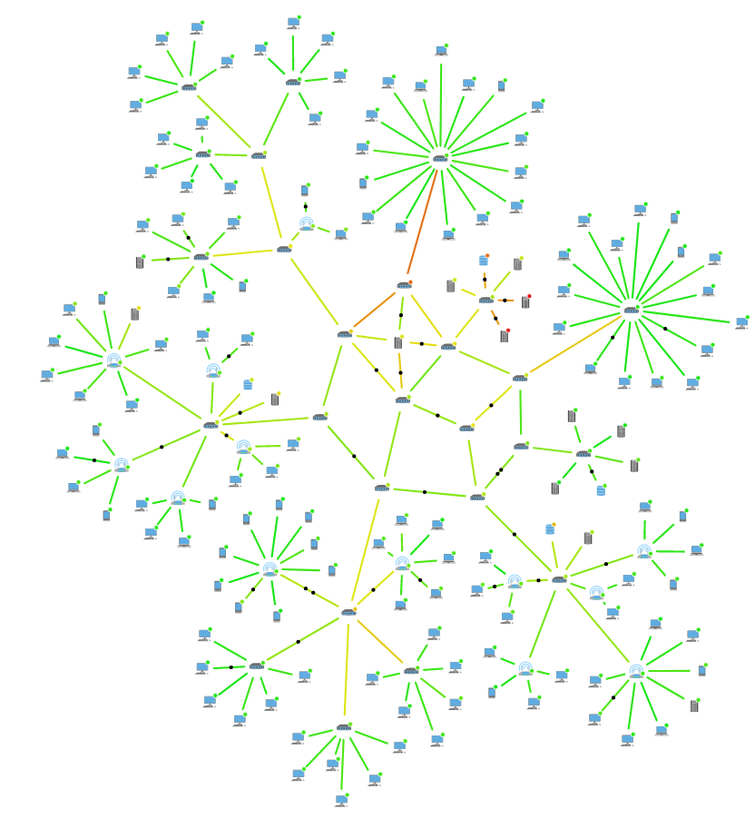
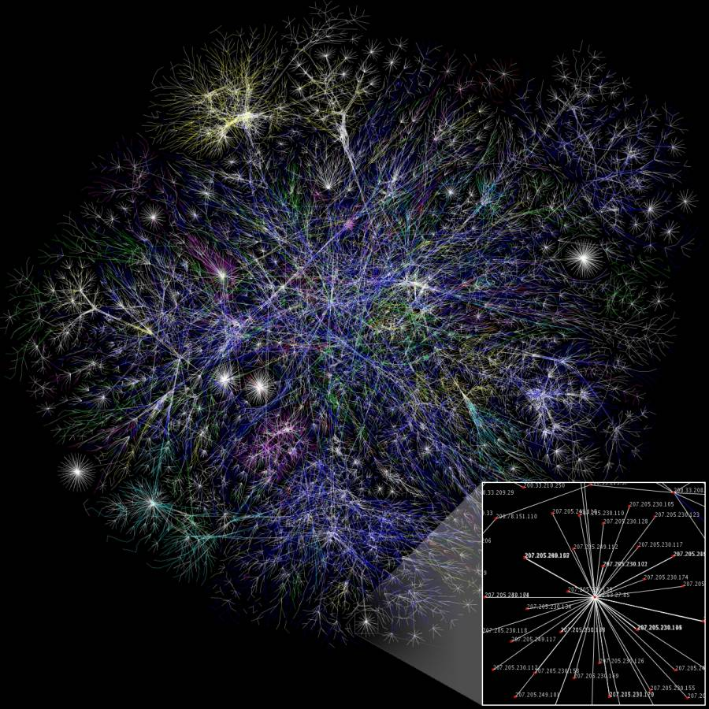

# Sareak

- [Sareak](#sareak)
  - [Sare motak](#sare-motak)
  - [Sare abiadura](#sare-abiadura)
  - [OSI geruzak](#osi-geruzak)
  - [Kableatu egituratua](#kableatu-egituratua)
    - [Lan-eremuko kableak](#lan-eremuko-kableak)
    - [Kable horizontalak](#kable-horizontalak)
    - [Administrazio-kableak (kable-armairua, rack)](#administrazio-kableak-kable-armairua-rack)
    - [Kableatu bertikala](#kableatu-bertikala)
    - [Ekipamendu-kableak](#ekipamendu-kableak)
    - [Kampuseko kableatua](#kampuseko-kableatua)
  - [Ariketak](#ariketak)
    - [1. Ariketa](#1-ariketa)
    - [2. Ariketa](#2-ariketa)
    - [3. Ariketa](#3-ariketa)
    - [4. Ariketa](#4-ariketa)
    - [5. Ariketa](#5-ariketa)
    - [6. Ariketa](#6-ariketa)
    - [7. Ariketa](#7-ariketa)

## Sare motak

|            | Zuntz Optikoa | Kobrezko Kablea     | Huinak              |
|------------|--------------|-----------------------|--------------------|
| Interneta   | FTTH         | Docsis, ADSL, RDSI    | 3G, 4G, 5G         |
| Etxea       | FDDI, Ethernet | Ethernet, Token Ring | Wifi               |

**Zuntz optikoa**: Datuak argi-pultsuen bidez transmititzeko beirazko edo plastikozko kableak erabiltzen dituen komunikazio-sarea da. Abiadura handiagatik eta datu kopuru handiak transmititzeko gaitasunagatik da ezaguna. Abiadura handiko Interneteko konexioetan erabiltzen da, hala nola FTTH (Fiber to the Home).

**Kobrezko kablea:** sare honek kobrezko kableak erabiltzen ditu datuak elektrikoki transmititzeko. Docsis, ADSL eta RDSI bezalako teknologiak barne hartzen ditu, normalean banda zabaleko Interneteko konexioetarako erabiltzen direnak. Hala ere, zuntz optikoaren eta uhinen teknologiak gero eta gutxiago erabiltzen dira.

**Uhinak:** Sare mota honetan, datuak airetik transmititzen dira, kableen beharrik gabe. 3G, 4G eta 5G bezalako teknologiak komunikaziorako uhinak erabiltzen dituzten sare mugikorren adibideak dira, batez ere gailu mugikorretan. Gainera, Wifia haririk gabeko sareko teknologia bat da, etxeetan eta leku publikoetan erabiltzen dena Interneterako konexioa egiteko. Azkarrak eta komenigarriak direnez, asko erabiltzen dira gaur egun.

## Sare abiadura

[Data rate units](https://en.wikipedia.org/wiki/Data-rate_units)
[Kbps, Mbps, Gbps](https://www.lifewire.com/bits-per-second-kbps-mbps-gbps-818122)

## OSI geruzak

**Geruza fisikoa (1. geruza):** Geruza hau datuen transmisio fisikoaz arduratzen da komunikabidearen bidez, dela kablea, dela zuntz optikoa, dela haririk gabekoa. Sareko gailuen ezaugarri elektrikoak, mekanikoak eta funtzionalak definitzen ditu, baita bitak transmititzeko modua ere.

**Datuen lotura-geruza (2. geruza):** Bere funtzio nagusia ondoko nodoen arteko datu-lotura fidagarria eta akatsik gabea ematea da, komunikabide partekatu baten bidez. Erroreak detektatzeaz eta zuzentzeaz, fluxua kontrolatzeaz eta ingurunera sartzeaz arduratzen da.

**Sare-geruza (3. geruza):** geruza hori datuak sarearen bidez transmititzeaz arduratzen da, eta datuak jatorritik helmugara bideratzen ditu sareko gailu batzuen bidez. Bideratze- eta helbideratze-protokoloak ezartzen ditu, datuak bidaltzeko biderik onena zehazteko.

**Garraio-geruza (4. geruza):** Bere funtzio nagusia da muturreko konexio fidagarria eta gardena ematea jatorriko eta helmugako gailuen artean. Fluxua kontrolatzeaz, datuak segmentatzeaz eta berriro mihiztatzeaz eta erroreak zuzentzeaz arduratzen da.

**Saio-geruza (5. geruza):** Gailuen arteko komunikazio-saioak ezartzen, kudeatzen eta amaitzen ditu geruza horrek. Aplikazioen arteko elkarrizketa kontrolatzen du, bi norabideko komunikazioa eta datuen sinkronizazioa ahalbidetuz.

**Aurkezpen-geruza (6. geruza):** Datuak irudikatzeaz arduratzen da, eta aplikazioetarako formatu komun ulergarri bihurtzen ditu. Datuak konprimatzeaz eta enkriptatzeaz ere arduratzen da.

**Aplikazio-geruza (7. geruza):** Azken erabiltzailearengandik hurbilen dagoen geruza da, eta interfazeak ematen ditu sareko aplikazioetarako. Aplikazioei sarera sartzeko aukera ematen dieten protokoloak eta zerbitzuak biltzen ditu, hala nola HTTP, FTP, SMTP, etab.

## Kableatu egituratua 

Kableatu egituratuaren azpisistemak:

1- Lan-eremuko kableak
2- Kable horizontalak
3- Administrazio-kableak (kable-armairua, rack)
4- Kableatu bertikala (central backbone)
5- Kalkulu-zentroa
6- Ekipamendu-kableak (eraikinaren sarrerako armairua)
7- Kampuseko kableatua (hargunea, eraikinen arteko kableatua)

### Lan-eremuko kableak

Kat. egituratutako kable-latigiloa. 6

### Kable horizontalak

Kable horizontalak honako hauek ditu:

Telekomunikazioen irteerak (kutxak/plakak/konektoreak) lan-eremuan (ingelesez: work area outlets, WAO).

Lan-eremuko irteeren eta telekomunikazio-gelaren artean instalatutako trantsizio-kableak eta konektoreak.

Telekomunikazio-gelan kable horizontalen konexioak konfiguratzeko erabiltzen diren panelak (patch panels) eta lotura-kableak.

### Administrazio-kableak (kable-armairua, rack)
Kable-sistemak osatzen dituzten elementuak fisikoki kokatzeko, rack armairuak erabili behar dira, horretarako bakarrik diseinatuta daudenak. Rack armairu horien barruan kokatu beharreko elementu kopuruaren arabera, hainbat irtenbide eskaintzen dira, bezero bakoitzaren beharrak kontuan hartuta.

**Horma-armairuak:** Hormari lotuta eta altueran jarrita, barruan telekomunikazio-ekipoak daude. Rack armairu horien altuera 6U eta 15U artekoa da.

### Kableatu bertikala

### Ekipamendu-kableak 

### Kampuseko kableatua 

## Ariketak

### 1. Ariketa
Aldatu unitate hauek bps bihurtzeko:

- 1 mbps
- 0,5 KB/s
- 3 Mb/s
- 1 MB/s
- 1 GB/s
- 1 gbps
- 2 KiB/s
- 1 mib/s

### 2. Ariketa
Ordenatu balio handienetik txikienera unitate hauek:

- 1 kB/s
- 1 Mb/s
- 1 bps
- 1 mib/s
- 1 tbps
- 1 TB

### 3. Ariketa
Bilatu Espainiako 6 hornitzaileren preziorik onenak teknologia hauetan:

- ISDN
- DOKSIA
- ADSL
- FTTH

Adierazi horietako bakoitzerako:

- Hileko prezioa
- Eskaintzen dituzten jaitsiera-abiadurak. Abiadura MB/s-en erakutsi behar da
- Eskaintzen dituzten igoera-abiadurak. Abiadura MB/s-en erakutsi behar da

### 4. Ariketa
Adierazi eremu lokaleko sare hauetarako gehieneko abiadurak:

- Ethernet
- Token Ring
- FDDI

### 5. Ariketa
Adierazi Interneteko sare hauetarako gehieneko abiadurak:

Modem analogikoa
- ISDN
- xDSL
- DOKSIA
- FTTH
- 
### 6. Ariketa
Internet bidez, bilatu ordenagailura konekta ditzakezun txartelak, konektatu ahal izateko:

- Ethernet kable bat
- FDDI kable bat

### 7. Ariketa
Ordenagailu bat izan nahi dugu, BSD banaketa batekin, pfSense izenekoa, router funtzioak egiten dituena. 16 sareko kable ordenagailu batera konektatu nahi baditugu. Nola egin dezakegu 16 ordenagailuak ordenagailu berera konektatu ahal izateko?