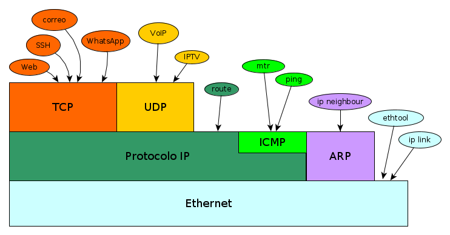

# TCP Protokoloa

- [TCP Protokoloa](#tcp-protokoloa)
  - [Garraio Protokoloa](#garraio-protokoloa)
  - [Portua](#portua)
  - [Bezero-zerbitzaria](#bezero-zerbitzaria)
  - [TCP Protokoloa](#tcp-protokoloa-1)
  - [UDP protokoloa](#udp-protokoloa)
- [Ariketak](#ariketak)
  - [Ariketa 1](#ariketa-1)
  - [Ariketa 2](#ariketa-2)
  - [Ariketa 3](#ariketa-3)
  - [Ariketa 4](#ariketa-4)
  - [Ariketa 5](#ariketa-5)
  - [Ariketa 6](#ariketa-6)
  - [Ariketa 7](#ariketa-7)
  - [Ariketa 8](#ariketa-8)
  - [Ariketa 9](#ariketa-9)

## Garraio Protokoloa

Orain arte ikusitakoaren laburpena egingo dugu, eta, horrela, TCP protokoloa non egokitzen den ikusiko dugu.

- Zuzenean konektatuta dauden ordenagailuetarako, Ethernet bidez konekta gaitezke. Ordenagailuen helbide gisa MAC-a erabiliz.
- Ordenagailuak ez badaude zuzenean konektatuta, routerrak eta IP protokoloa behar ditugu. Ordenagailuen helbide gisa IP erailiz.
  - IP protokoloak hainbat arazo ditu:
    - Datuak nahasita irits daitezke
    - Datuak gal daitezke
    - Datuak bikoiztuta irits daitezke
    - Ez da zehazten helmugako ordenagailuaren zein prozesutara doazen datuak.
- IP protokoloarekin batera, IP protokoloari "laguntzen" dioten ARP eta ICMP protokoloak daude.
  
Zertarako balio du, orduan, TCP protokoloak? Jakina, IP protokoloak dituen arazoak konpontzeko. Beraz, hauek izango dira TCPren abantailak:
- Datuak ordenatuta iristen dira
- Datuak ez dira inoiz galtzen
- Datuak ez dira inoiz bikoiztuta iristen
- Datuak zein prozesutara bideratuko diren zehaztu daiteke.

TCP protokoloarekin batera, UDP izeneko beste bat dago, TCPren antzekoa. Bien artean garrantzitsuena TCP da. Eta TCPrako baliagarriak diren gauza asko UDPrako ere baliagarriak dira.

Goiko diagraman, ezagutzen ditugun protokolo guztiak eta horiek erabiltzen dituzten programak ikus ditzakegu. Ikus daitekeenez, TCPk eta UDPk, IPn protokoloa erabiliz lan egiten dute.

## Portua

Orain arte, ordenagailu batetik bestera komunikatzeko, datuen zati bat, jatorrizko ordenagailuaren IPa eta xede-ordenagailuaren IPa baino ez genituen behar. Baina horrekin ez da nahikoa. Pentsa dezagun gure mugikorrean. Mugikorrera datuak iristen zaizkigunean, zein aplikaziora doaz? Whatsapparako dira? Postarako? Web-nabigatzailerako? eta abar, eta abar. Beraz, datuak nora iristen diren ere zehaztu behar da, zer aplikaziorako diren jakiteko. Hori PUERTO izeneko zenbaki berri batekin egiten da. Zenbaki horrek adierazten du gure ordenagailuaren zein aplikaziotan entregatu behar diren datuak. Baita, portuaz gain, TCP edo UDP bidez doazen ere adierazi behar da. Beraz, konexioa ezartzeko, honako hau behar dugu:

- Erabili beharreko protokoloa: TCP edo UDP
- IP Jatorria eta Jatorrizko Portua
- Helmugako IP eta helmugako portua

Hori jakinda, ikus dezagun taula bat aplikazio batzuk erabiltzen dituzten portuen zenbakiekin:

| Aplikazioa | Portua | Protokoloa |
| --- | --- | --- |
| SSH | 22 | TCP |
| Serbitzari Web | 80 | TCP |
| Serbitzari Web | 443 | TCP |
| MySQL | 3306 | TCP |
| VoIP | 5060 | TCP |
| VoIP | 5060 | UDP |
| VoIP | 5004 | UDP |
| IPTV | 12000 | UDP |
| Minecraft | 25565 | TCP |
| BitTorrent | 6881 | TCP |
| BitTorrent | 6969 | TCP |

Portu "ofizialen" taula osoa, "portu aski ezagunak" deitzen da, eta [Wikipedian ikus dezakezu.](http://es.wikipedia.org/wiki/Anexo:N%C3%BAmeros_de_puerto)

⚠️*Portuaren kontzeptua da garatzaile batek ikasi behar duen gauzarik garrantzitsuenetako bat. Izan ere, sareko aplikazio bat programatzean, guk erabakitzen dugu zein portu erabiltzen duen gure aplikazioa.*
*Gainera, askok entzun duzuen bezala, askotan portuak ireki behar izaten dira.*

Ondo, baina ez da ahaztu momentuz sareei buruzko kontatutako guztia, **ordenagailu batean dagoen prozesu batetik** **beste prozesu batera** datuak bidaltzera bideratuta dagoela.

Adibidez:

- Web nabigatzaile batetik (Firefox bezala) Web zerbitzari batera (Apache bezala) eta alderantziz.
- SSH bezero batetik (putty gisa) SSH zerbitzari batera
- Posta-bezero batetik posta-zerbitzari batera.
- Minecraft bezero batetik Minecraf zerbitzari batera.

Bada, prozesu batek sistema eragileari esan behar dio protokolo batera, portu batera eta IP batera "konektatzen" dela (jakina, ekipoaren beraren IPetara mugatuta). Eta datuak bidaltzen edo jasotzen dituzunean, portu eta protokolo hori erabiliko duzu. Eta, gero, prozesuak datuak bidaliko ditu helmugako portu eta IPa dituen orgenagilu batera (helmugako protokoloa, jakina, jatorrikoaren berdina izango da).

                    TCP
    (IP, Portua) ----------> (IP, Portua)

    
                    UDP
    (IP, Portua) ----------> (IP, Portua)

- Garrantzitsua da nabarmentzea prozesu bakar bat (gauzatzen ari den programa bat) konekta daitekeela portu eta protokolo batera. Adibidez:
  - Javan programa bat egiten badugu eta TCP bidez 3306 portura konektatzen badugu, gero ezingo dugu MYSQL instalatu, MYSQL-k 3306 portua erabiltzen baitu TCP bidez.
  - Baina Javan programa bat egiten badugu eta UDP bidez 3306 portura konektatzen badugu, gero MYSQL instalatu ahal izango dugu, MYSQLk 3306 portua erabiltzen baitu TCP bidez.
- Baina prozesu bat bi portu konektatzea baimentzen da. Adibidez:
  - Javaren Web zerbitzaria, Tomcat izenekoa, 8080 portuan konektatuta dago nabigatzaileen eskaerak jasotzeko
  - Baina 8005 portuan ere konektatuta dago zerbitzaria berrabiarazten duten eskaerak jasotzeko

⚠️*Posible da Mysql eta aplikazio gehienen defektuzko portua aldatzea, baina ez da gomendagarria.*

## Bezero-zerbitzaria

Ikus dezagun orain xehetasun bat. Ziurtzat jotzen dugu edozein ordenagailu konekta daitekeela beste edozein ordenagailurekin. Baina benetan ez da horrela.

- Ethernet eta IP mailan, edozein ordenagailurekin konekta zaitezke, sistema eragileak berak jasotzen baititu datuak.
- TCP mailan, helmugako ordenagailuan konektatu nahi duzun portuan prozesu bat konektatutako badago baino ezin zara konektatu.
Ikus dezagun berriro lehen adibidea:

Ikus dezagun adibide bat:

Demagun 192.168.3.14 Host-a 192.168.4.123 Host-arekin konektatu nahi dela. Orain badakigu lehenik eta behin garraio-protokoloa aukeratu behar dela:

- TCP
- UDP

Demagun TCP protokoloarekin konektatu nahi dugula.

Orain, helburuko ordenagailuaren portua aukeratu behar dugu (192.168.4.123):

- 1
- 2
- 3
- .....
- 655355

Demagun 3306 portura konektatu nahi dugula.

Galdera da, Prozesu bat dago 192.168.4.123 Hosteko 3306 portuan konektatuta? Hau da, beste ordenagailu batera konektatzeko prozesu batek portu horretara konektatuta egon behar du nahitaez, bestela sistema eragileak ez bailuke jakingo zer prozesutara bidali datuak. Izan ere, datuak ez ditugu ordenagailutik ordenagailura bidaltzen, programatik programara baizik. Pentsatu Whatsappean....

Baina bada besterik ere. 3306 portura konektatuta dagoen prozesu hori **ENTZUTEN** ari dela edo prozesu hori **ZERBITZARI** bat dela esaten da.

:bulb: *Garrantzitsua da azpimarratzea ez garela ari bezero-ordenagailuez eta zerbitzari-ordenagailuez. Izan ere, ordenagailu berak bezero-lanak eta zerbitzari-lanak egiten dituzten prozesuak izan ditzake. Beraz, egokiena bezero-prozesuei eta zerbitzari-prozesuei buruz hitz egitea da. Hala ere, lengoaia gehiegi erabiltzen dugu eta ordenagailu bat zerbitzaria dela esan ohi dugu, baldin eta garrantzitsuena prozesu zerbitzariak izatea bada, nahiz eta inoiz prozesu bezero bat izan. Bezero eta zerbitzari gisa ere egin dezake, aldi berean, nahiz eta, jakina, ataka desberdinetan.*

Itzuli gaitez eskema honetara:

                    TCP
    (IP, Portua) ----------> (IP, Portua)

Orain, datu hauek dauzkagu:

                    UDP
    (192.168.3.14, Portua) ----------> (192.168.4.123, 3306)

Baina oraindik jatorrizko portua jakitea falta zaigu. Bada, jatorrizko portua, ez genuen guk erabaki. Sistema eragileak bezeroarena egin nahi dugunean nahi duen portua esleitzen digu. Pentsa genezake 3306a eduki behar dugula, edo beti berdina izan behar dela, baina pixka bat pentsatzen badugu, berdin dio bezeroak zer ataka duen. Zerbitzariak beti erantzungo digu jatorri-atakari, beraz, berdin dio.

Beraz, jatorrizko ataka gisa suposatuko dugu sistema eragileak 45345 ataka zenbakia esleitzen digula. Orain, azkenik, badugu TCP konexiorako informazio guztia.

                    UDP
    (192.168.3.14, 45345) ----------> (192.168.4.123, 3306)

Azkenik, esan behar da bezeroa zerbitzarira konektatzen hasten den arren, zerbitzaria beti dagoela bezeroren batek konektatu zain. Konexioa ezarri ondoren, bezeroak eta zerbitzariak datuak bidal ditzakete.

## TCP Protokoloa

Azkenik, TCP protokoloa azalduko dugu. Oso modu errazean ikusiko dugu, oso protokolo konplexua baita.

Lehenik eta behin, adierazi behar da **Ethernetek** bidaltzen duenari **Trama**  deitzen zaiola, **IPk** bidaltzen duenari **Datagrama** , **TCPk** bidaltzen duenari **Segmentu** deitzen zaiola.

Orain, gogora dezagun zer egin behar duen TCP protokoloak:

- Datuak zein prozesutara bideratuko diren zehaztu daiteke
- Datuak ordenatuta iristen dira: Datuak zenbakituz konpontzen da
- Datuak ez dira inoiz galtzen: Datuak zenbakituz konpontzen da
- Datuak ez dira inoiz bikoiztuta iristen: Datuak zenbakituz konpontzen da

Datuak zein prozesutara bideratuko diren zehazteko, ikusi dugu portuaren kontzeptuak konpontzen duela, prozesu bat ate batera konektatzen baita.

Orain ikus dezagun nola konpontzen dituen gainerako arazoak: TCPn ezartzen den konexio bakoitzean (Gogoratu konexio bat jatorrizko IPren, jatorrizko portua, helmugako IPren, helmugako portuaren arteko lotura dela), bidaltzen dituen segmentuak zenbakituko dira. Horrela, baten bat iristen ez bada, errepikatuta iristen bada edo beste ordena batean iristen bada, TCPk jakingo du.

| Segmentuen iritsiera | Hautemandako arazoa |
| --- | --- |
| 1, 2, 3, 4, 5 | Bat ere ez. Dena ondo iritsi da. |
| 1, 2, 4, 5 | Galdu egin da 3. segmentua |
| 1, 2, 3, 4, 4, 5 | 4. segmentua bikoiztuta iritsi da |
| 1, 2, 4, 3, 5 | 3. eta 4. segmentuak desordenatuta iritsi dira |
| 3, 1, 4, 4, 5 | 4. segmentua bikoiztuta iritsi da, 2. segmentua galdu egin da, 3. eta 1.  segmentuak ordenatik kanpo iritsi dira |

Arazorik izanez gero, TCPk honela konpontzen ditu:

- **Segmentu bikoiztua:** TCPk bikoiztuta iritsi den segmentua deskargatzen du
- **Segmentu desordenatuak:** TCPk ordena berregiten du, sekuentzia-zenbakia baitu.
- **Segmentu galdua:** TCPk Host jatorriari adierazten dio iritsi ez den segmentua berriz bidaltzeko.

Informazioa gehiago 
  - [Wikipedia, TCP ](http://es.wikipedia.org/wiki/Transmission_Control_Protocol)
  - [Wikipedia, TCP Ingelesez](https://en.wikipedia.org/wiki/Transmission_Control_Protocol)
  - [TCP segmentua](http://es.wikipedia.org/wiki/Segmento_TCP)

Irudi honetan ikus dezakegu nola TCPk bere goiburua gehitzen duen IP datuen gainean. Hau da, burualde bat dago segmentuetarako.

Hau da:

- Datu batzuk ditugu.
- TCP goiburu bat erantsiko dugu, eta segmentua bidaliko dugu goiburuarekin (jatorrizko eta helmugako portuarekin) eta datuak IP protokolora.
- IP protokoloak bere goiburua gehitzen du, jatorriko eta helmugako IParekin, datagrama bat sortuz eta Ethernetera bidaliz
- Azkenik, Ethernetek bere goiburua gehitzen du MACekin (jatorria eta helmuga), eta azkenik trama bidaltzen du kable fisikotik.

Ikus dezagun orain segmentuaren goiburuaren formatua

Hona hemen interesatzen zaizkigun eremuak:

- **Jatorrizko portua:** datuak bidaltzeko erabiltzen den portua.
- **Helmugako portua**: Datuak zein portutara bidaltzen diren
- **Sekuentzia-zenbakia:** Erroreak detektatzeko aukera ematen duen segmentuaren sekuentzia-zenbakia.
- **Hartu-agiriaren zenbakia:** ACK zenbakia ere deitzen da. Beste Host-ari jasotzeko zain gauden segmentu kopurua esaten diona da, eta horrela, zein galdu den jakingo dugu.
- **Goiburuaren luzera:** 32 biteko hitzetan zehazten da. Hau da, 1ek esan nahi du goiburuak 32 bit hartzen dituela, 2k esan nahi du goiburuak 64 bit hartzen dituela, etab.
- **Egiaztapenaren batura:** Segmentu osoaren CRCa da (goiburua eta datuak)
- **SYNC eta ACK:** Bi bit horiek TCP konexioa ezartzeko eta ixteko erabiltzen dira. Esan dugunez, datuak bidaltzeko beharrezkoa da aldez aurretik konexio bat ezartzea. Eta datuak bidali berri direnean, itxi konexioa. Hurrengo irudian, konexioa ezartzeko bidaltzen diren TCP segmentuak ageri dira (antzera egiten da konexioa ixteko).

Datuak bidali aurretik, segmentu batzuk bidali behar dira konexioa ezartzeko. SYNC eta/edo ACK bitak aktibatuta dituzten hasierako segmentu horiek gabe, zerbitzariak ez ditu onartuko datu-segmentuak.

:bulb: *TCPrekin amaitzeko, esan dezakegu TCP duten protokolo askoren ondoren lortu dugula datuak prozesu batetik bestera modu fidagarrian bidaltzea, informazioa galdu edo aldatu gabe.*

## UDP protokoloa

UDP protokoloa TCP protokoloaren oso antzekoa da, beraz, TCPtik azaldu ditugun gauza gehienek UDPrako balio dute. Orduan, zertan bereizten dira?

UDPk arazo hauek konpontzen ez dituenean:

- Ez du ebazten datuak ordenarik gabe iristen badira
- Ez du ebazten datuak galtzen badira
- Ez du ebazten datuak bikoiztuta iristen badira.

Eta UDPn ez da beharrezkoa konexioa ezartzea/ixtea, hau da, datuak zuzenean bidaltzen dira.

Dena den, datuak zein prozesutara bideratuta dauden zehaztu ahal izango da. Hau da, portuaren kontzeptua UDPn erabiltzen da.

Informazioa gehiago 
  - [Wikipedia, UDP ](http://es.wikipedia.org/wiki/User_Datagram_Protocol)

Orduan, UDPk zertarako balio du IP protokoloaren arazoak konpontzen ez badira?. Beno, esan bezala, badago bat konpontzen dena eta portuari esker datuak zein prozesutara doazen zehaztu ahal izatea.

Ikus dezagun orain UDP goiburua

Ikus dezakegunez, oso sinplea da eta ez du azalpen gehiagorik behar.

Baina aspalditik pentsatu behar duzuna da zertarako balio duen UDPk? Gaizki badabil!!!! Erantzuna oso sinplea da, TCP protokolo oso ona da, baina inplementatzeko oso konplexua da, gainera, gauzak bidaltzean oso motela da. UDP, berriz, oso erraza da programatzeko eta bidalketa oso azkarra da. Beraz, fidagarritasuna galtzen baduzu ere, hobekuntzak ditu azkartasunean.

:bulb: *UDPren azkartasunaren arrazoietako bat da ez duela konexioa ezarri eta itxi behar, beraz, transmisio laburretan denbora asko aurrezten da*

Bai, baina azkarrago bada ere, ez duzu inoiz daturik galdu nahi. Beraz, zertarako izan daiteke erabilgarria UDP?

| Aplikazioa | Abantailak | Desabantailak | 
| --- | --- | --- | 
| Bidali tenperatura mendi batetik gora dagoen sentsore batetik | Datu gutxiago gastatzen ditu eta prozesadore sinpleagoa behar du | Ez da ezer gertatzen noizbait tenperaturaren bat galtzen bada edo desordenatuta iristen bada edo bi aldiz iristen bada |
| Internet bidezko telefonia | Banda-zabalera txikiagoa erabiltzen du | Ez da ezer gertatzen batzuetan gaizki entzuten bada, aurretik zerbait entzuten bada edo ahotsa galtzen bada |
| Bideo-deia Internet bidez | Banda-zabalera txikiagoa erabiltzen du  | Ez da ezer gertatzen batzuetan gaizki ikusten bada edo aurreko zerbait ikusten bada edo irudiren bat galtzen bada |

Ikusten dugunez, aplikazio horietan noizbehinkako akatsen bat izanez gero, ez dago arazorik. Gainera, esan behar da, oro har, sareek ez dutela hainbeste huts egiten, beraz, arazo horiek gutxitan gertatuko dira. Baina berriro diot: fidagarritasuna behar badugu, beti erabili beharko da TCP.

# Ariketak

## Ariketa 1

1. IP bidez komunikatzen diren 4 programa informatiko bilatu eta erabiltzen duen garraio-protokoloa eta zerbitzariaren portua adierazi. Horietako batek, gutxienez, UDP erabili beharko du, eta ezin dituzu errepikatu apunteetan erabili ditudan adibideak.
2. Gure Linuxetik SSH bidez 8.8.8.8 IPra konektatzen bagara, zein izango dira konexioarako "datuak"? Hau da, portuak eta IPak
3. Ordenagailutik ordenagailurako berehalako mezularitzako aplikazio bat badugu (Whatsapp edo Telegram, adibidez), baina ordenagailu zentraletik pasatu gabe. Instalatzen dugun programak bezeroarena edo zerbitzariarena egiten du?
4. Berehalako mezularitzako aplikazio bat badugu, eta haren komunikazioak zerbitzari zentral batetik igarotzen badira. Instalatzen dugun programak bezeroarena edo zerbitzariarena egiten du?

## Ariketa 2

1024 datu byte bidaltzen baditugu TCP bidez

- zenbat byte bidaltzen dira gutxienez benetan TCP segmentuan?
- zenbat byte bidaltzen dira gutxienez benetan IP datagraman?
- zenbat byte bidaltzen dira gutxienez benetan Ethernet traman?

## Ariketa 3

1024 datu-byte bidaltzen baditugu UDP bidez

- zenbat byte bidaltzen dira gutxienez benetan UDP segmentuan?
- zenbat byte bidaltzen dira gutxienez benetan IP datagraman?
- zenbat byte bidaltzen dira gutxienez benetan Ethernet traman?

## Ariketa 4

Honako galdera hauei erantzuteko, muga teorikoez hitz egiten dugu beti, eta muga horiek ez daude mugatuta RAM memoria, CPU eta abarrekin.

- Host batek zenbat portu ditu gehienez TCP bidez?
- Zenbat portu ditu, gehienez, Host batek UDPrako?
- Zerbitzari batek bere TCP portu guztiak erabiltzen baditu, zerbait bidal dezake UDP bidez?
- Ezar dezakegu 2 SSH konexio prozesutik Host helmuga berera? Erantzuna baiezkoa bada, adierazi nola ez den okertzen informazio bakoitza itzultzean zein Host prozesutara doan.

## Ariketa 5

- Prozesu bat 34567 portua TCP bidez erabiltzen ari bada, beste prozesu bat konekta al daiteke TCP portu berera?
- Prozesu bat 34567 portua erabiltzen ari bada TCP bidez, beste prozesu bat konekta al daiteke UDP portu berera?
- Prozesu bat 34567 portua erabiltzen ari bada UDP bidez, beste prozesu bat konekta al daiteke TCP portu berera?
- Prozesu bat 34567 portua erabiltzen ari bada UDP bidez, beste prozesu bat konekta daiteke UDP portu berera?

## Ariketa 6

- Prozesu bat 34567 portua TCP bidez erabiltzen ari bada, prozesu bera konekta al daiteke TCP bitartez 12345 portura?
- Prozesu bat 34567 portua erabiltzen ari bada TCP bidez, prozesu bera konekta al daiteke UDP bitartez 12345 portura?
- Prozesu bat 34567 portua erabiltzen ari bada UDP bidez, prozesu bera konekta al daiteke TCP bitartez 12345 portura?
- Prozesu bat 34567 ataka erabiltzen ari bada UDP bidez, prozesu bera konekta daiteke UDP bitartez 12345 portura?

## Ariketa 7

- MySQL-ra konektatzen bazara, bezeroarena egiten duen programa nola deitzen den eta zerbitzariarena egiten duen programa nola deitzen den adierazi.
- Web zerbitzari batera konektatzen bazara, bezeroarena egiten duen programa nola deitzen den eta zerbitzariarena egiten duen programa nola deitzen den adierazi.
- SSH bidez Linux-era konektatzen bazara, adierazi nola deitzen zaion bezeroarena egiten duen programari eta nola deitzen zaion zerbitzariarena egiten duen programari.

## Ariketa 8

- MySQL bezero bat erabiliz, adierazi nola zehaztu dezakezun MySQL zerbitzaria entzuten ari den IPa eta ataka.
- Web nabigatzaile bat erabiliz, adierazi nola zehaztu dezakezun web zerbitzaria entzuten ari den IPa eta ataka.
- Putty erabiliz, adierazi nola zehaztu dezakezun IPa eta SSH zerbitzaria entzuten ari den ataka.

## Ariketa 9 

- Egin formula bat, TCP bidez bidali beharreko byte kopuruaren arabera, kalkulatu Ethernetek bidaltzen dituen datuen gutxieneko gainkargaren ehunekoa, konexioa kapsulatzen duten protokolo guztiak kontuan izanda. Adibidez, 10 datu-byte bidali nahi baditugu eta Etherneten bidez 13 datu bidaltzen badira, %30 gainkarga izango litzateke.

- Egin formula bat, UDPk bidali beharreko byte kopurua kontuan hartuta, kalkulatu Ethernetek bidaltzen dituen datuen gutxieneko gainkargaren ehunekoa, konexioa kapsulatzen duten protokolo guztiak direla eta. Adibidez, 10 datu-byte bidali nahi baditugu eta Etherneten bidez 12 datu bidaltzen badira, %20 gainkarga izango litzateke.

- Egin grafiko bat sortu dituzun 2 formulak ikusteko (TCP eta UDPrako).
  - X ardatzean, bidali beharreko datuen tamaina ikusiko da.
  - Y ardatzean gainkargaren ehunekoa % izango du.

- Gainkargaren % bakarrik kontuan hartuta, zein kasutan izango litzateke hobe TCP erabiltzea eta zein kasutan izango litzateke hobea UDP erabiltzea?

