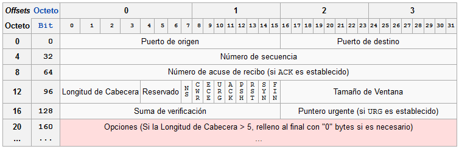

# Azterketa Sareak

- Data: Asteartea, 2024ko ekainak 4
- Izen Abizenak:
- Nota: 
- Puntuak: 19.85
--- 

#### 1. Zein da `255.255.224.0` maskara duen azpizare baten CIDR zenbakia? *(+1/-0.33)*
1. $/19$
2. $/20$
3. $/21$
4. $/22$

--- 
#### 2. Zenbat hosterako ip daude eskuragarri `255.255.224.0` maskara duen azpizare baten? *(+1/-0.33)*
1. $2^{13}-2$
2. $2^{12}-2$
3. $2^{11}-2$
4. $2^{10}-2$
--- 

#### 3. Zein da `10.10.1.15/23` sarearen maskara? *(+1/-0.33)*
1. $255.255.224.0$
2. $255.255.240.0$
3. $255.255.248.0$
4. $255.255.254.0$
--- 

#### 4. Zein da `10.10.1.15/23` sarearen ID-a? *(+1/-0.33)*
1. $10.10.0.0$
2. $10.10.0.1$
3. $10.10.1.0$
4. $10.10.1.128$
--- 

#### 5. Zein da `10.10.1.15/23` sarearen Broadcast helbidea? *(+1/-0.33)*
1. $10.10.8.255$
2. $10.10.1.255$
3. $10.10.63.255$
4. $10.10.1.128$
--- 

#### 6. Ezarri osi geruzaren izen bakoitza dagokion tokian hurrengo irudian: *7x(+0.3/-0.1)*

`Saio-geruza` `Aplikazio-geruza` `Garraio-geruza` `Sare-geruza` `Aurkezpen-geruza ` `Geruza fisikoa` `Datuen lotura-geruza`

--- 

#### 7. Nola deitzen zaie IP protokoloaren informazio unitateie: *(+0.5/-0.15)*
1. Datagrama
2. Trama
3. Segmentua
4. Paketea
--- 

#### 8. Nola deitzen zaie Etherneteko informazio unitateei: *(+0.5/-0.15)*
1. Datagrama
2. Trama
3. Segmentua
4. Paketea
--- 

#### 9. Nola deitzen zaie TCP protokoloaren informazio unitateei: *(+0.5/-0.15)*
1. Datagrama
2. Trama
3. Segmentua
4. Paketea
   
--- 

#### 10. IP protokoloa, protokolo sinple baina ahalmentsu bat da. IP protokoloaren pausoak azaldu gainetikan. *(+3)*

<pre>

</pre>

--- 
 

#### 12. Zeintzuk dira IPv4 protokoloaren arazo nagusiak? Izendatu. Nola konpontzen ditu IPv4 protokoloak arazo hauek? *(+1.5)*
<pre>

</pre>

#### 13. OSI ereduaren zein geruzatan jarduten du TCP protokoloak? *(+1/-0.33)*
1. Datuen lotura-geruza
2. Geruza fisikoa
3. Garraio-geruza
4. Aurkezpen-geruza

#### 14. TCP protokoloaren helburua: *(+1/-0.33)*
1. Web orrien edukia cachean gordetzea.
2. Sarearen fisikoki konektatzea eta deskonektatzea.
3. IP helbideak esleitzea eta kudeatzea.
4. Datuak sarean fidagarritasunez transferitzea.

#### 16. Zein protokolo erabiltzen du `ping` aginduak? *(+0.5/-0.15)*
1. ARP
2. TCP
3. UDP
4. ICMP

#### Zein agindurekin ikusi dezakegu gure linux sistemaren ARP taula?*(+1/-0.33)*
1. ip neighbour
2. ip a
3. lsarp
4. ip -la

#### 17. Hona hemen TCP protokoloak segmentuei txetatzen dien goiburua: *5x(0.25)*

Hona hemen interesatzen zaizkigun eremuak:

- **Jatorrizko portua:** <pre></pre>
- **Helmugako portua:** <pre></pre>
- **Sekuentzia-zenbakia:** <pre></pre>
- **Hartu-agiriaren zenbakia ACK:** <pre></pre>
- **Egiaztapenaren batura:** <pre></pre>

#### 18. Azaldu TCP eta UDP-ren arteko desberdintasun eta antzekotasunak. Zertarako erabiliko zenuke TCP? Eta UDP? Eman adibide pare bat bakoitzerako eta arrazoitu. *(+2)*

<pre>

</pre>

#### 19. Zein da NAT-ak betetzen duen funtzioa gure routerretan? Zergaitik da garrantzitsua?*(+2)*