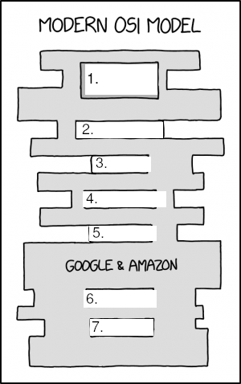

# Azterketa Sareak

- Data: Asteartea, 2024ko Maiatzak 7
- Izen Abizenak:
- Nota: 
--- 

#### 1. Zein da `255.248.0.0` maskara duen azpizare baten CIDR zenbakia? *(+1/-0.33)*
1. $/11$
2. $/12$
3. $/13$
4. $/14$

--- 
#### 2. Zenbat hosterako ip daude eskuragarri `255.248.0.0` maskara duen azpizare baten? *(+1/-0.33)*
1. $2^{18}-2$
2. $2^{19}-2$
3. $2^{20}-2$
4. $2^{21}-2$
--- 

#### 3. Zein da `10.10.38.12/19` sarearen maskara? *(+1/-0.33)*
1. $255.255.192.0$
2. $255.255.224.0$
3. $255.255.240.0$
4. $255.255.248.0$
--- 

#### 4. Zein da `10.10.38.12/19` sarearen ID-a? *(+1/-0.33)*
1. $10.10.0.0$
2. $10.10.16.0$
3. $10.10.32.0$
4. $10.10.64.0$
--- 

#### 5. Zein da `10.10.38.12/19` sarearen Broadcast helbidea? *(+1/-0.33)*
1. $10.10.255.0$
2. $10.10.32.255$
3. $10.10.63.255$
4. $10.10.128.0$
--- 

#### 6. Ezarri osi geruzaren izen bakoitza dagokion tokian hurrengo irudian: *7x(+0.3/-0.1)*



`Saio-geruza` `Aplikazio-geruza` `Garraio-geruza` `Sare-geruza` `Aurkezpen-geruza ` `Geruza fisikoa` `Datuen lotura-geruza`

--- 

#### 7. Nola deitzen zaie IP protokoloaren informazio unitateie: *(+1/-0.33)*
1. Datagrama
2. Trama
3. Segmentua
4. Paketea
--- 

#### 8. Nola deitzen zaie Etherneteko informazio unitateei: *(+1/-0.33)*
1. Datagrama
2. Trama
3. Segmentua
4. Paketea
--- 

#### 9. Nola deitzen zaie TCP protokoloaren informazio unitateei: *(+1/-0.33)*
1. Datagrama
2. Trama
3. Segmentua
4. Paketea
--- 

#### 10. IP protokoloan, zer da Gateway-a? Azaldu esaldi baten. *(+1)*

- 
--- 

#### 11. Hurrengo irudiko sarea izanda zehaztu: *13x(+0.2)*


Ezkerreko ordenagailuaren bideratze taula:
| IP helmuga                | Maskara         | Gatewaya         | Interfazea | Azalpena |
|---------------------|----------------|-----------------|-----------|----------------------|
| <pre>        </pre>   | <pre>        </pre>   |  0.0.0.0 | eth0 |   <pre>                             </pre>   |
| <pre>        </pre>  | <pre>        </pre>  |  192.168.3.34	 |  eth0 |  <pre>                             </pre>  |

Eskumako ordenagailuaren bideratze taula:
| IP helmuga              | Maskara         | Gatewaya         | Interfazea | Azalpena |
|---------------------|----------------|-----------------|-----------|----------------------|
| 192.168.4.0	  | <pre>        </pre>   | <pre>        </pre> | eth0 |   <pre>                             </pre>   |
| <pre>        </pre>  | <pre>        </pre>  |  	 |  eth0 |  <pre>                             </pre>  |

--- 

#### 12. Zeintzuk dira IPv4 protokoloaren arazo nagusiak? Izendatu. Nola konpontzen ditu IPv4 protokoloak arazo hauek? *(+2)*
<pre>


</pre>

#### 13. OSI ereduaren zein geruzatan jarduten du ARP protokoloak? *(+1/-0.33)*
1. Datuen lotura-geruza
2. Geruza fisikoa
3. Garraio-geruza
4. Aurkezpen-geruza

#### 14. ARP protokoloaren helburua: *(+1/-0.33)*
1. IP helbidea jakinda, MAC helbidea aurkitzea.
2. MAC helbidea jakinda, IP helbidea aurkitzea.
3. IP helbidea jakinda, konexioa ezartzea.
4. MAC helbidea jakinda, konexioa ezartzea.
 
#### 15. Lotu hurrengo zerbitzuak erabiltzen dituzten portu arruntenekin: *4x(+0.25/-0.1)*

| Zerbitzua | Portua | 
| --- | --- |
| SSH |  |
| Web Zerbitzaria|  |
| MySql |  |
| VoIP |  |

`80` `22` `3306` `5060`  

#### 16. Zein protokolo erabiltzen du `ping` aginduak? *(+1/-0.33)*
1. ARP
2. TCP
3. UDP
4. ICMP

#### 17. Hurrengo aginduaren irteera ikusita, erantzun galderei: 

```bash
❯ ip addr
1: lo: <LOOPBACK,UP,LOWER_UP> mtu 65536 qdisc noqueue state UNKNOWN group default qlen 1000
    link/loopback 00:00:00:00:00:00 brd 00:00:00:00:00:00
    inet 127.0.0.1/8 scope host lo
       valid_lft forever preferred_lft forever
    inet6 ::1/128 scope host noprefixroute 
       valid_lft forever preferred_lft forever
2: enp2s0f2: <BROADCAST,MULTICAST,UP,LOWER_UP> mtu 1500 qdisc fq_codel state UP group default qlen 1000
    link/ether 38:d5:47:9a:fe:0a brd ff:ff:ff:ff:ff:ff
    inet 10.23.25.37/22 brd 10.23.27.255 scope global dynamic noprefixroute enp2s0f2
       valid_lft 32681sec preferred_lft 32681sec
    inet6 fe80::6014:e9ff:615f:50eb/64 scope link noprefixroute 
       valid_lft forever preferred_lft forever
3: wlp3s0: <NO-CARRIER,BROADCAST,MULTICAST,UP> mtu 1500 qdisc noqueue state DOWN group default qlen 1000
    link/ether 5e:9e:58:30:60:d5 brd ff:ff:ff:ff:ff:ff permaddr 94:e9:79:10:61:5f
```

1. Zer dira 1, 2 eta 3 zenbakiekin izendatutakoak? *(+0.5)*
<pre>
</pre>
1. Zertarako erabiltzen da `lo`? *(+0.5)*
<pre>


</pre>

3. Zein da `enp2s0f2` eta `wlp3s0`ren arteko desberdintasuna? *(+0.5)*
<pre>
</pre>
3. Azaldu zer gertatuko den hurrengo agindua erabiliz? *(+0.5)*

`sudo ip addr add 10.23.25.129/22 dev enp2s0f2`  
<pre>

</pre>

4. Azaldu zer gertatuko den aurreko kasuan hurrengo agindua erabiliz? Interneta izango dugu? *(+0.5)*

`sudo ip link set wlps30 down`

<pre>


</pre>

#### 18. Azaldu TCP eta UDP-ren arteko desberdintasun eta antzekotasunak. Zertarako erabiliko zenuke TCP? Eta UDP? Eman adibide pare bat bakoitzerako eta arrazoitu. *(+3)*

