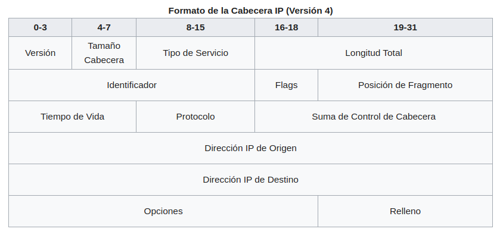
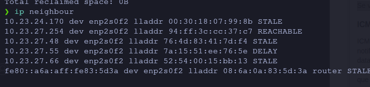

# IPv4 protokoloa

- [IPv4 protokoloa](#ipv4-protokoloa)
  - [IP protokoloa](#ip-protokoloa)
    - [Adibideak](#adibideak)
      - [1. kasua:](#1-kasua)
      - [2. kasua:](#2-kasua)
      - [3. kasua:](#3-kasua)
      - [4. kasua:](#4-kasua)
  - [IPv4 protokoloaren ezaugarriak eta gabeziak](#ipv4-protokoloaren-ezaugarriak-eta-gabeziak)
    - [IP protokoloaren ezaugarriak](#ip-protokoloaren-ezaugarriak)
    - [IP protokoloaren akatsak](#ip-protokoloaren-akatsak)
  - [IPv4 datagrama formatua](#ipv4-datagrama-formatua)
- [Beste protokolo batzuk](#beste-protokolo-batzuk)
  - [ARP](#arp)
    - [Ikus dezagun ARPk nola funtzionatzen duen](#ikus-dezagun-arpk-nola-funtzionatzen-duen)
    - [ip neighbour](#ip-neighbour)
- [ICMP](#icmp)
- 

## IP protokoloa

Imajinatu Internet hasiberri bat Espainian. Router bakoitza autonomia-erkidego bakoitzeko Espainiako unibertsitate batean dago, eta gela bakarra dago router horri konektatuta. Routerren arteko lotura horrela geratuko litzateke.

Erreparatu munduari konektatzeko irteera bat dagoela Bartzelonako routerretik Parisera (urdinez margotuta).

| Jatorria   | Helmuga        | Jauziak                                                                                 | Jauzi kopurua |
|----------|----------------|----------------------------------------------------------------------------------------|-----------|
| Valencia | Castilla-Leon | Valencia, Madrid, Castilla-Leon                                                      | 3         |
| Valencia | Castilla-Leon | Valencia, Aragón, País Vasco, Castilla-Leon                                           | 4         |
| Valencia | País Vasco    | Valencia, Madrid, País Vasco                                                          | 3         |
| Valencia | País Vasco    | Valencia, Aragón, País Vasco                                                          | 3         |
| Valencia | Aragón        | Valencia, Aragón                                                                      | 2         |
| Valencia | Aragón        | Valencia, Cataluña, Aragón                                                            | 3         |
| Valencia | Cataluña      | Valencia, Aragón, Cataluña                                                            | 3         |
| Valencia | Cataluña      | Valencia, Cataluña                                                                    | 2         |
| Valencia | Cataluña      | Valencia, Madrid, Euskadi, Aragón, Cataluña                                        | 5         |
| Valencia | Murcia        | Valencia, Murcia                                                                      | 2         |
| Valencia | Murcia        | Valencia, Madrid, Sevilla, Murcia                                                      | 4         |
| Valencia | Murcia        | Valencia, Cataluña, Aragón, Euskadi, Castilla-Leon, Madrid, Sevilla, Murcia        | 8         |

Jauziei routerrei deitzen zaie, nondik igarotzen den, jatorritik helmuga iristeko.

Ikus dezakegunez, bide asko daude jatorrizko routerretik helmugako routerrera iristeko. Zein aukeratzen duzu routerra? Hainbat estrategia daude:

- Aukeratu jauzi gutxien dituen bidea.
- Aukeratu banda-zabalera onena duen ibilbidea. Agian, Kataluniara iristeko hobe da Aragoitik barrena egitea, banda-zabalera hobea baitago Valentzia eta Aragoi artean eta Aragoi eta Katalunia artean, Valentzia eta Katalunia artean zuzenean baino.
- Banda-zabalera, atzerapena, karga, fidagarritasuna: aukera bakoitzaren ezaugarri gehiago nahastea, ibilbiderik onena aukeratzeko.

Benetan ez zaigu interesatzen jakitea routerrak nola aukeratzen duen ibilbide onena. Garrantzitsuena da datagrama bakoitzerako routerrak ibilbide onena zein den aukeratzen duela, baina hurrengo datagramarekin beste ibilbide bat aukera dezakeela, nahiz eta helmuga berera joan.

### Adibideak
Jarrai dezagun Valentziako ordenagailu batetik Kataluniako beste ordenagailu batera mezu bat bidaltzearen adibidearekin. Mezu horrek 2 datagrama ditu, Datagrama A eta Datagrama B. deituko diegu eta gerta daitekeenaren zenbait kasu ikusiko ditugu.

#### 1. kasua:

- Gure ordenagailutik bi datagrama sortzen ditugu
- Gure ordenagailuak **A Datagrama** *Valentziako* routerrera bidaltzen du
- *Valentziako* routerrak *Kataluniarako* bideean trafiko handia dagoela ikusten du, beraz, *Zaragozako* routerrera bidaltzen du.
- *Zaragozako* routerrak **A datagrama** jasotzen du, bere RAM memorian gordetzen du eta, denbora duenean, berriz bidaliko du
- Gure ordenagailuak **B Datagrama** *Valentziako* routerrera bidaltzen du
- *Valentziako* routerrak ikusten du jada ez dagoela pilaketarik Kataluniarako bidean, beraz, **B Datagrama** bidaltzen du zu####zenean *Kataluniako* routerrera.
- *Kataluniako* routerrak **B Datagrama** jasotzen du *Valentziatik* eta *Kataluniara* bidaltzen du helmuga ordenagailura
- *Zaragozako* routerrak **A Datagrama** *Kataluniako* routerrera bidali du
- *Kataluniako* routerrak **A Datagrama** jasotzen du *Zaragozatik* eta helmuga ordenagailura bidaltzen du
- Zer gertatu da? Lehenengo **B Datagrama** heldu da eta gero **A Datagrama**. Laburbilduz: Datagramak nahasita irits daitezke.

#### 2. kasua:

- Gure ordenagailutik bi datagrama sortzen ditugu
- Gure ordenagailuak **A Datagrama** *Valentziako* routerrera bidaltzen du
- *Valentziako* routerrak *Kataluniarako* bide zuzenean trafiko handia dagoela ikusten du, beraz, *Zaragozako* bidaltzen du.
- *Zaragozako* routerrak **A datagrama** jasotzen du, bere RAMean gordetzen du eta, denbora duenean, berriz bidaliko du
- Gure ordenagailuak **B Datagrama** *Valentziako* routerrera bidaltzen du
- *Valentziako* routerrak ikusten du jada ez dagoela pilaketarik *Kataluniarako* bidean, beraz, Datagrama B bidaltzen du zuzenean *Kataluniako* routerrera.
- *Kataluniako* routerrak **B Datagrama** jasotzen du *Valentziatik* eta *Kataluniara* bidaltzen du ordenagailura
- Txartel-bideratzaileak, **B Datagrama** *Kataluniara* birbidali aurretik, akats bat du eta berriz hasten da.
- *Zaragozako* routerra berriz hasi ondoren, ez du **A datagrama** bidaltzen, **A datagrama** RAMen biltegiratuta zegoelako eta berriz hastean galdu egin delako.
- Zer gertatu da? *Zaragozako* routerrak Datagrama galdu duela A. Laburbilduz: Datagramak gal daitezke

#### 3. kasua:

- Gure ordenagailutik bi datagrama sortzen ditugu
- Gure ordenagailuak **A Datagrama** Valentziako routerrera bidaltzen du
- *Valentziako* routerrak *Kataluniarako* bide zuzenean trafiko handia dagoela ikusten du, beraz, Zarbonatik bidaltzen du.
- Zarbonako routerrak **A Datagrama** jasotzen du, bere Disko gogorrean gordetzen du eta denbora duenean berriz bidaliko du
- Gure ordenagailuak **B Datagrama** *Valentziako* routerrera bidaltzen du
- *Valentziako* routerrak ikusten du jada ez dagoela pilaketarik *Kataluniarako* bidean, beraz, **B Datagrama** bidaltzen du zuzenean *Kataluniako* routerrera.
- *Kataluniako* routerrak **B Datagrama** jasotzen du *Valentziatik* eta Kataluniara bidaltzen du ordenagailura
- Txartelezko routerrak **B Datagrama** bidaltzen du *Kataluniara*, baina bere disko gogorretik ezabatu aurretik, akats bat du eta berriz hasten da.
- *Kataluniako* routerrak **A Datagrama** jasotzen du *Zaragozatik* eta *Kataluniara* bidaltzen du ordenagailura
- *Zaragozatik* routerra berriz hasitakoan, berriro bidaltzen du **B Datagrama**, oraindik bere disko gogorrean gordeta baitzegoen.
- *Kataluniako* routerrak **A Datagrama** jasotzen du *Zaragozatik* eta *Kataluniara* bidaltzen du ordenagailura
- Zer gertatu da? Bada, *Zaragozako* routerrak bi aldiz bidali duela **A Datagrama**. Laburbilduz: Datagramak bikoiztuta irits daitezke.

#### 4. kasua:

- Gure ordenagailutik bi datagrama sortzen ditugu
- Gure ordenagailuak **A Datagrama** *Valentziako* routerrera bidaltzen du
- *Valentziako* routerrak *Kataluniarako* bide zuzenean trafiko handia dagoela ikusten du, beraz, *Zaragozatik* bidaltzen du.
- *Zaragozatik* routerrak **A Datagrama** jasotzen du, bere Disko gogorrean gordetzen du eta denbora duenean berriz bidaliko du
- Gure ordenagailuak **B Datagrama** *Valentziako* routerrera bidaltzen du
- *Valentziako* routerrak ikusten du jada ez dagoela pilaketarik *Kataluniarako* bidean, beraz, **B Datagrama** bidaltzen du zuzenean Kataluniako routerrera.
- *Kataluniako* routerrak **B Datagrama** jasotzen du *Valentziatik* eta *Kataluniara* bidaltzen du ordenagailura
*Zaragozako* routerrak uste du *Kataluniarekiko* sarea erorita dagoela, eta **B Datagrama** bidaltzen du *Euskadiko* routerrera.
*Euskadiko* routerrak **A Datagrama** saria jaso zuen *Zaragozatik* eta *Madrilgo* routerrera bidali zuen
*Madrilgo* routerrak **A Datagrama** saria jaso du *Euskal Herritik* eta *Zaragozako* routerrera bidali du
... eta hor begizta amaigabe batean sartzen gara...
Begizta hautsi egiten da datagramak jauzi gehiegi egin dituenean. Jauzi gehiegi egin dituen datagrama bat ikusten duen routerra (hau da, router askotatik igaro dena) baztertu egiten du, eta ez du berriro bidaltzen.

Zer gertatu da? Zaragozako routerrak gaizki bideratu duela Datagrama. Laburbilduz: Datagramak bukle batean sar daitezke, baina kasu horretan ezabatu egiten dira.

## IPv4 protokoloaren ezaugarriak eta gabeziak

Azkenean, azalpen asko eman ondoren, laburbildu dezagun zertarako balio duen IP protokoloa.

### IP protokoloaren ezaugarriak

- **Helbideratze unibertsala**: IP helbideari esker, ordenagailu guztiak identifika ditzakegu eta, horrela, informazioa banan-banan bidali ahal izango dugu.
- **Bideratzea**: Bideratzaile eta bideratze-taulei esker, ordenagailu batetik bestera irits gaitezke, Internet oso erosoa izan arren.

### IP protokoloaren akatsak

- Datagramak nahasita irits daitezke
- Datagramak gal daitezke
- Datagramak bikoiztuta irits daitezke
- Ez da zehazten zein programatara doan informazioa. Hori xehetasun handiagoz ikusiko dugu TCPa ikustean, baina orain kontuan hartu behar da.

## IPv4 datagrama formatua

Ethernet trama baten formatua ikusi genuen bezala, orain IPv4 datagrama baten formatua ikusiko dugu.

Hona hemen interesatzen zaizkigun eremuak:

- **Jatorrizko IP helbidea** eta **helmugako IP helbidea**: Bi datu interesgarrienak dira. Ikus dezakegunez, bakoitzak 32 bit okupatzen dituzte, eta hemen dago Interneteko IP kopuruaren muga. Muga hori aldatu nahi badugu, munduko router guztiak aldatu behar dira, tamaina berri bat onar dezaten, eta horixe egiten ari dira IPv6-rekin.
- **Datuak**: Benetan bidali nahi ditugun datuak dira.
- **TTL**. Datagrama batek egin ditzakeen jauzien kopurua da. Hasierako balioa 64koa izatea gomendatzen da. Datagrama bat Host batera iristen den bakoitzean (ordenagailua edo routerra), beherapen-balio hori eguneratzen da 1ean. Host batera 0 balioa duen datagrama bat iristen denean, ez da berriro bidaltzen, nahiz eta harentzat bada onartzen duen.
- **Checksum**: CRCa dute transmisio-errorerik egon ez dela egiaztatzeko.
- **Burualdearen luzera**: Burualdeak hartzen duen denbora. 32 biteko multiploetan neurtzen da. Hau da, 1eko balioak adieraziko luke 32 bit okupatzen dituela, 2ko balioak 64 bit okupatzen dituela, etab.
- **Guztizko luzera**: datagrama osoa okupatzen duenean, goiburua eta datuak batuz. Bytetan neurtzen da. Hau da, 1eko balioak 8 bit (1 byte) okupatzen dituela adieraziko luke, 2ko balioak 16 bit (2 byte) okupatzen dituela adieraziko luke, etab.
- **Protokoloa**: Adierazi datagrama TPC edo UDP protokolorako den.

# Beste protokolo batzuk

Orain Linuxen aginduak ikusiko ditugu. Linuxi buruz zerbait badakizue edo dokumentazioa Interneten ikusten baduzue, erraza da gauza bera egiteko beste agindu batzuk ematea. Urte askotan erabili izan diren zaharrak dira.

Hauek dira agindu "zaharretako" batzuk:

- arp
- ifconfig
- netstat
- route
- traceroute

## ARP
Ordu arte ikusi dugu nola bidaltzen diren datagramak routerren bidez, ethernet erabiliz komunikazio fisikorako. Hau da, dena Ethernet bidez bidaltzen da Hosts artean.

*OHARRA: Beti hitz egingo dugu Etherneti buruz, baina benetan sareko edozein teknologia da, hala nola Wifi, 3G, etab.*

Komunikazio honetan, jatorrizko ordenagailuak badaki bere IPa, helmugako IPa eta bere gateway-aren IPa, baina nola daki gateway-aren MAC helbidea? Hau da, ordenagailu bat beste ordenagailu batekin edo gatewayarekin zuzenean komunikatzen den guztietan. Nola dakizu zein den horien guztien MAC helbidea? Izan ere, IP protokolo egon arren, fisikoki dena Etherneten bidez bidaltzen da eta, beraz, MAC helbidea behar da.

MAC helbidea jakiteko, IPa soilik jakinda, ARP protokoloa erabiltzen da (ingelesezko Address Resolution Protocol). Ordenagailu bakoitzak tabula bat du Ip helbideekin eta MAC helbidearekin. Taula hori betetzeko ARP protokoloa erabiltzen da, IParen arabera MACa jakiteko.

### Ikus dezagun ARPk nola funtzionatzen duen

A ordenagailuak B ordenagailura datagrama bat bidali behar duenean:

1. Begiratu ea B ordenagailuaren MACa ARP taulan dagoen, egotekotan aurkitu dugu MACa.
2. Taulan ez badago, A ordenagailuak Ethernet trama bat bidaliko du broadcast 1 helbidera (MAC = FF: FF: FF: FF: FF: FF). Trama horretako datuek ARP protokoloaren formatuari jarraituko diote, eta B ordenagailuaren IPa barne hartuko dute.
3. B ordenagailuak Ethernet trama horri erantzungo dio A ordenagailuari, bere MACa bidaliz.
4. A ordenagailuak MAC gehituko du bere ARP taulan.

Ohartarazi behar da aldi oro MACak ezabatzen direla, ordenagailuak sare-txartela aldatzen badu.

Informazio gehiago:

- [¿Qué es el ARP (Address Resolution Protocol)?](https://www.ionos.es/digitalguide/servidores/know-how/arp-resolucion-de-direcciones-en-la-red/)
- [OpenWebinars. ARP](https://openwebinars.net/academia/aprende/tcp-ip/3648/)

### ip neighbour

`ip neighbour` gure Linuxeko ARP taula ikusteko aukera ematen du.

# ICMP 

ICMP protokolo "arraro" samarra da. IP protokoloaren gainean erabiltzen da, baina IP sareko erroreen eta informazioaren berri emateko baino ez da. Adibidez, router bati datagrama bat iristen bazaio eta ez badaki nondik bidali, ICMP mezu bat bidaliko du jatorrizko ordenagailura, helmuga iristezina dela esanez. Eta horrela routerrek jakin dezakete bide hori ez dela baliozkoa.

Baina erabiltzaile gisa, ICMP protokoloa ez da erabilgarria, helmugako ordenagailu bateraino sare osoak ondo funtzionatzen duen jakiteko aukera ematen baitu. Hau da, konektatu nahi dugun ordenagailuraino Internetek funtzionatzen duen.

# 