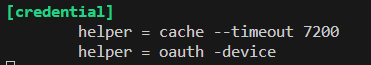
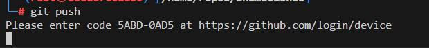
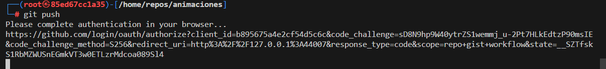
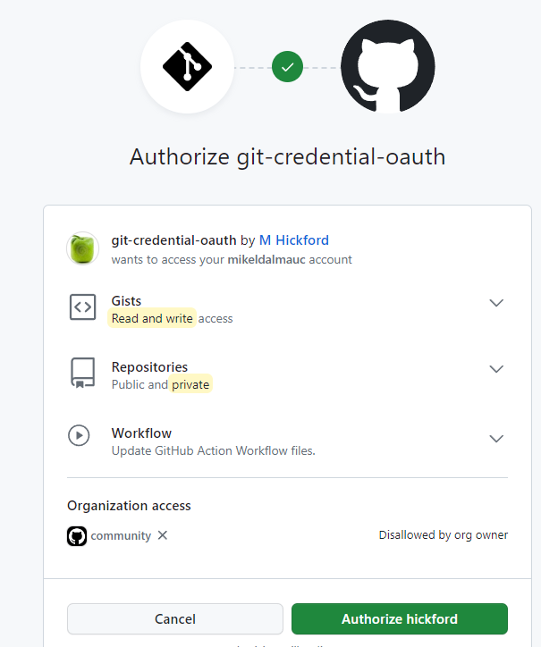
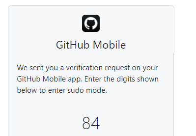

Git erabiliz repositorioak kudeatzeko oinarrizko komandoak hemen dituzu:

- [TOP erabilenak](#top-erabilenak)
- [Git-en Konfigurazioa](#git-en-konfigurazioa)
- [Repositorioa Sortu edo Klonatu](#repositorioa-sortu-edo-klonatu)
- [Egoera eta Aldaketak](#egoera-eta-aldaketak)
- [Konmitak eta Aldaketa Historia](#konmitak-eta-aldaketa-historia)
- [Adarrak (Branches)](#adarrak-branches)
- [Urruneko Repositorioarekin Interakzioa](#urruneko-repositorioarekin-interakzioa)
- [Aldaketa Konfliktuak](#aldaketa-konfliktuak)
- [Besteak](#besteak)
- [OAUTH kredentzial kudeatzailea](#oauth-kredentzial-kudeatzailea)
  - [Nola instalatu linuxen.](#nola-instalatu-linuxen)
    - [Brew instalatu](#brew-instalatu)
    - [Oauth instalatu](#oauth-instalatu)
    - [Browser gabe](#browser-gabe)
    - [Browserra izanda](#browserra-izanda)


### TOP erabilenak

1. `git clone [URL]`

    Adibidez, repositorio hau clonatzeko
`git clone https://github.com/mikeldalmauc/sinfortolosaldealh`

2. `git add [fitxategi/direktorio]`

    Adibidez, kokatuta zauden direktorio osoa gehitzeko

    `git add --all` edo `git add .`

3. `git commit -m "[Mezua]"` . Aldaketak repositorio localera igotzeko.

    Adibidez:

    `git commit -m "Aldaketa baten deskribapen laburra"`


4. `git push` Aldaketak urruneko repositoriora igotzeko.

5. `git pull` Aldaketak urruneko repositoriotik jaisteko.

### Git-en Konfigurazioa

- `git config --global user.name "[Izena]"`: Zure izena konfiguratu.
- `git config --global user.email "[Emaila]"`: Zure emaila konfiguratu.

### Repositorioa Sortu edo Klonatu

- `git init`: Sortu git repositorio berria uneko direktorioan.
- `git clone [URL]`: Klonatu urruneko repositorio bat.

### Egoera eta Aldaketak

- `git status`: Erakutsi uneko egoera (aldaketak, konmit egiteko prest dauden fitxategiak, etab.).
- `git add [fitxategi/direktorio]`: Aldaketak "staging area"-ra gehitu.
- `git reset [fitxategi/direktorio]`: "Staging area"-tik kendu aldaketak.
  
### Konmitak eta Aldaketa Historia

- `git commit -m "[Mezua]"`: Egin konmit berria "staging area"-ra dauden aldaketekin.
- `git log`: Erakutsi konmiten historia.
- `git show [konmit ID]`: Erakutsi konmit baten xehetasunak.

### Adarrak (Branches)

- `git branch`: Erakutsi lokal dauden adarrak.
- `git branch [adarraren izena]`: Sortu adar berria.
- `git checkout [adarraren izena]`: Aldatu adar batetara.
- `git merge [adarraren izena]`: Batu adar bat uneko adarrarekin.

### Urruneko Repositorioarekin Interakzioa

- `git remote add [izen aldizkaria] [URL]`: Gehitu urruneko repositorioa.
- `git push [urruneko izena] [adarraren izena]`: Bidali aldaketak urruneko repositoriora.
- `git pull [urruneko izena] [adarraren izena]`: Hartu aldaketak urruneko repositoriotik.
- `git fetch [urruneko izena]`: Hartu urruneko repositorioko informazioa, baina batu ez.

### Aldaketa Konfliktuak

- `git diff`: Erakutsi fitxategien arteko desberdintasunak.
- `git merge --abort`: Utzi adarren batuketa, konfliktuak direla-eta.

### Besteak

- `git stash`: Aldaketak gorde eta garbitu lan-eremua.
- `git stash apply`: Berreskuratu gorde diren aldaketak.

Hau da oinarrizko ikuspegi bat, eta komando eta aukera askoz gehiago daude. Zure galderak edo azalpen gehiago behar badituzu, esan mesedez.

### OAUTH kredentzial kudeatzailea

Pasahitzaren alternatiba segurtasun gehiagokoa.

#### Nola instalatu linuxen.

##### Brew instalatu

Idatzi agindu zehatz hauek brew instalatzeko.

```bash
/bin/bash -c "$(curl -fsSL https://raw.githubusercontent.com/Homebrew/install/HEAD/install.sh)"
```

PATH-era gehitu.

```bash
(echo; echo 'eval "$(/home/linuxbrew/.linuxbrew/bin/brew shellenv)"') >> /root/.bashrc
```
```bash
eval "$(/home/linuxbrew/.linuxbrew/bin/brew shellenv)"
```
Eguneratu brew eta instalatu git-credential-oauth.

##### Oauth instalatu

```bash
brew update
```

```bash
brew install git-credential-oauth
```

```bash
git credential-oauth configure
```

##### Browser gabe

Ediatatu `~/.gitconfig` fitxategia horrela (fitxategi hau zuere /home direktorioaren erroan aurkituko duzu `ls -a` eginez)

Gehitu -device linea horri
```bash
    helper = oauth -device
```





Jarraitu esteka eta idatzi kodea autorizatzeko.

##### Browserra izanda



Jarraitu 2FA zihurtapen prozesua:





[Gehiago ikus](https://github.com/hickford/git-credential-oauth)
